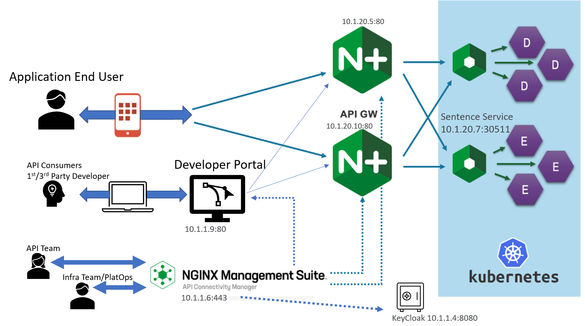

Class 10 - NMS API Connectivity Manager
=======================================

UDF Lab Maintainers:

   Matthieu Dierick <m.dierick@f5.com>

UDF Blueprint : 

   📖 NGINX NMS 2.4 ACM
   

.. toctree::
   :maxdepth: 2
   :caption: Contents:
   :glob:

   module*/module*

