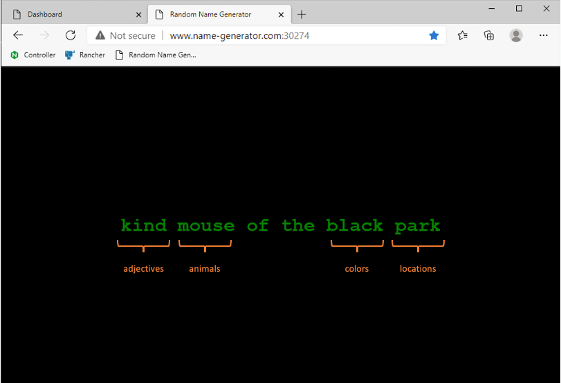

Architecture of the API Sentence app
####################################

First of all, before we delve into the lab, it is important to understand how the API Sentence app is split between micro-services.

**This is what the API Sentence website Frontend looks like when all the necessary micro-services are up and running:**

.. image:: ../pictures/api-app-full.png
   :align: center

Behind the scenes, the ``Frontend`` app reaches a ``Generator`` micro-service. In turn, the ``Generator`` micro-service reaches four distinct ``Words`` micro-services. Each ``Words`` micro-service generates a distinct **word** (an ``adjective``, an ``animal``, a ``color`` and a ``location``).

Each ``Words`` micro-service is a ``NodeJS`` API server. This means we can ``GET``, ``POST``, ``PATCH``, and ``DELETE`` each respective ``Words`` micro-service.
The ``Frontend`` is just a web interface representing the outcomes of the APIs. This ``Frontend`` page has a background and logos on purpose in order to make it "heavy" for Volterra demonstrations.

**And this is how the micro-services are meshed together**

.. image:: ../pictures/lab1/api-workflow.png
   :align: center

We can request each endpoint separately:
   * Frontend -> Displays the web interface with the generated sentence.
   * Generator -> Responds with a JSON payload and 4 words (one for each ``Words`` micro-service).
   * Adjectives -> Responds with an adjective.
   * Animals -> Responds with an animal.
   * Colors -> Responds with a color.
   * Locations -> Responds with a location.

A direct API call to a ``Words`` micro-service (like ``/animals``) will provide a JSON response as below:

.. code-block:: JSON

   [
      {
         "id": 1,
         "name": "lion"
      },
      {
         "id": 2,
         "name": "whale"
      },
      {
         "id": 3,
         "name": "mouse"
      }
   ]

A direct API call to the ``Generator`` micro-service will provide a JSON response as below:

.. code-block:: JSON

   {
      "adjectives": "kind",
      "animals": "mouse",
      "colors": "black",
      "locations": "park"
   }

From the previous example, this is how the sentence is generated when the ``Generator`` micro-service requests the 4 words:

.. note :: In this lab, we will publish the ``Words`` micro-services through an NGINX API Gateway managed by NMS ACM. Then, we will check the result through the ``Frontend`` web interface.

.. note :: In this lab, in order to simplify steps not related to NMS ACM, the Sentence App is already up and running in version 1 (color WORD is not deployed).