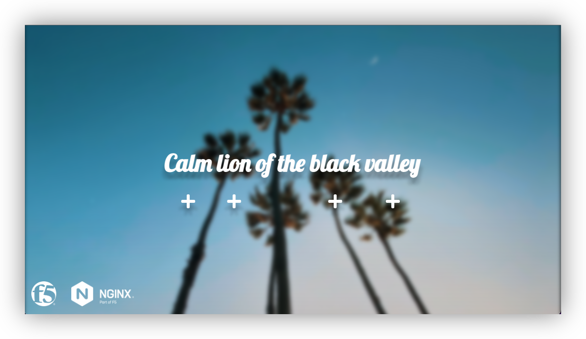

Module 1 - Deploying an API for a modern app
############################################

In this class, we will deploy a modern API driven app (called API Sentence) in a state of the art environment (K3S).

This application generates a sentence where each word is generated by a distinct API endpoint/server (one server per word).

.. note:: If you want to deploy this application in your own environment, you can find the project in Github : https://github.com/f5devcentral/sentence-demo-app
   

**Module 1 - All sections**

.. toctree::
   :maxdepth: 1
   :glob:

   lab*/lab*
