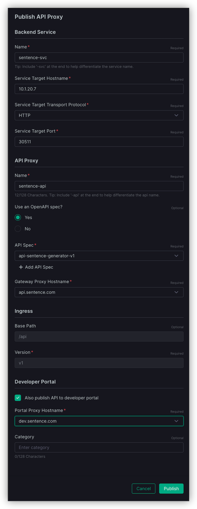

Step 4 - Publish API v1.0
#########################

Before publishing our first API, we must understand what the DevOps (or API Dev) team provided us.

They provided us with an OpenAPI spec file (OASv3) via ``SwaggerHub``. You can consult ``version 1.0`` here: https://app.swaggerhub.com/apis/F5EMEASSA/API-Sentence-2022/v1

.. image:: ../pictures/swaggerhub.png
   :align: center
   :scale: 40%

.. note:: This is version 1.0 of the API, and in this version, as you can notice, the ``Colors`` micro-service is not yet available. This means that with this spec file, we will publish the API Sentence application without the ``Colors`` micro-service (e.g., a sample sentence might look like ``calm mouse of the mountain``).

|

Create the API Services
***********************

#. In NMS ACM UI, click on the ``Services`` menu on the left
#. Create a new workspace. As you can notice, ``Infra team`` and ``API team`` have their separate workspaces

   * Name : sentence-app

#. Click on ``Back to Workspaces`` and click on ``sentence-app`` workspace just created

.. note :: We will expose the API and document it on Dev-Portal at the same time.

Upload the OpenAPI Spec file
============================

#. Click on the ``API Docs`` tab

   .. image:: ../pictures/lab1/api-docs.png
      :align: center

#. Click on ``Add API Doc`` and drag-drop the Swagger file, then click ``Save``

   .. note :: In Win10 RDP Jumphost, the Swagger file located on the desktop (oas-sentence-v1.yaml)

Expose the API proxy
====================

#. Click on ``API Proxies`` tab, and ``Publish to Proxy``

   * Backend Service

      * Name : sentence-svc
      * Service Target Hostname : 10.1.20.7 (this is the K3S Ingress IP Address)
      * Service Target Transport Protocol : HTTP
      * Service Target Port : 30511 (K8S Node Port)

   .. note :: autocomplete may cause problems; if you copy and past over the port, it may be easier
   
   * API Proxy

      * Name : sentence-api
      * Use an OpenAPI Spec ? -> YES
      * API Spec : api-sentence-generator-v1
      * Gateway Proxy Hostname : api.sentence.com

   * Developer Portal

      * Check the box "Also publish API to developer portal" - **This will push documentation in Developer Portal**
      * Portal Proxy Hostname : dev.sentence.com
      * No Category

   * Click ``Publish``

   * Click ``Back to workspace``

.. image:: ../pictures/lab1/edit-adv-config.png
   :align: center
   :scale: 50%

Customize and finalize the configuration
========================================

The configuration still needs to be finished.

   * Define how the API Gateway will ``route`` the API requests per ``Version``

#. Edit the API Proxy just created (sentence-api) by clicking on the three dots on the top right of the row, then click ``Edit Proxy``.

   .. image:: ../pictures/lab1/edit-proxy.png
      :align: center

#. As you can notice, the first page (configuration) is what we just created previously. Click on ``Next``
#. Configure the ``Ingress`` as below

   * Append Rule : Prefix - version/basepath
   * Strip Base Path and Version before proxying the request : YES
   * Select Status : Latest

      .. image:: ../pictures/lab1/ingress.png
         :align: center

   * Click ``Next``

#. Click ``Next`` > ``Next`` then ``Save and Publish``

.. note :: Congrats, your first API is exposed on the Nginx API Gateway and Documented in the Developer Portal.
