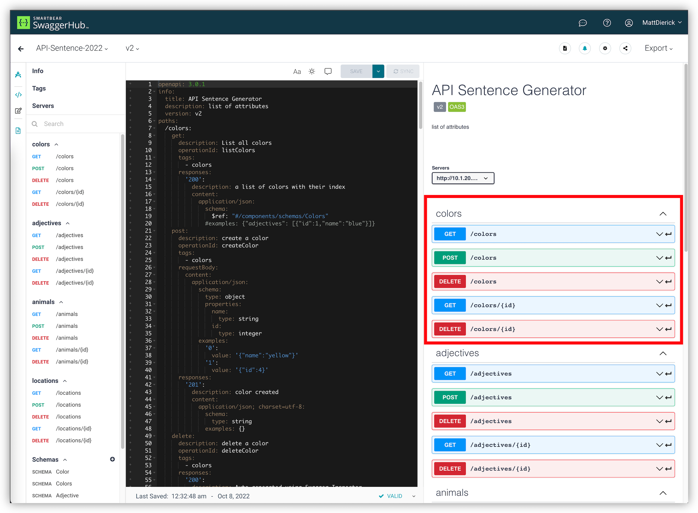

Module 5 - API Team - Publish API v2.0
######################################

In this class, the API Team just get notified DevOps and API Dev pushed a new version (v2) of the API. This version add a new micro-service (/colors).
A new swagger file has been provided by those teams.

https://app.swaggerhub.com/apis/F5EMEASSA/API-Sentence-2022/v2

.. warning :: All actions in the NMS UI must be done from the Win10 Jumphost RDP session

**Module 5 - All sections**

.. toctree::
   :maxdepth: 1
   :glob:

   lab*/lab*
