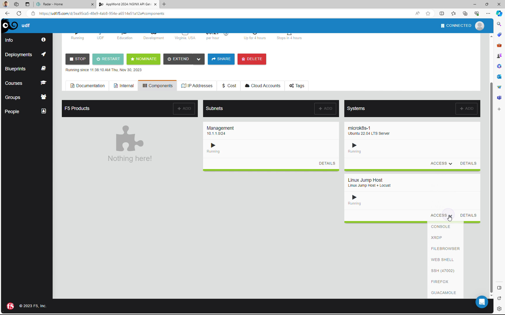
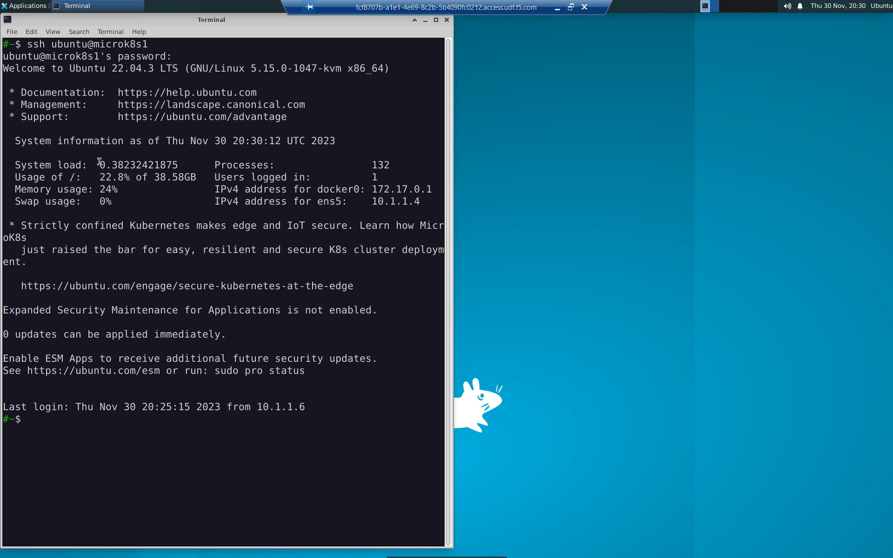
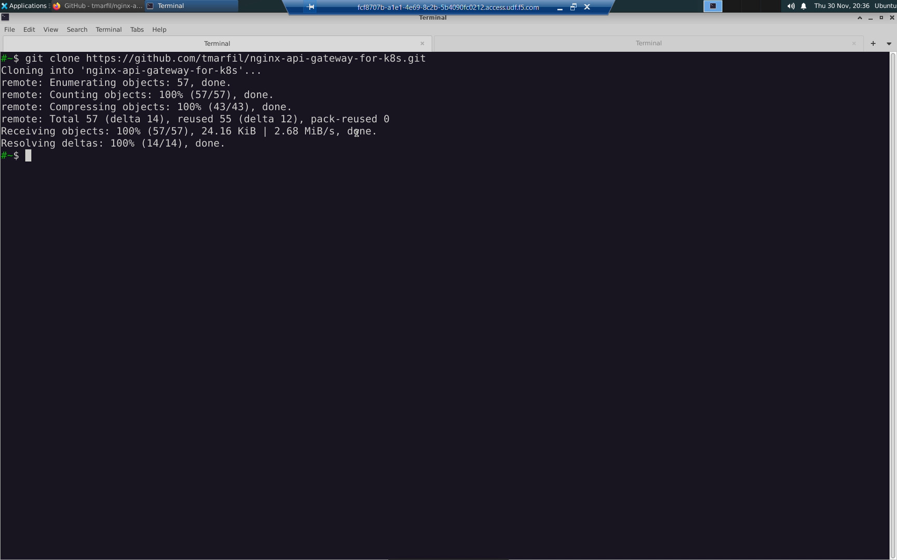
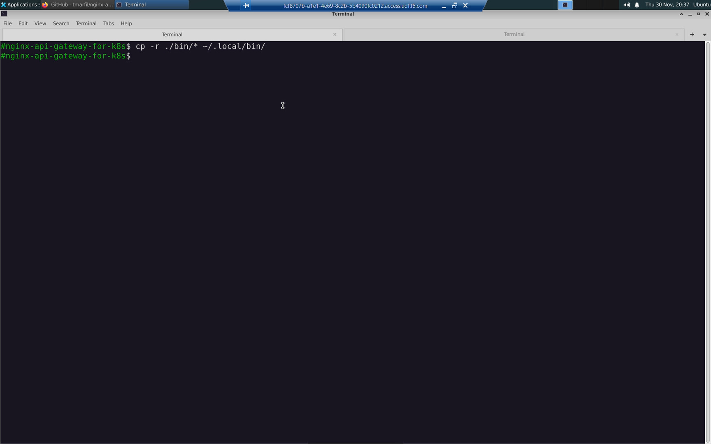
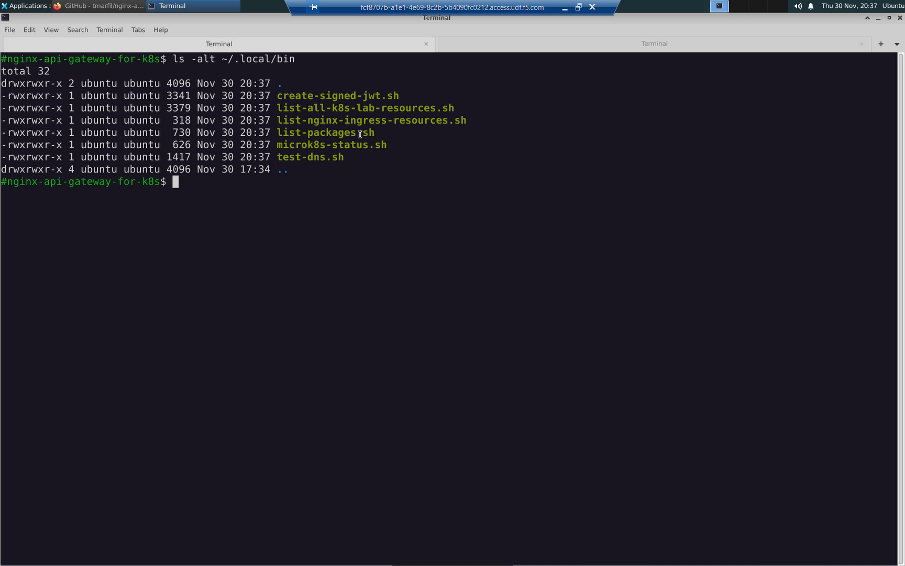
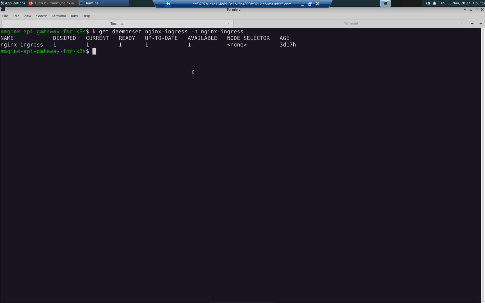
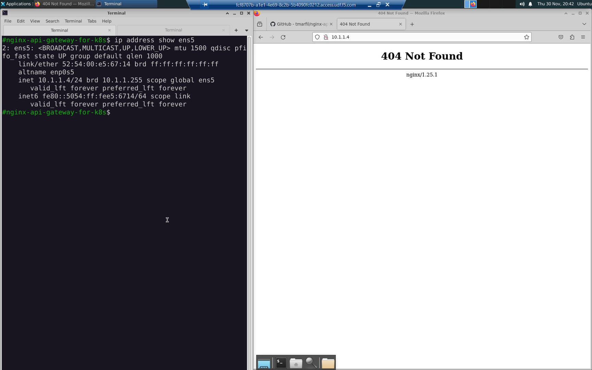
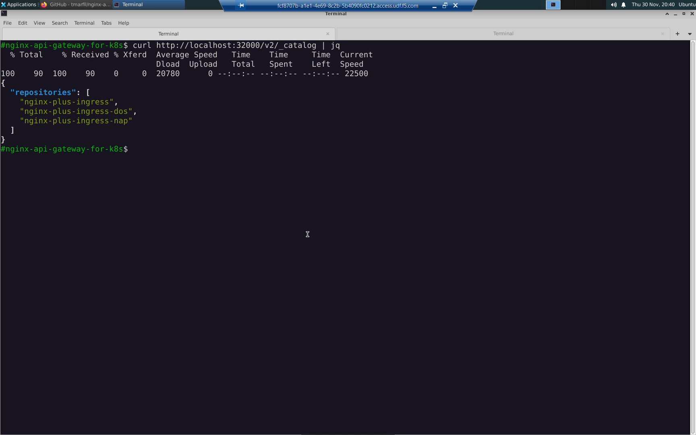
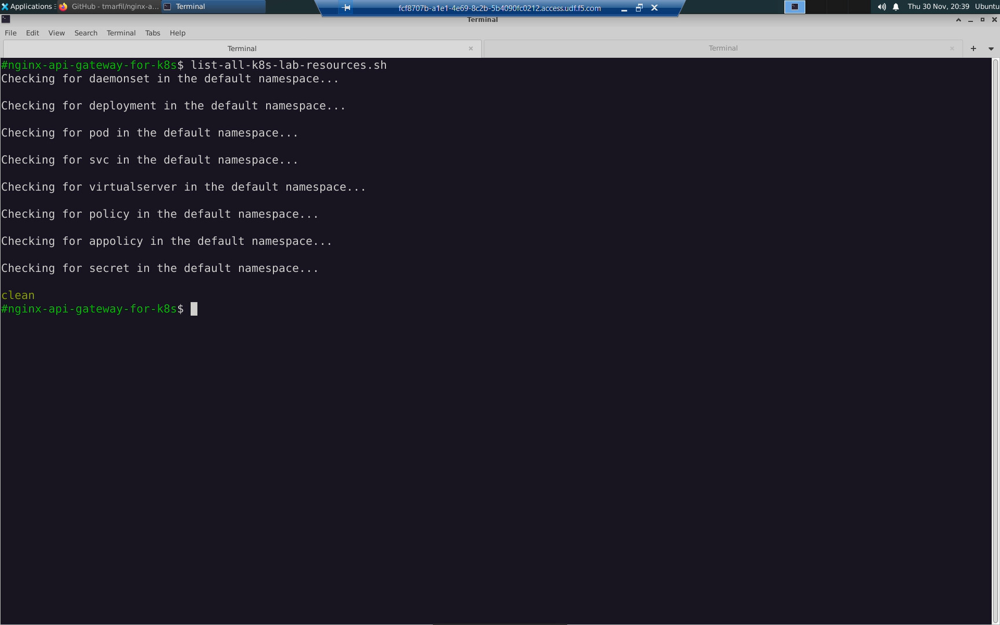

Task 00: Kubernetes Lab Environment
===================================

Connect to the lab environment via RDP. Linux Jump Host => Access => XRDP

  
username: ``ubuntu``
password: ``ubuntu``

If you're prompted for a password a second time: ``ubuntu``

Open a terminal. Position and resize the terminal to the left side of the screen. ssh to microk8s1.

.. code-block:: bash

   ssh ubuntu@microk8s1
   ubuntu

Open the Firefox web browser. Position and resize the web browser to the right side of the screen.
With your screen split between left (terminal) and right (web browser) windows, you can toggle maximize either window to take up the whole screen if you need the extra room to complete a lab task.

.. image:: images/04_split_screen.jpg
  :scale: 50%

Clone the *nginx-api-gateway-for-k8s* repository.

.. code-block:: bash

   git clone https://github.com/tmarfil/nginx-api-gateway-for-k8s.git 

Change into the working directory.

.. code-block:: bash

   cd nginx-api-gateway-for-k8s
   
Copy the lab commands into your ``~/.local/bin`` directory.

.. code-block:: bash

   cp -r ./bin/* ~/.local/bin/

Any shell script commands copied to ``~/.local/bin`` wil be made executable and available to invoke from anywhere automatically. Use [Tab] completion to save time.

.. code-block:: bash

   ls -alt ~/.local/bin

If running in your own environment, make the shell script commands executable.

.. code-block:: bash

   chmod +x ~/.local/bin/*

Familiarize yourself with the lab environment before you get started.

The lab environment consists of a single-node K8s cluster (`microk8s <https://microk8s.io/>`_) running (`NGINX Plus with App Protect <https://www.nginx.com/products/nginx-app-protect/>`_) as ingress in a daemonset.

``kubectl`` and ``k`` are aliased to ``microk8s kubectl``. These commands can be used interchangeably.    

.. code-block:: bash

   alias
   
The three commands below would display the same results.

.. code-block:: bash

   k get daemonset nginx-ingress -n nginx-ingress
   kubectl get daemonset nginx-ingress -n nginx-ingress
   microk8s kubectl get daemonset nginx-ingress -n nginx-ingress

NGINX Plus is running as a daemonset and will listen on TCP ports 80 and 443 by default.

From the web browser try:

   ``http://10.1.1.4:80``    # returns "404 Not Found" when not configured

   ``http://10.1.1.4:443``   # returns "400 Bad Request" when not configured

Confirm the K8s cluster is healthy. Look for green 'clean'.

.. code-block:: bash

   microk8s-status.sh

.. image:: images/09_microk8s-status.jpg
  :scale: 50%

Confirm name resolution works from inside a test container.

.. code-block:: bash

   test-dns.sh

.. image:: images/10_test-dns.jpg
  :scale: 50%
  
The NGINX Plus images are available in the container registry running on ``http://localhost:32000/v2/_catalog``.

.. code-block:: bash

   curl http://localhost:32000/v2/_catalog | jq

You can see all the K8s resources created in the lab at any time.
  
.. code-block:: bash

   list-all-k8s-lab-resources.sh
	

.. attention::

   You can restore the lab back to a clean state at any time with the ``start-over`` flag.
  
   .. code-block:: bash

      list-all-k8s-lab-resources.sh --start-over

