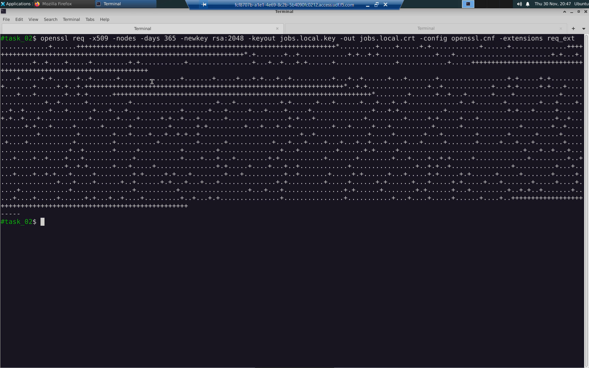
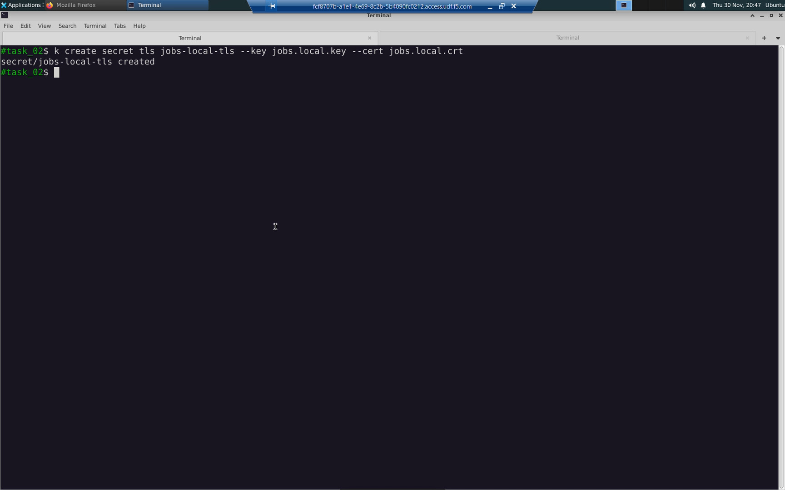
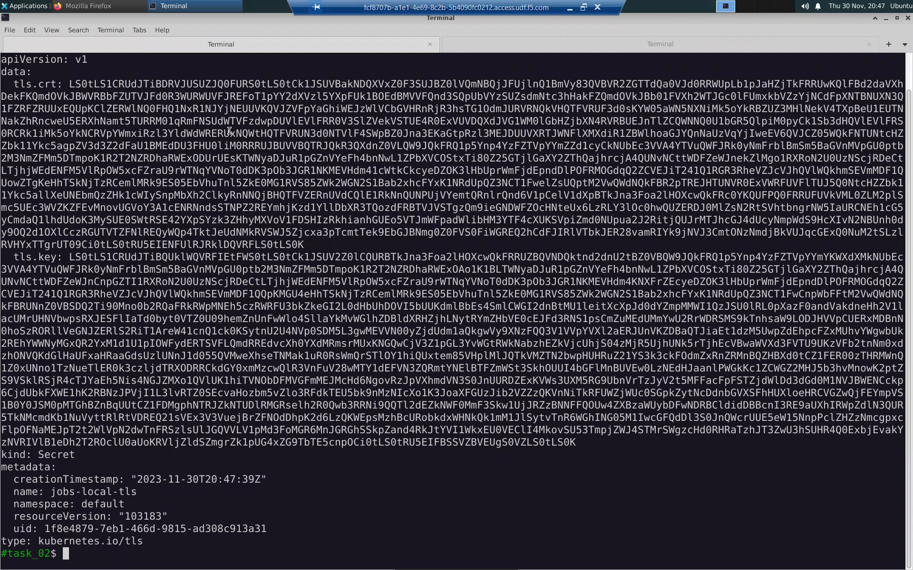
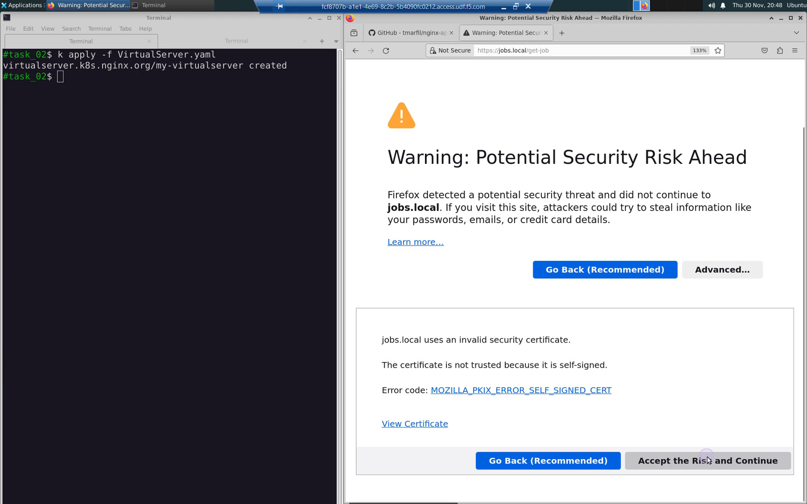
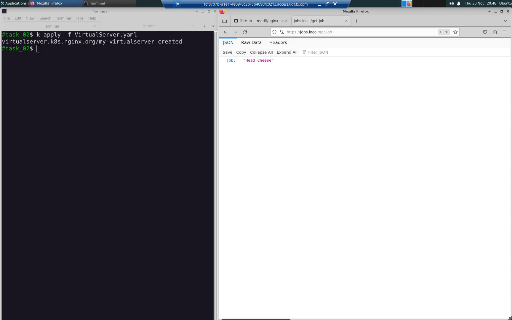

Task 02: Create https://jobs.local/get-job API endpoint
=======================================================

Change to the task_02 directory.

.. code-block:: bash

   cd ../task_02

Create a TLS certificate and key for the https://jobs.local/get-job api endpoint we plan to create.

.. code-block:: bash

   openssl req -x509 -nodes -days 365 -newkey rsa:2048 -keyout jobs.local.key -out jobs.local.crt -config openssl.cnf -extensions req_ext

Create a K8s secret to store the TLS certificate and key.

.. code-block:: bash

   kubectl create secret tls jobs-local-tls --key jobs.local.key --cert jobs.local.crt

Confirm the K8s secret was created.

.. code-block:: bash

   kubectl get secret jobs-local-tls -o yaml

All Kubernetes admins are familiar with native K8s resources such as 'pods', 'deployments', and 'services', but what is a 'virtualserver'? A virtualserver is a K8s Custom Resource Definition (CRD) used to configure NGINX ingress. Custom Resource Defnitions extend the Kubernetes system to support new resource types. We will create the virtualserver named "my-virtualserver" here for the first time. The properties for "my-virtualserver" are in the `VirtualServer.yaml` manifest. We will build all of the advanced API gateway functionality by layering them one-by-one, each time applying a modified, more capable version of the `VirtualServer.yaml` manifest that we start with here. 

.. code-block:: bash

   bat VirtualServer.yaml
   k apply -f VirtualServer.yaml

Confirm the status of the virtualserver 'my-virtualserver' you just created.

.. code-block:: bash

   kubectl describe virtualserver my-virtualserver

Our environment now looks like this:

.. table::
   :class: custom-table

   +----------------------------+----------------------------------+
   | Outside K8s Cluster        | Inside K8s Cluster               |
   +============================+==================================+
   | https://jobs.local/get-job | http://eclectic-jobs:3000/       |
   +----------------------------+----------------------------------+
   | https://jobs.local/add-job | http://eclectic-jobs:3000/add-job|
   +----------------------------+----------------------------------+

From the URL bar of the web browser, connect to the new API endpoint: ``https://jobs.local/get-job``
Skip the **Warning: Potential Security Risk Ahead** self-signed certificated warning by clicking on [Advanced...] => [Accept the Risk and Continue].

The API endpoint ``https://jobs.local/get-job`` is ready to receive API GET requests.
The API endpoint ``https://jobs.local/add-job`` is ready to receive API POST requests.

