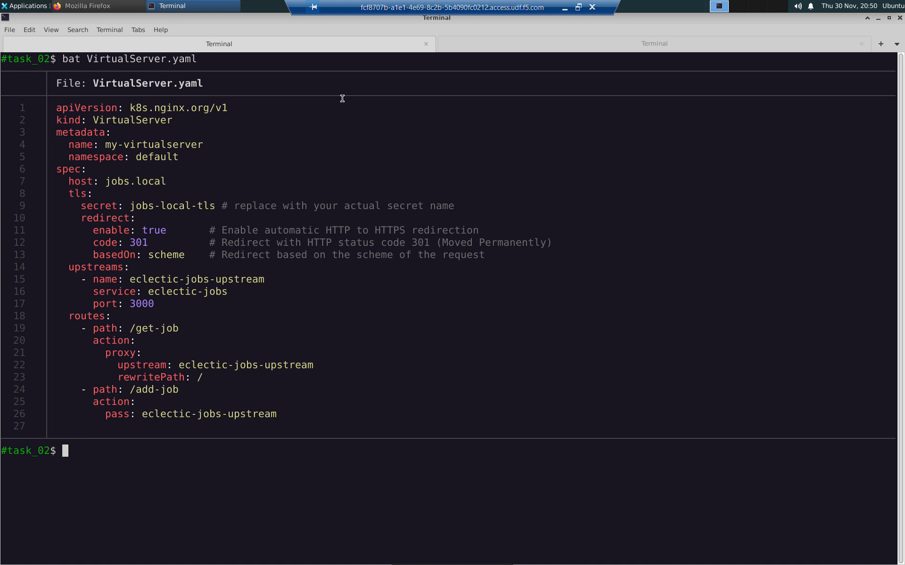
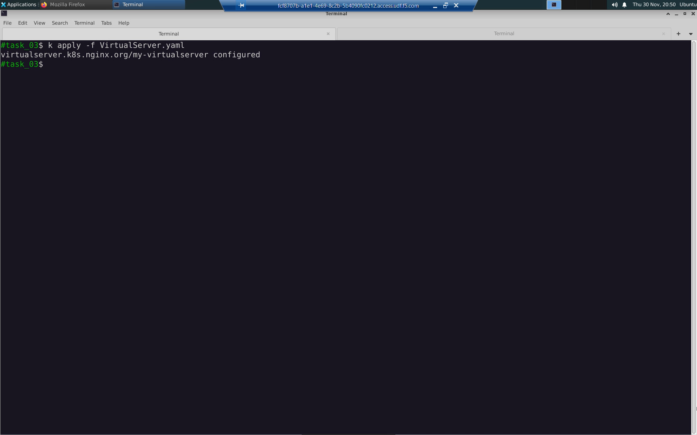
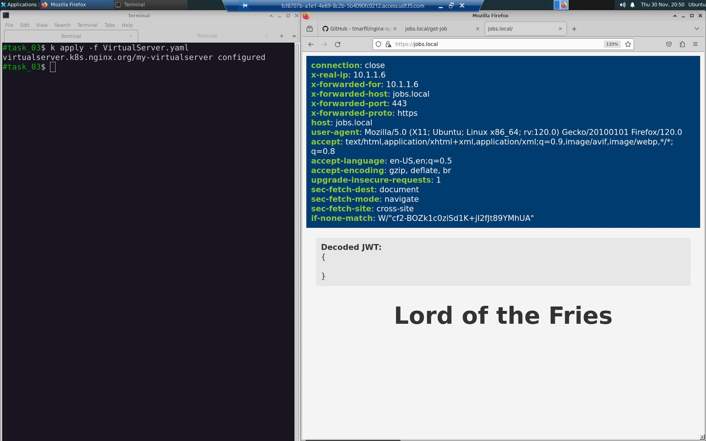

Task 03: Complete the https://jobs.local application
====================================================

Change to the task_03 directory.

.. code-block:: bash

   cd ../task_03

Review the modified `VirtualServer.yaml` manifest.

.. code-block:: bash

   bat VirtualServer.yaml

.. code-block:: bash

   k apply -f VirtualServer.yaml

Our environment now looks like this:

.. table::
   :class: custom-table

   +----------------------------+----------------------------------+
   | Outside K8s Cluster        | Inside K8s Cluster               |
   +============================+==================================+
   | https://jobs.local/get-job | http://eclectic-jobs:3000/       |
   +----------------------------+----------------------------------+
   | https://jobs.local/add-job | http://eclectic-jobs:3000/add-job|
   +----------------------------+----------------------------------+
   | https://jobs.local/        | http://myapp:3000                |
   +----------------------------+----------------------------------+

From the URL bar of the web browser, connect to the web application: ``https://jobs.local``.

How does this work?

  - The client requests ``https://jobs.local``
  - The request resolves to GET https://10.1.1.4:443 /
  - The request is received by the NGINX Plus ingress
  - The NGINX Plus ingress terminates TLS and then HTTP routes URL path '/' to the myapp service 
  - Embedded Javascript in the response HTML fetches a random job title from the ``https://jobs.local/get-job`` API endpoint
  - The NGINX Plus ingress rewrites URL path '/get-job' to '/' before sending to the eclectic-jobs service
  - The ``https://jobs.local`` web application styles and renders the JSON response from ``https://jobs.local/get-job``

  
Press the [F5] key a few times to refresh the random job title and confirm the web application / api integration is working.

