Task 04: OpenAPI Spec Enforcement with NGINX App Protect
========================================================

Our API has two endpoints:

- ``https://jobs.local/get-job`` is used to GET a random job title.
- ``https://jobs.local/add-job`` is how we add more jobs titles and will accept an HTTP POST with a list of job titles in JSON format. For example:

.. code-block:: yaml

   ["Junior Analyst", "Site Reliability Engineer"]
   
In the URL bar of the web browser, connect to the ``https://jobs.local/get-job`` API endpoint.

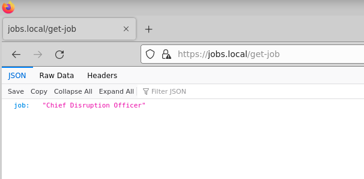

- Press [F12] to reveal the Firefox Developer Tools
- Select "Network"

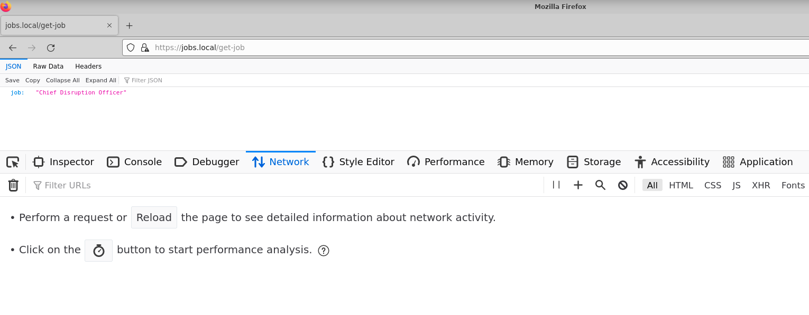

- Press [F5] to create a new HTTP requestor
- click and highlight the document "get-job"
- Select 'Response' just like the screenshot below 

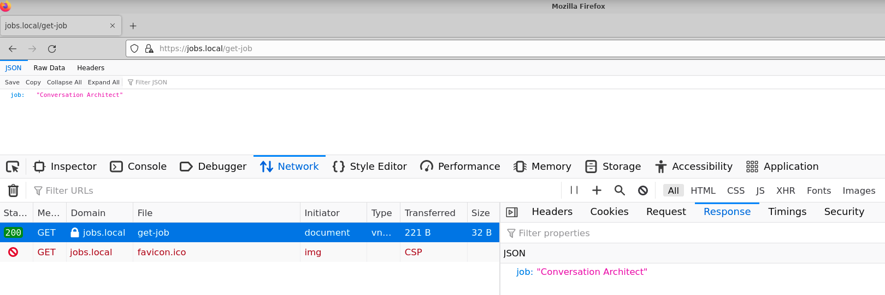

- Right-click on the 'get-job' request just like in the screenshot below
- Select 'Edit and Resend'

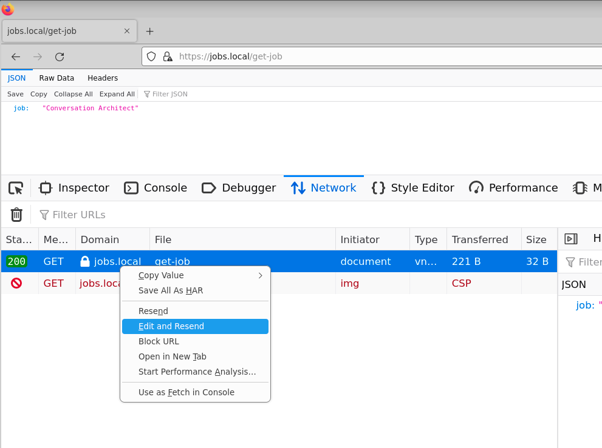

- On the left-hand side, in the 'New Request' section, select [Clear]

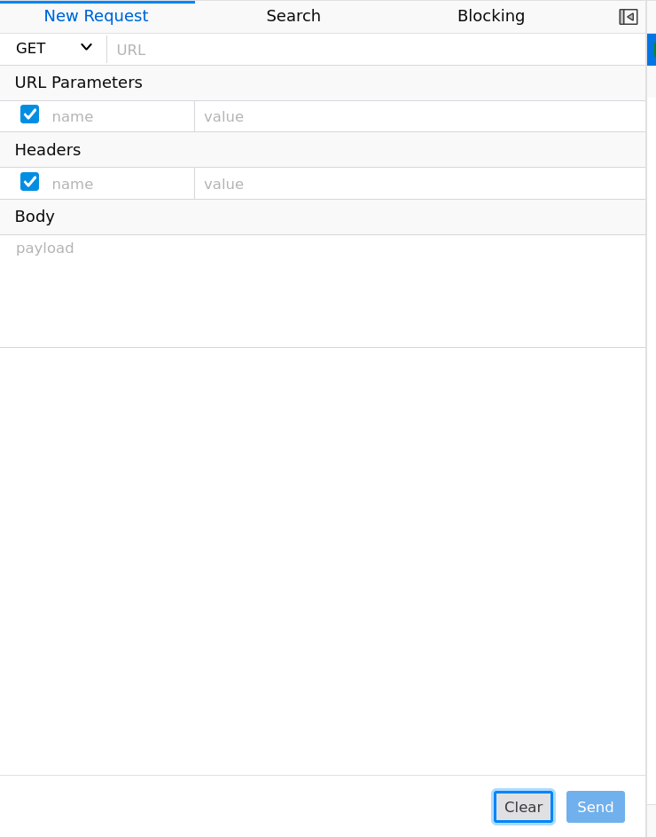

- Fill in the values just like the table below

+---------------------------------+----------------------------+
| New Request                     |                            |
+=================================+============================+
| POST                            | https://jobs.local/add-job |
+---------------------------------+----------------------------+
| *Headers*                       |                            |
+---------------------------------+----------------------------+
| Content-Type                    | application/json           |
+---------------------------------+----------------------------+
| *Body*                          |                            |
+---------------------------------+----------------------------+
| [\"Professional Skateboarder\"] |                            |
+---------------------------------+----------------------------+

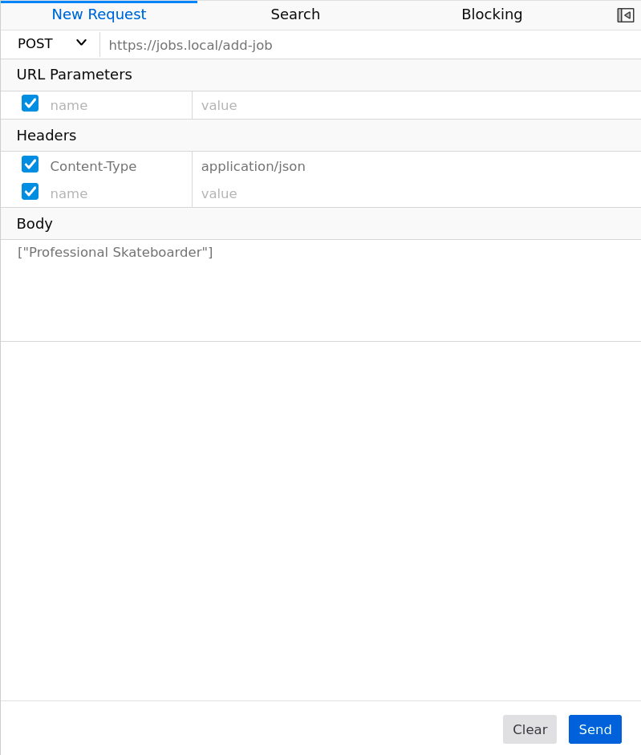

Click [Send]

The **Response** on the right-hand side will be a JSON formatted list of strings representing a list of jobs.
Go ahead and add a append to the list with more fun jobs. You can send multiple jobs at once: ["job1", "job2", "job3"].

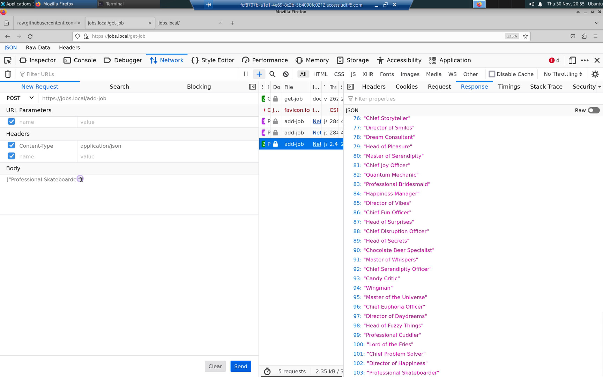
  
However, there is a problem with our ``https://jobs.local/add-job`` API endpoint.

Append new values to the list of job titles by POSTing a bad payload to ``https://jobs.local/add-job``. For example, an array of non-string types: [42, true].

The API will accept anything! We need to enforce the API schema so only valid requests are allowed.

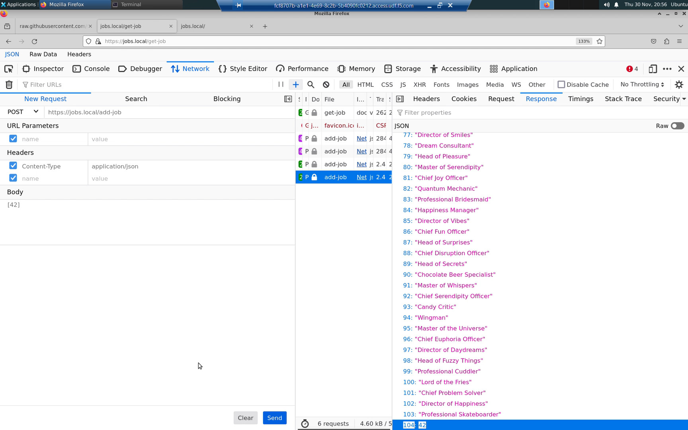

Change to the task_04 directory.

.. code-block:: bash

   cd ../task_04

An `OpenAPI Spec <https://en.wikipedia.org/wiki/OpenAPI_Specification>`_ is a standard that defines the schema of a REST API. In an OpenAPI Spec file, we can define the allowable endpoints (/get-job, /add-job), methods (GET /get-job, POST /add-job) and value types (POST /add-job must be an array of strings). NGINX Plus App Protect can convert OpenAPi Spec files into enforceable Web Appliation Firewall (WAF) policies.

Review the OpenAPI spec file for our /get-job and /add-job API endpoints:

.. code-block:: bash

   bat jobs-openapi-spec.yaml

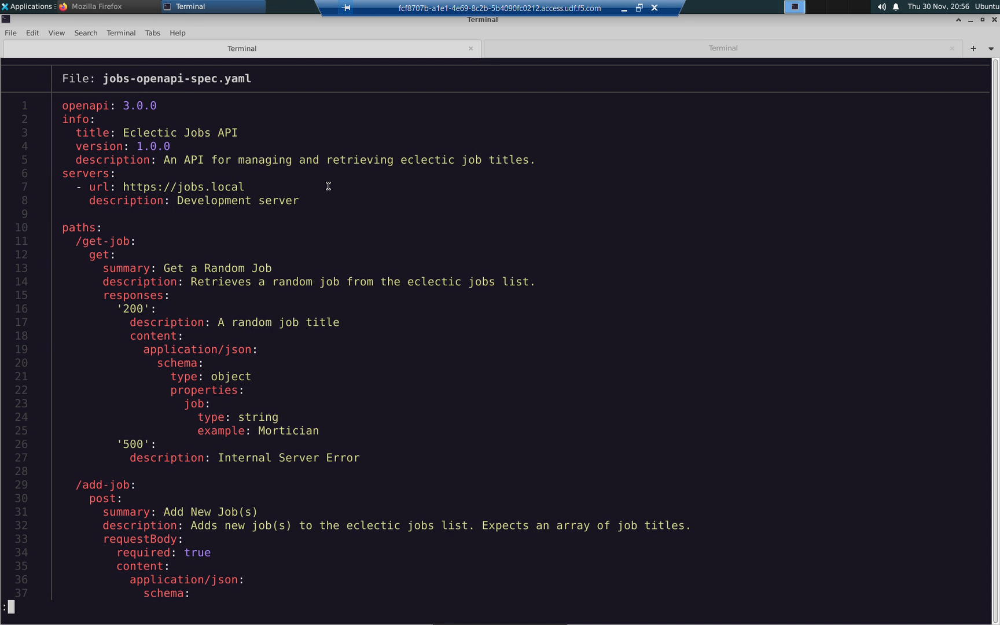

The `jobs-openapi-spec.yaml <https://raw.githubusercontent.com/tmarfil/nginx-api-gateway-for-k8s/main/task_04/jobs-openapi-spec.yaml>`_ is hosted on GitHub.

Create an ``appolicy`` Custom Resource Definition (CRD). NGINX Plus App Protect includes a WAF policy template. You only need to reference your OpenAPI Spec link from this template.

.. code-block:: bash

   bat jobs-openapi-spec-appolicy.yaml

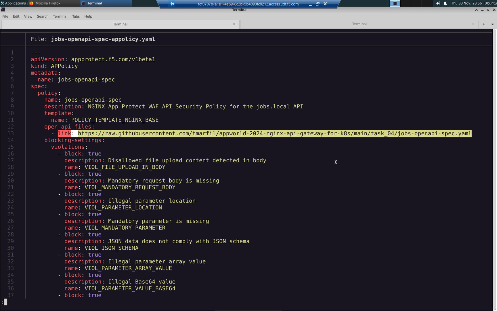

.. code-block:: bash

   k apply -f jobs-openapi-spec-appolicy.yaml

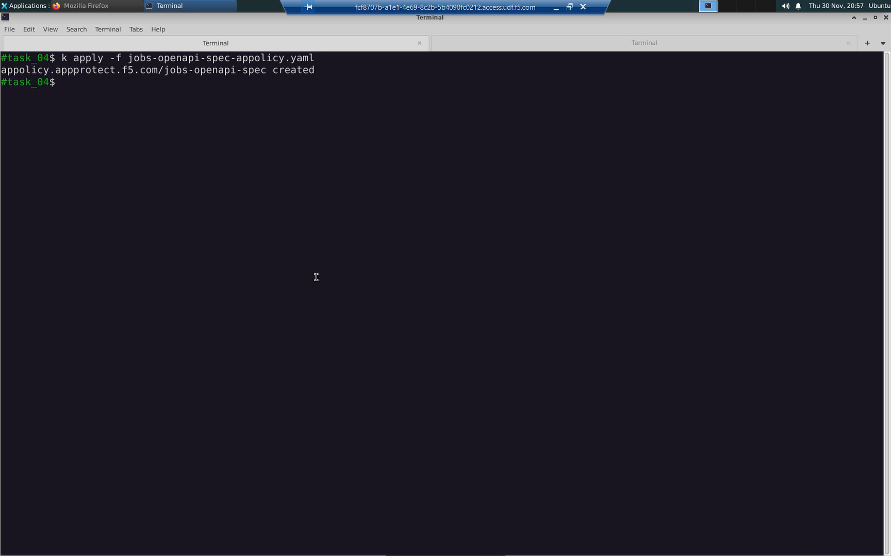

Create a ``policy`` Custom Resource Definition (CRD). The ``policy`` CRD references the ``appolicy`` CRD.

.. code-block:: bash

   bat app-protect-policy.yaml

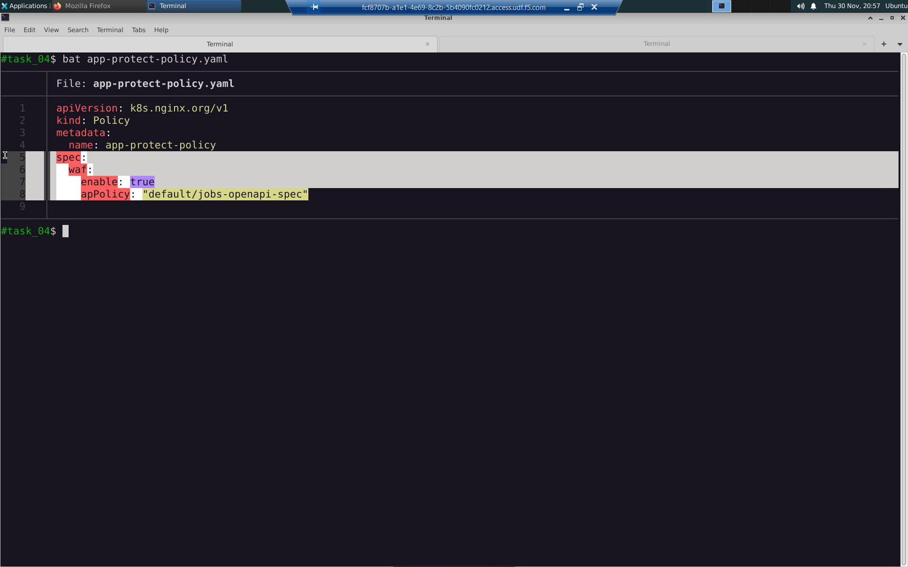

.. code-block:: bash

   k apply -f app-protect-policy.yaml

Apply the modifed virtualserver CRD. Note how the ``/add-job`` path now has the ``app-protect-policy`` applied.

.. code-block:: bash

   bat VirtualServer.yaml

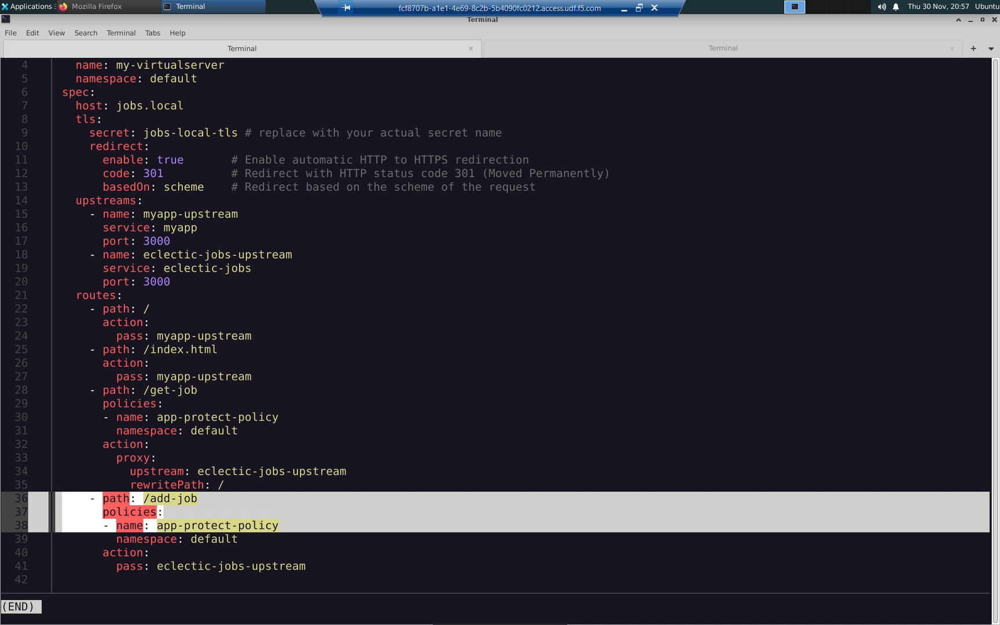

.. code-block:: bash

   k apply -f VirtualServer.yaml

If you now try to POST a payload that does not conform to the spec, it will be rejected and the supportID will be displayed in the response.

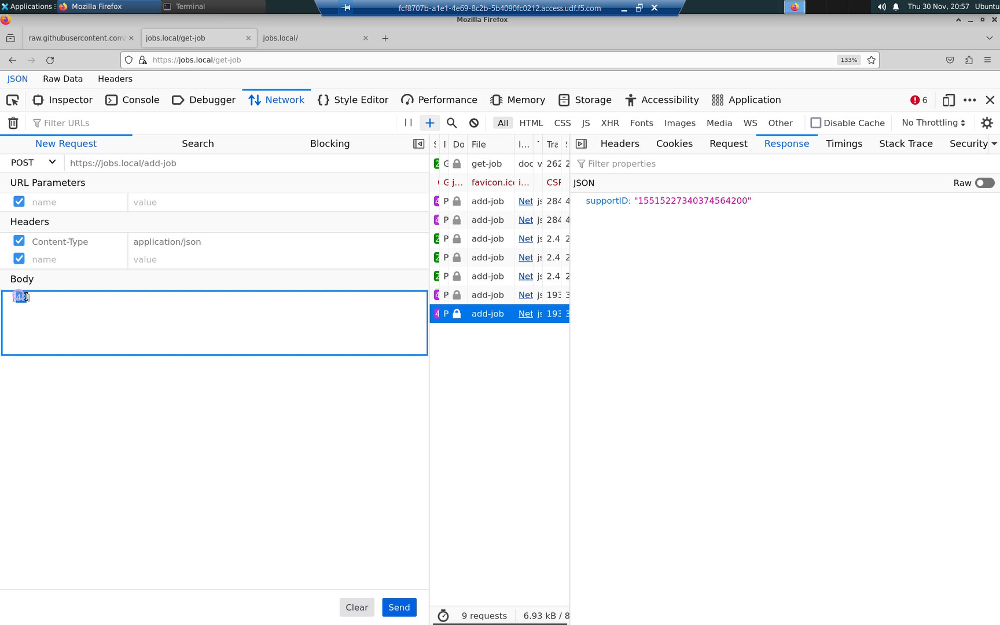

However, valid POST payloads (array of strings representing job titles) are still allowed.

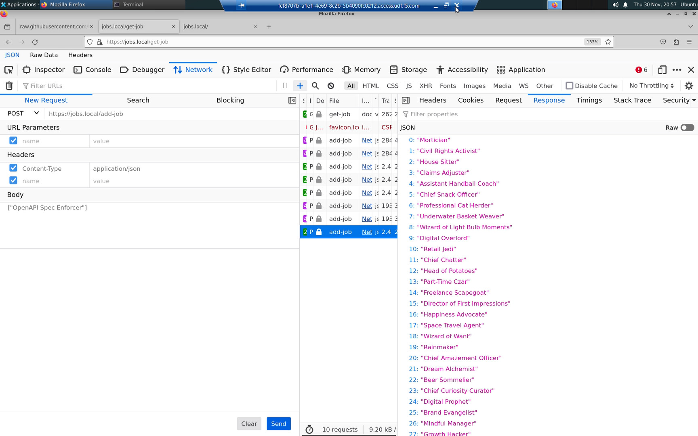

