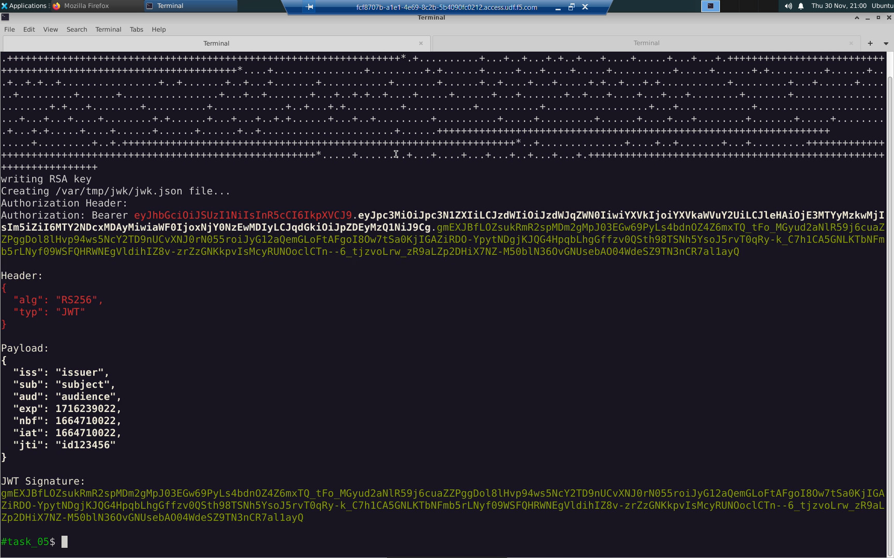
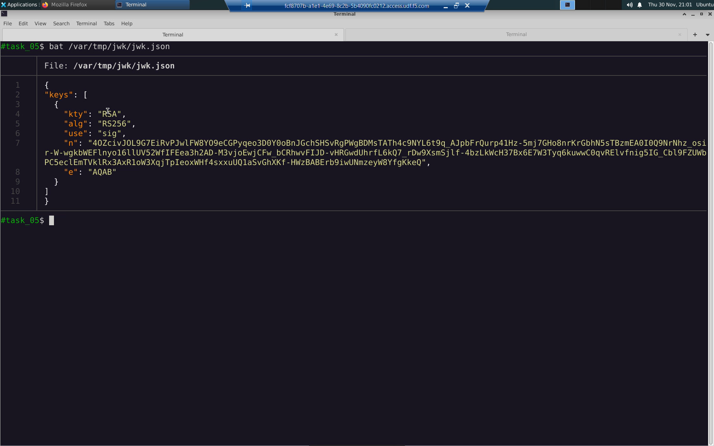
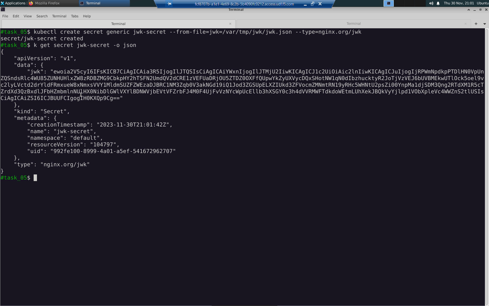
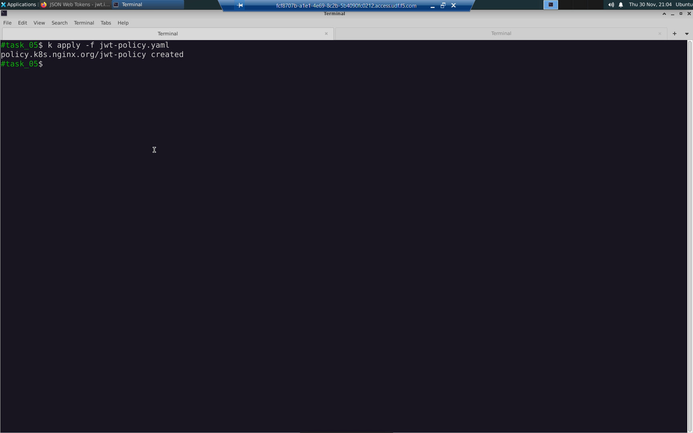
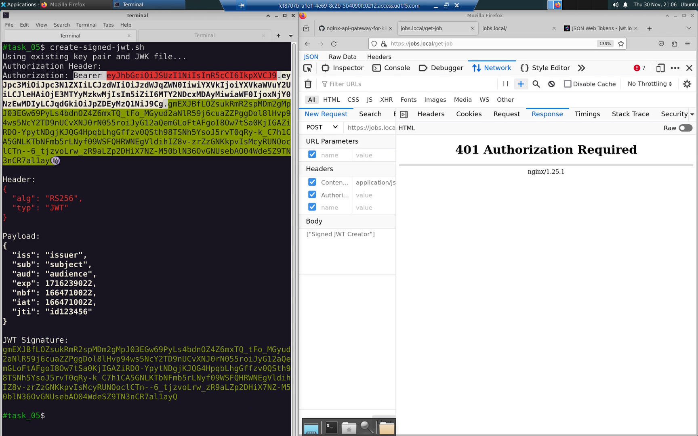
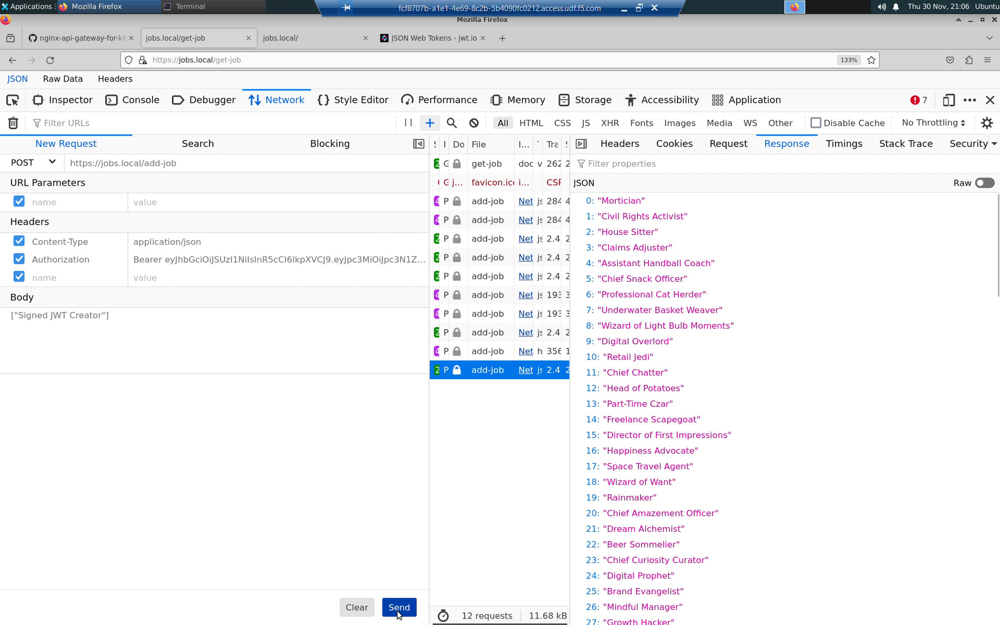
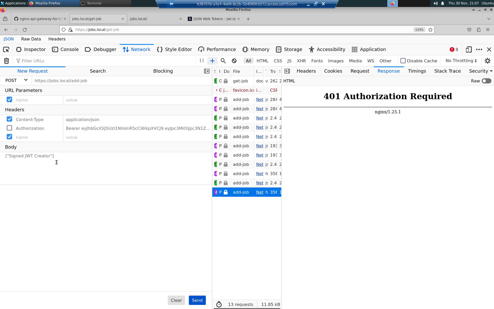

Task 05: Authorization - Signed JSON Web Token (JWT) Validation
===============================================================

The ``https://jobs.local/add-job`` API endpoint is not authorizing users and will accept changes from anyone. In this task, we restrict access to authorized users only.

The most common method to authorize API users is via an "Authorization" HTTP header in the format:

+--------------+---------------------------------+
| Authorization| Bearer <base64 encoded JWT>     |
+--------------+---------------------------------+

The <base64 encoded JWT> is a base64 encoded string that can be decoded to reveal three parts.

+----------------+---------------------------------------------------------------+
| JWT Header     | algorithms used for signing                                   |
+----------------+---------------------------------------------------------------+
| JWT Payload    | a series of claims                                            |
+----------------+---------------------------------------------------------------+
| JWT Signature  | signature validating the contents have not been tampered with |
+----------------+---------------------------------------------------------------+

A JWT is identification the API client/user will present to the API gateway to assert their identity.

Change to the task_05 directory.

.. code-block:: bash

   cd ../task_05

Create an RSA public and private key pair and then create a signed JWT.
The private key is used to sign the JWT.
The public key will be used to validate the JWT signature.

.. code-block:: bash

   create-signed-jwt.sh

.. image:: images/01_signed_jwt.jpg
  :scale: 50%

.. code-block:: bash

   create-signed-jwt.sh

.. attention::

   The ``create-signed-jwt.sh`` command is idempotent. You can run it as many times as you need when looking for JWT values in future tasks.
   
.. code-block:: bash

   create-signed-jwt.sh
   create-signed-jwt.sh
   create-signed-jwt.sh

The output of ``create-signed-jwt-sh`` is presented in two formats:

- Authorization Bearer: <base64 encoded string>. This is the value expected in an HTTP "Authorization" header.

- Human redable Base64 decoded Header, Payload, and JWT Signture components.

The public key used to validate the JWT must be converted to a JSON formatted array of JSON Web Keys (JWK). The create-signed-jwt.sh script has prepared this as well.

.. code-block:: bash

   bat /var/tmp/jwk/jwk.json

Create a K8s secret to store the JSON Web Keys (JWK).

.. code-block:: bash

   kubectl create secret generic jwk-secret --from-file=jwk=/var/tmp/jwk/jwk.json --type=nginx.org/jwk
   kubectl get secret jwk-secret -o yaml

Create a Policy Custom Resource Definition (CRD) with property ``spec.jwt`` and reference the ``jwk-secret`` we just created.

.. code-block:: bash

   bat jwt-policy.yaml

.. image:: images/05_bat_jwt-policy.jpg
  :scale: 50%

.. code-block:: bash

   kubectl apply -f jwt-policy.yaml

The VirtualServer.yaml manifest has been modified. The /add-job path now has the ``jwt-policy`` applied to enable JWT validation.
Apply the modified VirtualServer.yaml.

.. code-block:: bash

   bat VirtualServer.yaml
   kubectl apply -f VirtualServer.yaml

Copy to the clipboard the value of the "Authorization" header in the output of ``create-signed-jwt.sh``.

.. code-block:: bash

   create-signed-jwt.sh
   

You may have already prepared this step in the previous task. If so, skip these instructions and just create the "Authorization" header as shown in the table and screenshot below.

In the URL bar of the web browser, connect to the ``https://jobs.local/get-job`` API endpoint.

- Press [F12] to reveal the Firefox Developer Tools
- Select 'Network' and 'Response' just like the screenshot below 
- Press [F5] to create a new HTTP request
- Right-click on the 'add-job' request just like in the screenshot below
- Select 'Edit and Resend'
- On the left-hand side, in the 'New Request' section, select [Clear]
- Fill in the values just like the table below

Copy and paste the value of the "Authorization" header just like the table and screenshots below. Replace the <base64 encoded JWT> placeholder.

+------------------------------------------------+
| New Request                                    |
+==============+=================================+
| POST         | https://jobs.local/add-job      |
+--------------+---------------------------------+
| *Headers*                                      |
+--------------+---------------------------------+
| Content-Type | application/json                |
+--------------+---------------------------------+
| Authorization| Bearer <base64 encoded JWT>     |
+--------------+---------------------------------+
| *Body*                                         |
+------------------------------------------------+
| ["Professional Skateboarder"]                  |
+------------------------------------------------+

With the "Authorization" header on/enabled, you can POST new jobs to the ``https:/jobs.local/add-job`` API endpoint.

Toggle the "Authorization" header off/disabled, and you will be rejected with a "401 Authorization Required" HTTP error message.

