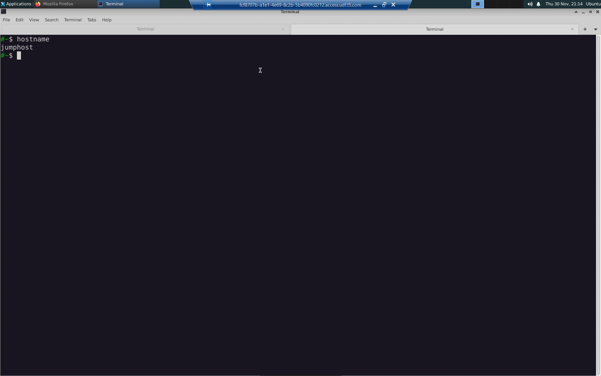
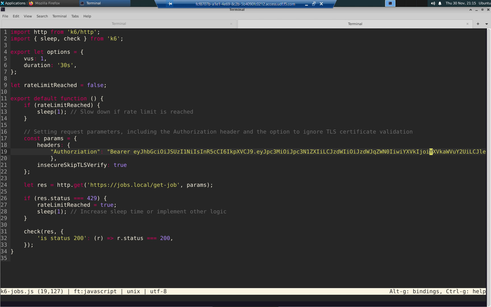
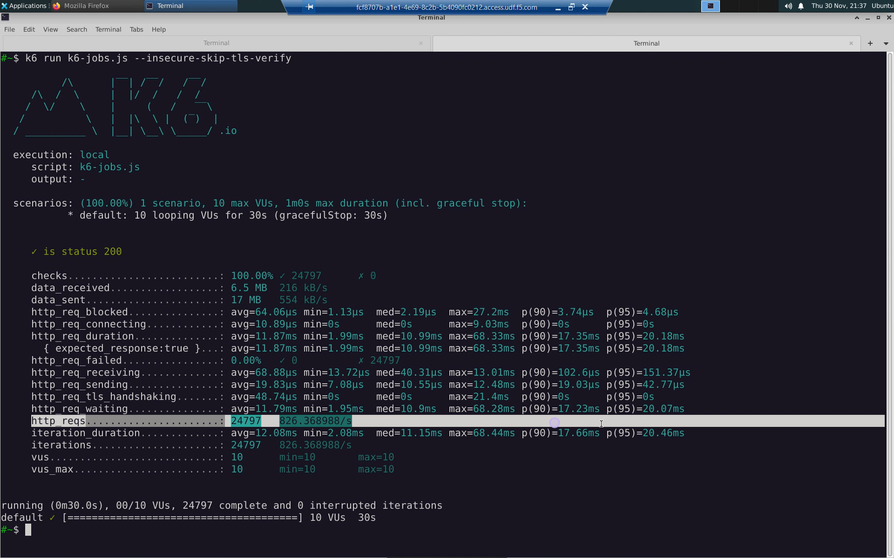
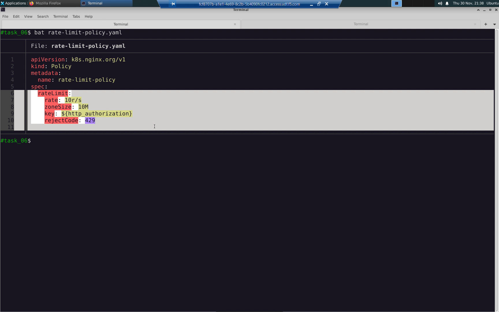
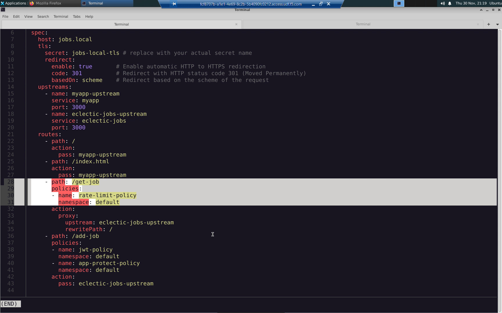
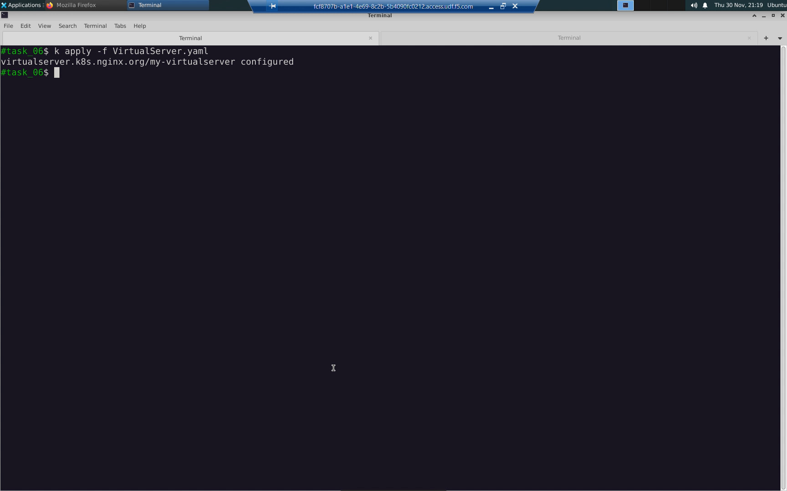
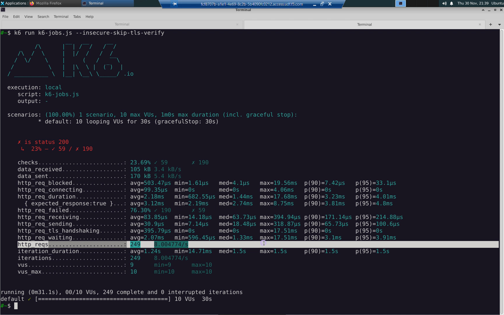

Task 06: API Request Rate-Limiting
==================================

In order to ensure fair use of our API, we need to protect against a single user crowding out other users.

NGINX Plus can rate-limit the API requests of a single user. The rate-limit policy can be keyed to their "Authentication" header.

Open a new terminal tab. We will run an HTTP load test from the jumphost to the ``https://jobs.local/get-job`` API endpoint to confirm the rate-limit policy is working.

.. code-block:: bash

   hostname
   
The reponse should be: ``jumphost``.

You should now have two terminal tabs open:

- [Tab #1] microk8s1
- [Tab #2] jumphost

From jumphost, download the performance test script.

.. code-block:: bash

   wget https://raw.githubusercontent.com/tmarfil/nginx-api-gateway-for-k8s/main/jumphost/k6-jobs.js
   
From microk8s1, lookup your JWT token.

.. code-block:: bash

   create-signed-jwt.sh

From jumphost, edit the HTTP load test script to include your JWT token in every request.

.. code-block:: bash

   micro k6-jobs.js

From jumphost, run the performance test.

.. code-block:: bash

   k6 run k6-jobs.js --insecure-skip-tls-verify

Note the row reporting *http_reqs*. These are the successfull HTTP requests made by the client.

From microk8s1, create a rate-limit policy. Our rate-limit policy will limit clients to 10 HTTP requests-per-second keyed to the Authorization HTTP header. You can key the rate-limit policy to client IP address, any arbitrary HTTP header, and more.

.. code-block:: bash

   bat rate-limit-policy.yaml

.. list-table::
   :widths: 25 25 50
   :header-rows: 1

   * - rateLimit
     -
     -
   * - Property Name
     - Value
     - Comments
   * - rate
     - 10r/s
     - 10 requests per second
   * - zoneSize
     - 10M
     - 10 MegaBytes
   * - key
     - \${http_authorization}
     - HTTP Authorization Header
   * - rejectCode
     - 429
     - Too Many Requests

.. code-block:: bash

   k apply -f rate-limit-policy.yaml

Modify ``my-virtualserver`` to reference the ``rate-limit`` policy. This has already been prepared for you in the lab.

.. code-block:: bash

   bat VirtualServer.yaml
   

  
.. code-block:: bash

   k apply -f VirtualServer.yaml
   

From jumphost, run an HTTP request load test with rate-limiting. When the client exceeds the requests per second specified in the rate-limit policy, it will receive a 429 "Too Many Requests" error. Our client is configured to be well behaved and will slow down the rate of requests. Note the ``http_reqs`` recorded under the rate-limit policy will be roughly ~10/s.

.. code-block:: bash

   k6 run k6-jobs.js --insecure-skip-tls-verify

