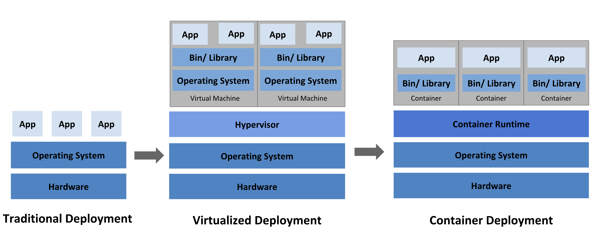

The Path to Understanding Kubernetes and Containers - Intro
-----------------------------------------------------------

Purpose:

*Containers* slightly resemble virtual machines. In that, they contain file systems, all necessary libraries, and will use portions of memory and compute
from the host. Containers can allow you to build and move applications nearly anywhere and are usually lightweight. Being that they are lightweight, 
this allows you to maintain different environments (dev, qa, production) and have full application functionality.

*Kubernetes* originates from Greek, meaning pilot or helmsman. It's an open source platform used in managing containerized workloads and services. Kubernetes
is an *orchestration* tool ensuring containerized workloads are available and scalable. And since its power is in orchestration this relieves admins from the burden
of many manual processes to keep applications available and push updates.

What Kubernetes is **NOT**:
 - Hypervisor or Operating System
 - Replacement for container runtime (i.e. Docker)
 - Just for Microservices
 - Standalone solution

What Kubernetes **IS**:
 - Orchestration Platform (ensuring workloads are available/scalable)
 - Ideal for microservices 
 - Enables *cloud native* application design

The evolution of applications from baremetal servers, to virtual servers and now containers. Each one of these technologies serves its purpose and moving to the latest and greatest
is not always the answer. There are, however, some definite advantages to a container based environment. In the *Container Deployment* image you can see we are no longer
bound to the operating system, you can set resource limits per container and application dependencies are all built with the container image. Since the container houses
the application and its dependencies, this allows for easier upgrades and security fixes to your application.

Official Kubernetes Documentation
---------------------------------

Feel free to use the official documentation to clarify information or dive deeper in this lab:

- `Kubectl Commands <https://kubernetes.io/docs/reference/generated/kubectl/kubectl-commands>`_
- `Kubernetes Documentation <https://kubernetes.io/docs/home/>`_
- `Kubernetes Nodes <https://kubernetes.io/docs/concepts/architecture/nodes/>`_
- `Kubernetes Custom Resource <https://kubernetes.io/docs/concepts/extend-kubernetes/api-extension/custom-resources/>`_

Lab Inventory
-------------

.. list-table:: 
  :header-rows: 1

  * - **Instance**
    - **IP Address**
    - **OS**
    - **NGINX Services**
    - **Apps/Protocols**
  * - k3s Leader Node
    - 10.1.1.5
    - Ubuntu 20.04 LTS
    - NIC
    - SSH, k3s
  * - k3s Worker Node 1
    - 10.1.1.6
    - Ubuntu 20.04 LTS
    - NIC
    - SSH, k3s, Arcadia Finance
  * - k3s Worker Node 2
    - 10.1.1.7
    - Ubuntu 20.04 LTS
    - NIC
    - SSH, k3s, Arcadia Finance
  * - NGINX Plus 1
    - 10.1.1.8
    - Ubuntu 20.04 LTS
    - Plus + NAP
    - SSH
  * - NGINX Plus 2
    - 10.1.1.9
    - Ubuntu 20.04 LTS
    - Plus
    - SSH
  * - DevOps Tools
    - 10.1.1.10
    - Ubuntu 20.04 LTS
    - none
    - SSH

Accessing the Lab
-----------------

All of the procedures you'll be asked to accomplish will be done using a web shell. To access the web shell from the Jumphost client:

.. image:: images/jumphost_webshell.png
