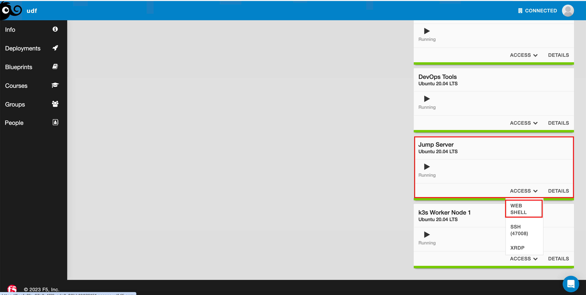

Container Components
====================

Containers are a lightweight, executable software package containing all the necessary code and its dependencies to run as a process on a host. Traditionally, applications
were run from bare metal or virtual machines atop an operating system. This meant that multiple applications could compete for resources and any changes to the operating system
could break dependencies for web servers and applications running on the host. This also meant that any upgrade was a long process to upgrade the OS, then test. Next 
upgrade the web server language dependencies, then test. Finally the application code could be upgraded and user acceptance testing could begin.

Containerization has greatly decreased the time it takes to roll-out new code (enhancements or fixes) to production. In the world of applications and application security, 
speed is still king. 

Later in this lab we will build a container, but first we will discuss some important things about containers. First, containers run as a process on the host system. They need 
a container runtime, such as Docker to run on. The runtime engine will validate the container's image and configuration. Secondly, your new container will share host network information
(i.e. DNS, routing/nat) and will ONLY have what you installed. Again, a container is not a full distro of an operating system. 

Building your container can be compared to making a layered cake. There needs to be a base image (Linux or Windows base images), then you can add on 
packages/libraries to allow your application to run. Containers can be *built* using a Dockerfile. In this file you'll define the base, packages needed, and important
necessary commands to be run. In Kubernetes it's **VERY** important to remember, containers only run while the default command executes, then they terminate. 

Let's look at some excerpts from our very own Nginx container. 

.. code-block:: bash 
   :caption: Nginx Dockerfile 

   FROM debian:bookworm-slim

   EXPOSE 80

   CMD ["nginx", "-g", "daemon off;"]

The above excerpt tells us our container has a base image **FROM** Debian Linux and is a particular slimmed down version of Debian. To communicate 
with the container, you'll need to **EXPOSE** ports and this is that command (ports can be TCP or UDP). The **CMD** (command) is turning the Nginx daemon off so it will run in the foreground so it will not stop. 

In this lab, we will build a custom container image using *Podman*. Podman is similar to Docker for many tasks but does not have licensing constraints.
First, access the Jumphost via Web Shell 

To save on time, some of the files have been built for you. From the web shell, change directory to **lab1** ``cd lab1``. Within this directory you can 
see two of the necessary files. *web.conf* and *index.html*. It will now be up to you to create the Dockerfile that will make our new Nginx container.
To edit the file, you'll need to open the file in an editor ``vim Dockerfile``. To enter *interactive* mode press ``i``. You should now see **INSERT** in the
bottom left of your web shell.

.. image:: images/interactive.png

.. code-block:: bash 
   :caption: Dockerfile 

   FROM nginx
   RUN rm -f /etc/nginx/conf.d/default.conf

   COPY web.conf /etc/nginx/conf.d/web.conf
   COPY index.html /usr/share/nginx/html/index.html
   EXPOSE 83/tcp

To close and save the file please press ``ESC`` (escape key) use the command ``:wq``. If you make a mistake and would like to exit vim without saving, press the ``ESC`` key and use this command ``:q!``

Copying this text in the blank Dockerfile file, you'll:

- **Build** a custom container creation from the base Nginx image.
- The **RUN** command will execute a command, we will delete the default configuration shipped on all Nginx instances.
- The **COPY** command will allow us to place files inside the container image to be available at run time (web.conf, index.html).
- The **EXPOSE** command allows us to expose additional ports on the container.

Now to build and tag the new container. Podman will take the Dockerfile and other referenced files (web.conf, index.html) and build them into our new 
container image.

.. note:: You will want to copy the below command exactly to include the period ``.``

.. code-block:: bash
   :caption: Podman Build

   podman build -t appworld:v1 .

As your image is being built, let's cover the command being run. We are telling podman to build a new image and give it the tag *appworld:v1*. After the ``:`` (colon) is used for 
showing more specific version of the container build. You'll often hear this referred to as the *tag* version. If you do not supply a tag your container registry will assume 
*latest* is the tag to be used. The ``.`` (period) is simply telling podman the Dockerfile file is located in the same directory we are working from. 

Once the image is built, you can now run the command to list the images. You should see two images listed. This is because podman did not have the Nginx image
and had to download it first as it was our base. 

.. code-block:: bash 
   :caption: List Images

   podman images

Let's investigate the container images we now have:

.. list-table:: 
   :header-rows: 1

   * - **Repository**
     - **TAG**
     - **IMAGE ID**
     - **CREATED**
     - **SIZE**
   * - localhost/appworld
     - v1
     - 9d3b676be476
     - 6 days ago
     - 191 MB
   * - docker.io/library/nginx
     - latest
     - d453dd892d93
     - 2 months ago
     - 191 MB

| **Repository** show where the container came from
| **TAG** is the tag we set or with no tag set the default is *latest*
| **IMAGE ID** is a unique id assigned to the container
| **CREATED** 
| **SIZE** size of the container image

Now it is time to run our newly created container image. 

.. code-block:: bash
   :caption: Run Container

   podman run -p 83:83 --name app -dit appworld:v1

We'll cover in detail what the above command is doing. Podman is being instructed to ``-p`` (publish) the container on host port 83 and map it to container port 83, and give
our new container the ``--name`` (name) of *app*. The next flagged items are:

 - ``-d`` run the container detached, if we did not do this the terminal would reflect the prompt from inside the running container 
 - ``-i`` interactive - allows us to execute commands while the container is in a running state.
 - ``-t`` Pseudo-tty 
|
Once your container is running, you should see the container id like the below output.

.. code-block:: bash 
   :caption: Running Container

   root@ip-10-1-1-12:/# podman run -p 83:83 --name app -dit appworld:v1
   79869cbf10fe9424cafbc33a64af2ff812215b0bdad69379bb3d661360460628

We can now run this command to see all container (active and stopped)

.. code-block:: bash
   :caption: Show Containers

   podman ps -a

The above the command asks podman to list ``ps`` containers and ``-a`` shows all containers as the default is to only show running. You'll notice the continer id has been
truncated to the first 12 characters. If you'd like to see the full container id you can use this command: 

.. code-block:: bash
   :caption: Untruncated

   podman ps --no-trunc
|
Now you can use *curl* to test connectivity to our new container. 

.. code-block:: bash
   :caption: Curl Container

   curl http://localhost:83

Curl Output should look like this:

.. code-block:: bash 

   root@ip-10-1-1-12:/lab1# curl http://localhost:83
     <html>
     <head>
     <title>F5 AppWorld</title>
     </head>
     <body>
             First Page
             
Lab1 site for training.

     </body>
     </html>

Now that your container is running and a successful curl has completed, let's dig into the logs of the container. Running the below command will produce logs generated by the container.

.. code-block:: bash 
   :caption: Container Logs 

   podman logs app

The above command is asking podman to show logs for the container with the name of *app*, which we gave to our container when we started it.

Your log output should look like:

.. code-block:: bash 
   :caption: Container Logs
   :emphasize-lines: 20

   root@ip-10-1-1-12:/# podman logs app
   /docker-entrypoint.sh: /docker-entrypoint.d/ is not empty, will attempt to perform configuration
   /docker-entrypoint.sh: Looking for shell scripts in /docker-entrypoint.d/
   /docker-entrypoint.sh: Launching /docker-entrypoint.d/10-listen-on-ipv6-by-default.sh
   10-listen-on-ipv6-by-default.sh: info: /etc/nginx/conf.d/default.conf is not a file or does not exist
   /docker-entrypoint.sh: Sourcing /docker-entrypoint.d/15-local-resolvers.envsh
   /docker-entrypoint.sh: Launching /docker-entrypoint.d/20-envsubst-on-templates.sh
   /docker-entrypoint.sh: Launching /docker-entrypoint.d/30-tune-worker-processes.sh
   /docker-entrypoint.sh: Configuration complete; ready for start up
   2023/12/30 21:08:02 [notice] 1#1: using the "epoll" event method
   2023/12/30 21:08:02 [notice] 1#1: nginx/1.25.3
   2023/12/30 21:08:02 [notice] 1#1: built by gcc 12.2.0 (Debian 12.2.0-14) 
   2023/12/30 21:08:02 [notice] 1#1: OS: Linux 5.15.0-1051-aws
   2023/12/30 21:08:02 [notice] 1#1: getrlimit(RLIMIT_NOFILE): 1048576:1048576
   2023/12/30 21:08:02 [notice] 1#1: start worker processes
   2023/12/30 21:08:02 [notice] 1#1: start worker process 15
   2023/12/30 21:08:02 [notice] 1#1: start worker process 16
   2023/12/30 21:08:02 [notice] 1#1: start worker process 17
   2023/12/30 21:08:02 [notice] 1#1: start worker process 18
   10.88.0.1 - - [30/Dec/2023:21:08:20 +0000] "GET / HTTP/1.1" 200 117 "-" "curl/7.68.0" "-"

You can also follow the logs actively like you would any Linux system using the ``-f`` flag. An example would be ``podman logs -f app``.

This lab is not an all inclusive demonstration of building and running containers. There are many configurations you can construct from your Dockerfile, such as attaching storage. Some important 
security items to take note of is scanning your images. Scanning your images takes a deep look into the libraries/packages that make up your container and can help 
alert you to supply chain security vulnerabilities. Another security action to take is to limit the user being run inside the container. Otherwise in our container, you can get shell access as the root user.

This now concludes the Container section of this lab.