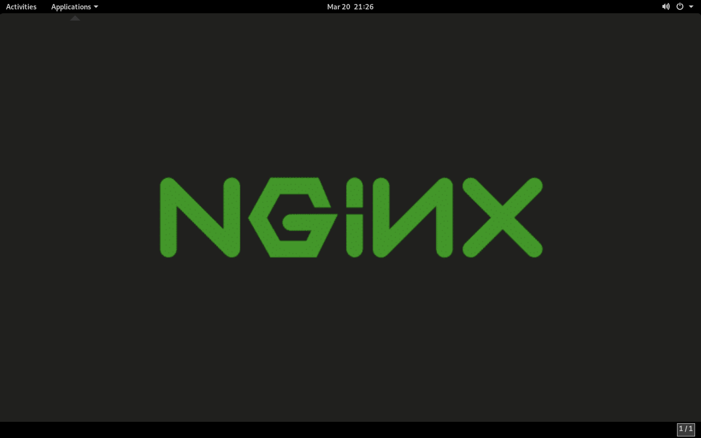
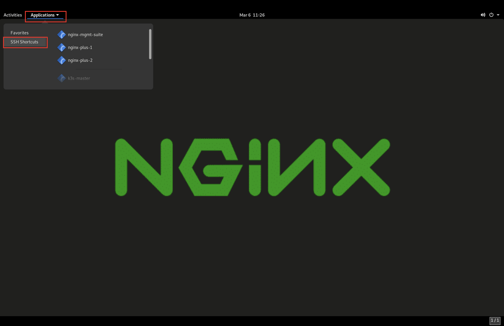

NGINX Kubernetes Overview
------------------------------

Lab Inventory
-------------

.. list-table:: 
  :header-rows: 1

  * - **Instance**
    - **IP Address**
    - **OS**
    - **NGINX Services**
    - **Apps/Protocols**
  * - k3s Master Node
    - 10.1.1.5
    - Ubuntu 20.04 LTS
    - NIC
    - SSH, k3s
  * - k3s Worker Node 1
    - 10.1.1.6
    - Ubuntu 20.04 LTS
    - NIC
    - SSH, k3s, Arcadia Finance
  * - k3s Worker Node 2
    - 10.1.1.7
    - Ubuntu 20.04 LTS
    - NIC
    - SSH, k3s, Arcadia Finance
  * - NGINX Plus 1
    - 10.1.1.8
    - Ubuntu 20.04 LTS
    - Plus + NAP
    - SSH
  * - NGINX Plus 2
    - 10.1.1.9
    - Ubuntu 20.04 LTS
    - Plus
    - SSH
  * - DevOps Tools
    - 10.1.1.10
    - Ubuntu 20.04 LTS
    - none
    - SSH

Accessing the Lab
-----------------

In this lab, you will access all resources by connecting to a Linux jump host running XRDP. XRDP is an open-source version of the popular Remote Desktop Protocol and is compatible with all popular RDP clients.

When you first connect to the Jump Host via RDP, you will be prompted to click **OK** to connect to the remote session.

.. image:: images/xrdp_login_prompt.png

Once connected, you will see the desktop as shown below.

Clicking on the **Applications** drop-down in the menu bar will bring up a list of applications you will need to finish this lab.

**Favorites** includes Firefox, Visual Studio Code and Terminal.

.. image:: images/desktop_favorites.png

**SSH Shortcuts** open SSH terminal windows to the command prompt of all machines in the lab.

Each section in this lab will begin with the assumption that you are connected via RDP, able to navigate the **Applications** menu and familiar with the available applications.

Remember these important tips:

- Lab modules are independent; feel free to tackle the modules in any order.
- The username **lab** and password **f5Appw0rld!** will work for every login unless specifically noted.
- Traffic and attack generators are running to help generate statistics, events and attacks.
- To paste text into the lab, right-click your mouse and select **Paste** as keyboard shortcuts are not consistent between applications.
- The screen resolution for the Remote Desktop connection is selected when conencting to the session. Choose a resolution that works best for you.

.. note:: To allow for easy reference back to this page, hold CTRL (Windows) or CMD (Mac) while clicking the **Next** button below to continue in a new tab.