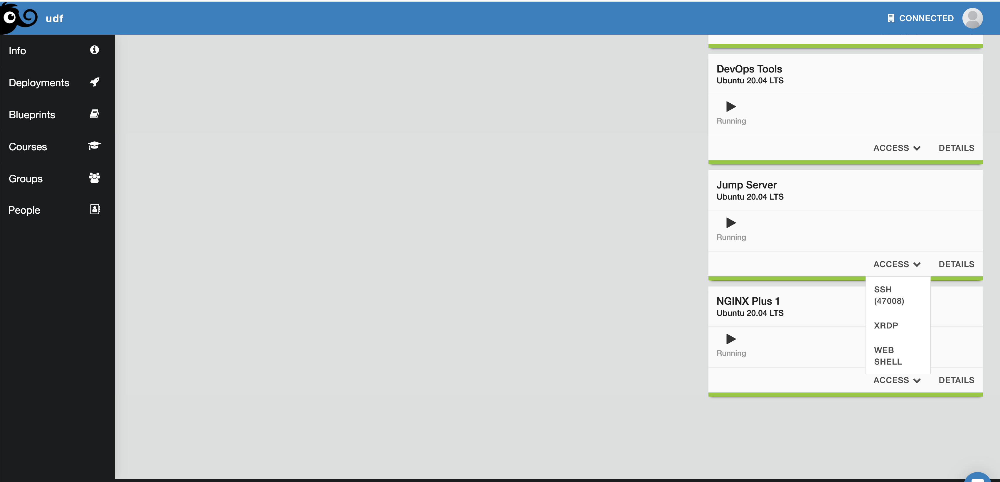

Kubernetes Components
=====================

Node
----

Nodes are the primary compent of a Kubernetes cluster. We will talk about the two types of nodes found in every cluster. A *worker node* and a *leader node*.
You will see the leader node referred to by different names (depending on documentation) but the process is all the same. Nodes can be bare metal, virtual
machines, or even containers (used in development use cases). Worker nodes will run your containerized workloads while the leader nodes will handle 
scheduling of where workloads will be deployed, configuration and state of the cluster. 

In this course, the cluster is already set up for you. You will communicate with the leader node to perform all actions for this course. The Kubernetes 
specific command-line tool you'll use is *kubectl*. Kubectl allows you to view, configure, inspect all aspects of the cluster.

Let's view the nodes attached to our cluster by connecting to the Jumphost from within the lab environment. 

.. code-block:: bash 
   :caption: Get node info

   kubectl get nodes 

Returned content:

.. code-block:: 
   :caption: Node data basic 

    NAME                       STATUS   ROLES                  AGE    VERSION
    k3s-leader.lab             Ready    control-plane,master   308d   v1.25.6+k3s1
    k3s-worker-2.lab           Ready    <none>                 308d   v1.25.6+k3s1
    k3s-worker-1.lab           Ready    <none>                 308d   v1.25.6+k3s1

That was very basic information on our nodes, but if we want more details we can add the `-o` flag, for *output*, and add *wide*

.. code-block:: bash 
   :caption: Get node info wide 

   kubectl get nodes -o wide

Returned content:

.. code-block:: 
   :caption: Node data wide 

    NAME                       STATUS   ROLES                  AGE    VERSION        INTERNAL-IP   EXTERNAL-IP   OS-IMAGE             KERNEL-VERSION    CONTAINER-RUNTIME
    k3s-leader.lab             Ready    control-plane,master   308d   v1.25.6+k3s1   10.1.1.5      <none>        Ubuntu 20.04.5 LTS   5.15.0-1030-aws   containerd://1.6.15-k3s1
    k3s-worker-2.lab           Ready    <none>                 308d   v1.25.6+k3s1   10.1.1.7      <none>        Ubuntu 20.04.5 LTS   5.15.0-1030-aws   containerd://1.6.15-k3s1
    k3s-worker-1lab            Ready    <none>                 308d   v1.25.6+k3s1   10.1.1.6      <none>        Ubuntu 20.04.5 LTS   5.15.0-1030-aws   containerd://1.6.15-k3s1

As you can see from the *-o wide* flag, we can get greater detail on our nodes. We can get further details by asking kubectl to *describe* the resource type and resource name.

.. code-block:: bash 
   :caption: Node describe 

   kubectl describe node k3s-leader.lab

Custom Resource Definitions (CRD)
----------------------------------

Namespaces
----------

In Kubernetes, namespaces provides a mechanism for isolating groups of resources within a single cluster. Names of resources need to be unique within a namespace, but not across namespaces.

Namespaces are intended for use in environments with many users spread across multiple teams, or projects. For clusters with a few to tens of users, you should not need to create or think about namespaces at all. Start using namespaces when you need the features they provide.

Namespaces provide a scope for names. Names of resources need to be unique within a namespace, but not across namespaces. Namespaces cannot be nested inside one another and each Kubernetes resource can only be in one namespace.

.. code-block:: bash 
   :caption: View All Namespaces

   kubectl get namespace

You can abbreviate resource types. The *namespace* resource can be abbreviated as **ns** as shown below.

.. code-block:: bash 
   :caption: View kube-system Namespaces

   kubectl describe ns kube-system

Pod
---

Deployment 
----------

Service
-------

How to determine A record 
- Loadbalancer
- ClusterIP
- NodePort
- Brief CNI 
