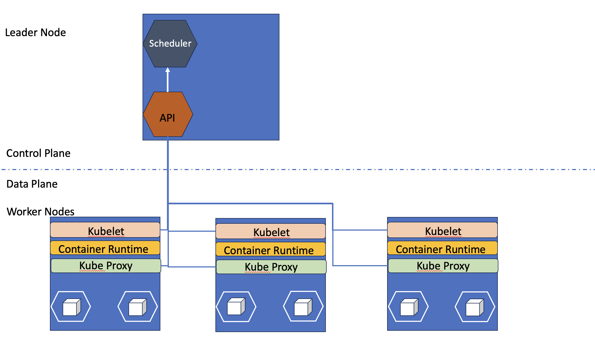
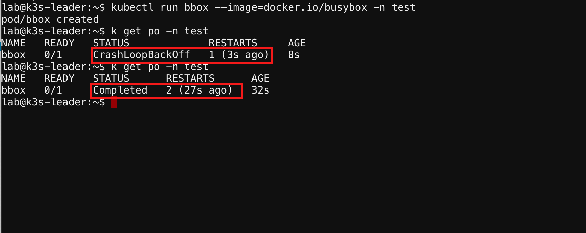

Kubernetes Components
=====================

Node
----

Nodes are the primary component of a Kubernetes cluster. We will talk about the two types of nodes found in every cluster. A *worker node* and a *leader node*.
You will see the leader node referred to by different names, such as master node (which is being removed), but the process is all the same. Nodes can be bare metal, virtual
machines, or even containers (used in development use cases). Worker nodes will run your containerized workloads while the leader nodes will handle 
scheduling of where workloads will be deployed, configuration and state of the cluster. 

In this course, the cluster is already set up for you. You will communicate with the leader node to perform all actions for this course. The Kubernetes 
specific command-line tool you'll use is *kubectl*. Kubectl allows you to view, configure, and inspect all aspects of the cluster.

Let's look at our two node types in detail.

The *Leader Node* is in charge of the cluster control plane. There must be at least, but not limited to, one leader node per cluster. Some of the components included in the leader
node are the API server and Scheduler. The API server validates and configures the cluster for all the cluster objects. This includes pods, services and deployments. The scheduler watches for newly created pods and determines the best matching node(s) to place the workload on. If there aren't any nodes 
matching the requirements of the pod, the pod will remain in an *unscheduled* state. 

The *Worker Node* is where our containerized workloads will run in our data plane. The worker nodes will need a container runtime engine (CRE) such as *Docker* or *containerd*
so our containers can be run. In order for the leader node to communicate to our worker node an agent called *Kubelet* must also run. Kubelet is responsible for pulling container 
images, allows control plane to monitor the node, and ensures containers are healthy and running. *Kube-proxy* is a network agent installed on every node and provides network 
forwarding to backend services. 

.. note:: Keep in mind that in a dev environment, your leader node may also be your worker node (not a production practice).

Let's view the nodes attached to our cluster by connecting to the Jumphost from within the lab environment. 

.. image:: images/jumphost_webshell.png

From the web shell you will ssh into the leader node:

| ``ssh lab@10.1.1.5``
| password: ``f5Appw0rld!``

.. code-block:: bash 
   :caption: Get node info

   kubectl get nodes 

Returned content:

.. code-block:: 
   :caption: Node data basic 

    NAME                       STATUS   ROLES                  AGE    VERSION
    k3s-leader.lab             Ready    control-plane,master   308d   v1.25.6+k3s1
    k3s-worker-2.lab           Ready    <none>                 308d   v1.25.6+k3s1
    k3s-worker-1.lab           Ready    <none>                 308d   v1.25.6+k3s1

That was very basic information on our nodes, but if we want more details we can add the `-o` flag, for *output*, and add `wide`

.. code-block:: bash 
   :caption: Get node info wide 

   kubectl get nodes -o wide

Returned content:

.. code-block:: 
   :caption: Node data wide 

    NAME                       STATUS   ROLES                  AGE    VERSION        INTERNAL-IP   EXTERNAL-IP   OS-IMAGE             KERNEL-VERSION    CONTAINER-RUNTIME
    k3s-leader.lab             Ready    control-plane,master   308d   v1.25.6+k3s1   10.1.1.5      <none>        Ubuntu 20.04.5 LTS   5.15.0-1030-aws   containerd://1.6.15-k3s1
    k3s-worker-2.lab           Ready    <none>                 308d   v1.25.6+k3s1   10.1.1.7      <none>        Ubuntu 20.04.5 LTS   5.15.0-1030-aws   containerd://1.6.15-k3s1
    k3s-worker-1lab            Ready    <none>                 308d   v1.25.6+k3s1   10.1.1.6      <none>        Ubuntu 20.04.5 LTS   5.15.0-1030-aws   containerd://1.6.15-k3s1

As you can see from the *-o wide* flag, we can get greater detail on our nodes. We can get further details by asking kubectl to *describe* the resource type and resource name.

.. code-block:: bash 
   :caption: Node describe 

   kubectl describe node k3s-leader.lab

Custom Resource
---------------

As the name implies, custom resources are objects you can build to extend capabilities in Kubernetes. You can create new resources that don't exist in the default
Kubernetes installation or even combine existing objects so they can be deployed at the same time. Imagine creating a custom Kubernetes API that could deploy your application
and expose it to the world in one manifest. That's what a CRD allows you to do. Throughout this course you'll be interacting with the Kubernetes 
API when we check on nodes, pods, namespaces etc. 

How you define the custom resource is by a Custom Resource Definition(CRD). This CRD will create a new RESTful endpoint that will be able to be utilized on either 
a namespace level or cluster level. 

Let's view the installed CRD's and we'll focus in on Nginx.

.. code-block:: bash
   :caption: CRD

   kubectl get crd

.. code-block:: bash
   :caption: CRD Output
   :emphasize-lines: 24

   lab@k3s-leader:~$ k get crd
   NAME                                         CREATED AT
   addons.k3s.cattle.io                         2023-02-23T02:26:32Z
   helmcharts.helm.cattle.io                    2023-02-23T02:26:32Z
   helmchartconfigs.helm.cattle.io              2023-02-23T02:26:32Z
   analysisruns.argoproj.io                     2023-02-23T03:39:17Z
   analysistemplates.argoproj.io                2023-02-23T03:39:17Z
   clusteranalysistemplates.argoproj.io         2023-02-23T03:39:17Z
   experiments.argoproj.io                      2023-02-23T03:39:17Z
   rollouts.argoproj.io                         2023-02-23T03:39:17Z
   applications.argoproj.io                     2023-02-23T04:18:30Z
   applicationsets.argoproj.io                  2023-02-23T04:18:30Z
   appprojects.argoproj.io                      2023-02-23T04:18:30Z
   apdospolicies.appprotectdos.f5.com           2023-02-25T20:46:34Z
   apdoslogconfs.appprotectdos.f5.com           2023-02-25T20:46:34Z
   globalconfigurations.k8s.nginx.org           2023-02-25T20:46:34Z
   aplogconfs.appprotect.f5.com                 2023-02-25T20:46:34Z
   transportservers.k8s.nginx.org               2023-02-25T20:46:34Z
   dosprotectedresources.appprotectdos.f5.com   2023-02-25T20:46:34Z
   dnsendpoints.externaldns.nginx.org           2023-02-25T20:46:34Z
   apusersigs.appprotect.f5.com                 2023-02-25T20:46:34Z
   policies.k8s.nginx.org                       2023-02-25T20:46:34Z
   virtualserverroutes.k8s.nginx.org            2023-02-25T20:46:34Z
   virtualservers.k8s.nginx.org                 2023-02-25T20:46:34Z
   appolicies.appprotect.f5.com                 2023-02-25T20:46:34Z

.. code-block:: bash
   :caption: Describe CRD

   kubectl describe crd virtualservers.k8s.nginx.org 

This CRD file defines how a user can employ the newly created resource with a full schema. If you are not familiar with schema's, think of it as syntax checking process to make sure newly created 
manifest files meet the defined specification to be deployed on the Kubernetes system. We will not be building any Custom Resources in this lab but knowing what Custom Resources are and that Custom
Resource Definitions describe them is valuable knowledge. This capability allows you and companies like F5 to greatly extend functions and capabilities of your cluster or products made to interact with 
applications. 

This particular CRD allows users of the VirtualServer resource to fully utilize Nginx capabilities that are not available in a standard ingress manifest or would require higher level 
capabilities.

Manifest
--------

A Kubernetes manifest is typically a YAML file used to describe the desired state of an object. In this course you'll use manifest files to define pods, deployments,
and services. You'll use the minimum set of directives to create these objects but Kubernetes will add some default information which we'll investigate.
Common directives among nearly all manifest files are:

- apiVersion - what api version to use of the CRD 
- Kind - what type of object is being created
- name - the name you want to reference this object by
- namespace - the namespace this object will reside in (default is *default*)

You'll find those directives at the top of all the manifest files you'll create in this course.

Namespaces
----------

In Kubernetes, namespaces provides a mechanism for isolating groups of resources within a single cluster, think of a namespace as a *sub-cluster*. Just like you'd use a partition in a BIG-IP to separate
objects, you'd use a namespace in Kubernetes. Names of resources need to be unique within a namespace, but not across namespaces. Namespaces cannot be nested inside one another and each Kubernetes resource can only be in one namespace.

Namespaces are intended for use in environments with many users spread across multiple teams, or projects. For clusters with a few to tens of users, you should not need to create or think about namespaces at all. Start using namespaces when you need the features they provide.

.. code-block:: bash 
   :caption: View All Namespaces

   kubectl get namespace

You can abbreviate resource types. The *namespace* resource can be abbreviated as **ns** as shown below.

.. code-block:: bash 
   :caption: View kube-system Namespaces

   kubectl describe ns kube-system

For this part of the lab, we'll just cover two important namespaces:

- **default**
- **kube-system** 

Let's look at the *default* namespace first, because it's just default. Any time you do **not explicitly** declare the namespace it is implied default. So you always want
to get into the habit of adding the namespace flag ``-n`` with the corresponding namespace. Having said all that, you will find out that some resources do indeed live in 
the default namespace. One item that you'll find in the default namespace are CRD's.

.. code-block:: bash
   :caption: default

   kubectl get all,crd
| 

Next is the *kube-system* namespace. This namespace is important as a vital Pod is running here, CoreDNS. Referencing the returned data below, we can see the CoreDNS 
objects in the namespace kube-system.

.. code-block:: bash
   :caption: kube-system

   kubectl get all -n kube-system

Example output:

.. code-block:: bash 
   :caption: CoreDNS
   :emphasize-lines: 4,8,13

   lab@k3s-leader:~$ k get all -n kube-system
   NAME                                          READY   STATUS    RESTARTS      AGE
   pod/local-path-provisioner-79f67d76f8-7bs59   1/1     Running   9 (15m ago)   5d9h
   pod/coredns-597584b69b-5fb2r                  1/1     Running   9 (15m ago)   5d9h
   pod/metrics-server-5f9f776df5-df9cx           1/1     Running   9 (15m ago)   5d9h

   NAME                     TYPE        CLUSTER-IP     EXTERNAL-IP   PORT(S)                  AGE
   service/kube-dns         ClusterIP   10.43.0.10     <none>        53/UDP,53/TCP,9153/TCP   314d
   service/metrics-server   ClusterIP   10.43.207.69   <none>        443/TCP                  314d

   NAME                                     READY   UP-TO-DATE   AVAILABLE   AGE
   deployment.apps/local-path-provisioner   1/1     1            1           314d
   deployment.apps/coredns                  1/1     1            1           314d
   deployment.apps/metrics-server           1/1     1            1           314d

   NAME                                                DESIRED   CURRENT   READY   AGE
   replicaset.apps/local-path-provisioner-79f67d76f8   1         1         1       314d
   replicaset.apps/coredns-597584b69b                  1         1         1       314d
   replicaset.apps/metrics-server-5f9f776df5           1         1         1       314d

The next three sections will reference highlighted data from the above output. Your data will not match exactly as the pod names or cluster ip's are generated at 
runtime. 

Pod
---

In Kubernetes, a Pod is smallest unit of compute and holds one or more containers. In this lab we will only work with a single container in a pod. Something to 
keep in mind though, if you deploy multiple containers in single pod, those containers will compete for resources. Placing containers inside of pods make them 
easier to manage and scale for Kubernetes. In the next module you will perform CRUD operations on a pod, but for this lab will will review data returned 
from our coredns pod.

.. list-table:: 
   :header-rows: 1

   * - **Resource Type**
     - **Resource Name**
     - **Ready**
     - **Status**
     - **Restarts**
     - **AGE**
   * - pod
     - coredns-597584b69b-5fb2r
     - 1/1
     - Running
     - 9
     - 5d9h 

| **Resource Type** indicates this is of type pod 
| **Resource Name** a unique name for the resource in the namespace
| **Ready** shows how many containers are running in the pod
| **Status** this examples shows the status as running, meaning the pod is bound to node and all containers are created and started
| **Restarts** shows the number of restarts of the container (not pod)
| **Age** describes how long ago our pod was created and running

|

Documentation:

- `Pod Status <https://kubernetes.io/docs/concepts/workloads/pods/pod-lifecycle/#pod-phase>`_

You can also describe this resource for more detail. **You'll have to replace your pod name with the example below**.

.. code-block:: bash
   :caption: Describe CoreDNS

   kubectl describe pod coredns-597584b69b-5fb2r -n kube-system

Looking at the above output you can see a wealth of information about the CoreDNS pod. From which node it's running on, labels, pod IP address and what 
image being used to pod related events. 

Please always remember a container's life is ephemeral in Kubernetes. You will hear the phrase "Cattle, not pets" a lot when talking about a containers *life* in Kubernetes. We
will do a short lab here to cover that exact concept. 

From the web shell execute these commands individually:

.. code-block:: bash
   :caption: BusyBox 

   kubectl create namespace test
   kubectl run bbox --image=docker.io/busybox -n test

We have created a new namespace and asked Kubernetes to run a pod named *bbox* with the container busybox inside the test namespace.

.. note:: You may have to run this command a few times as Kubernetes gets the pod to start 
   
.. code-block:: bash
   :caption: Get Pods

   kubectl get pod -n test

Notice now when you check on the pods in the test namespace, bbox is *Completed*. This means our pod was created, assigned to a node, then the kubelet got our BusyBox image
and ran the container inside the pod through execution. So without any applications or code to run our container executed and shutdown.

.. code-block:: bash
   :caption: Output

   lab@k3s-leader:~$ kubectl get pod -n test
   NAME                            READY   STATUS      RESTARTS         AGE
   bbox                            0/1     Completed   1 (2s ago)       3s

.. note:: You may not yet see a Completed status and instead see CrashLoopBackOff (clbo) status

If you encouter the CrashLoopBackOff status, please wait and then check that your pod completed. A couple of errors you may see during this course are:

- CrashLoopBackOff - pod is unable to start or runs into an error and is then restarted multiple times by the kubelet
- ImagePullBackOff - kubelet is unable to pull the container image

Now let's try running our pod again, but this time we'll run a shell function of sleep for 35 seconds. **Please run each single command at a time**.

.. code-block:: bash
   :caption: Sleep BusyBox

   kubectl delete pod bbox -n test
   kubectl run bbox -n test --image=docker.io/busybox -- /bin/sh -c 'sleep 35'
   watch kubectl get pod -n test

Again, you are asking Kubernetes to run a pod with a container using the BusyBox image inside. You are also passing in the bash command *sleep 35*.

*Watch* will re-run the ``kubectl get pod -n test`` command every 2 seconds by default. Now you can watch the new pod run. What will happen after 35 seconds?

To exit the *watch* command, use the shell escape **Control + C** 

Deployment 
----------

A Kubernetes deployment manages sets of pods used to run an application. The deployment manifest specifies these main components:

- deployment name and namespace
- container image
- container tags
- replicas (copies we want running/ scaling), 
- update strategy (how Kubernetes will roll out new versions of your application)

As you deploy a new application across your cluster, the deployment manifest tells Kubernetes the image version, expected number of pods to run across the cluster and
attaches a label to each pod showing it's association with the deployment. Kubernetes will assign and keep your requested replicas running (or restarted) keeping in line 
with cluster resources.

.. list-table:: 
   :header-rows: 1

   * - **Resource Type**
     - **Resource Name**
     - **Ready**
     - **UP-TO-DATE**
     - **AVAILABLE**
     - **Age**
   * - deployment.apps
     - coredns
     - 1/1
     - 1
     - 1
     - 314d

| **Resource Type** deployment.apps
| **Resource Name** coredns 
| **Ready** Number of replica's ready (1)
| **UP-TO-DATE** Number of replicas updated (1)
| **AVAILABLE** Number of replicas available (1)
| **AGE** amount of time the application has been running 

Let's see all the deployments in the *kube-system* namespace 

.. code-block:: bash
   :caption: Deployments

   kubectl get deployments -n kube-system

In the next module we will use the edit command to view more components of a deployment. 

Service
-------

A Kubernetes service is a method for exposing our application that can be running on one or many pods (think deployment). Services also use *tags* like deployments 
to associate pods to a service name. This is tremendously helpful as pods can created or deleted on different nodes and our service manifest will handle
service discovery.

.. list-table:: 
   :header-rows: 1

   * - **Resource Type**
     - **Resource Name**
     - **TYPE**
     - **CLUSTER-IP**
     - **EXTERNAL-IP**
     - **PORTS**
     - **Age**
   * - service
     - kube-dns
     - CLUSTER-IP
     - 10.43.0.10
     - <none>
     - 53/UDP,53/TCP,9153/TCP 
     - 314d

| **Resource Type** service
| **Resource Name** kube-dns 
| **TYPE** how the service is exposed to the world
| **CLUSTER-IP** this is the internal IP of the pod reachable from within the cluster
| **EXTERNAL-IP** if **TYPE** is Load balancer and public IP would be shown 
| **PORTS** the ports exposed for public access to the deployment 
| **AGE** amount of time the service has been running

One very important concept we will cover here is the service type. This type determines how your application will be exposed. There are three main service types that we will speak to:

- ClusterIP - this exposes your application on an internal cluster IP and is only reachable from within the cluster this way. Usually used with an ingress controller
- Load balancer - exposes application externally via load balancer using cloud service provider constructs(i.e. AWS NLB, Azure ALB, Google NLB)
- NodePort - exposes applications on each node on a specified port. Keep in mind even if a pod does not exist on the node, the port is still open.

Let's see all the services in the *kube-system* namespace 

.. code-block:: bash
   :caption: Services

   kubectl get services -n kube-system

Container Network Interface
---------------------------

We won't be talking a lot about CNI's in this lab but we do need to at least address it. CNI's focus on the connectivity, or removal of, container networks. The container runtime calls the 
installed CNI to add or delete a network interface for the container/pod. The CNI has sole responsibility of building the container network.

Two CNI's you'll probably see or hear about most often:

- Calico - BGP
- Flannel - VXLAN

Additional information:

- `Container Networking <https://github.com/containernetworking/cni>`_
- `Learn Calico <https://academy.tigera.io/course/certified-calico-operator-level-1/>`_

Ingress & Ingress Controller
-----------------------------

An Ingress controller is a specialized load balancer for Kubernetes (and other containerized) environments. An Ingress controller abstracts away the complexity 
of Kubernetes application traffic routing and provides a bridge between Kubernetes services and external ones. Ingress controllers can handle TLS offload, load balancing
to pods inside the cluster and with Nginx Plus ingress controller you can even run a web application firewall.

We will not cover ingress controllers in the course as there is already a specialized class for Nginx Ingress Controller. Having said that, an ingress controller still 
needs pods and a service to expose it. 

Official Documentation

- `Kubernetes Ingress <https://kubernetes.io/docs/concepts/services-networking/ingress/>`_