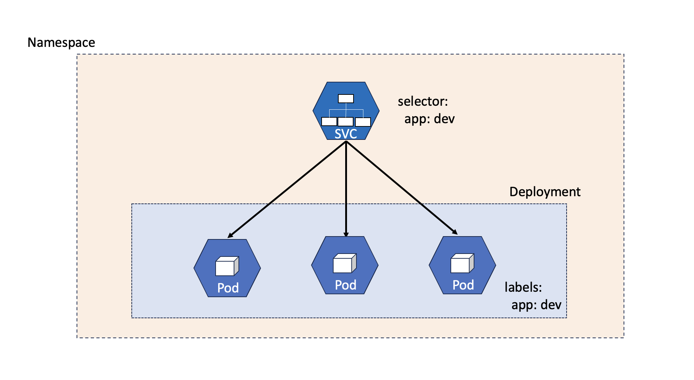

Kubernetes - Operations 
=======================

Now that we've covered the core components of Kubernetes, it's time to put it into operations. In this module you'll create Pods, Deployments, and Services. The image above depicts how 
we tie all these components together. When Kubernetes gets the run command, it will first look to see if the image is held locally on the cache by Kubelet. If there is not a local image, Kubelet 
will *pull* the image from a container registry. You have already created a namespace *test* and this will isolate resources. Kubernetes will create and assign the pods, while 
the Kublet will get image and stand up the container. Kubernetes, through the deployment manifest, watches all the pods tagged with labels matching the tags. Then, Kubernetes
will expose the deployment through the service manifest. This happens the same way, through matching label tags.

Let's jump into the operational items that make Kubernetes run.

Operations - Container registry
-------------------------------

We'll briefly talk about *container registries*. A container registry is a storage area for storing container and the most commonly used is Docker Hub which we use for the registry during this class. When you return to your jobs however, your company will most likely use a private container registry. Hosted in one of the cloud service providers, Github or Gitlab, and 
with some access controls. In Kubernetes this is done with a *docker-registry* secret. A secret is another Kubernetes object used for storing sensitive information.

In this class, you'll not have to set any of this up.

|
- `Kubernetes Secret <https://kubernetes.io/docs/concepts/configuration/secret/>`_
- `Kubernetes Private Registry <https://kubernetes.io/docs/tasks/configure-pod-container/pull-image-private-registry/>`_

Operations - Pod
----------------

You'll create a new pod using the Kubernetes imperative command shown below. When creating pods, best practice is to specifically define the image tag (version) and not use *latest*.

.. code-block:: bash
   :caption: Pod Creation 

   kubectl run testpod --image=nginx:1.21 -n test

Now, verify your pod is running:

-  ``kubectl get pod -n test`` 

Once you have verified the pod is running, you'll delete the pod:

-  ``kubectl delete pod testpod -n test``

|

Vim is not known for being overly friendly to copy/paste commands. Rather than have you spend time doing that and making sure all the indention's are correct, let's 
review what the manifest file would look like to deploy our Nginx container in a pod called *testpod*.

.. note:: YAML is can be very fussy on indentation, please pay **close attention** to your indentation

.. code-block:: yaml
   :caption: Pod Manifest 

   apiVersion: v1
   kind: Pod
   metadata:
     name: testpod
     namespace: test
   spec:
     containers:
     - name: nginx
       image: nginx:1.21
       ports:
       - containerPort: 80

Let's explain the directives from above.

| **apiVersion** determines what version of the API will be used for creation
| **kind** specifies the type of object to be created and is defined in the apiVersion
| **metadata** describes information of an object that allows for the unique identification of that object
| **spec** defines the desired state of the object in Kubernetes
| **containers** specifies the containers to be built inside the pod
| **name** defines the name of the container
| **image** defines what image to use
| **ports** defines what ports the container will listen on

|

A helpful resource to check for this lab is the *api-resource*. Here you can see object type (kind), what it's *shortname* is and the *apiVersion* associated. The shortname is 
very useful to save in typing and for those of you continuing on and take the Certified Kubernetes Administrator (CKA) certification. 

|

.. code-block:: bash
   :caption: API Resources

   kubectl api-resources

|

Now, back to creating pods. You can use the *dry-run=client* feature to have Kubernetes write the manifest for you. This process allows you run your Kubernetes command without submitting it to the cluster.

.. code-block:: bash
   :caption: Pod Dry Run

   kubectl run testpod --image=nginx:1.21 --port 80 -n test --dry-run=client -o yaml
|

Notice the *-o* output flag. You can also ask Kubernetes to output *json* format as well. You can also direct the output to a file by using ``>``. An example would be ``kubectl run dryrun --image=nginx --dry-run=client -o yaml > testpod.yaml``. Let's
try it out.

Now that your manifest file is ready, time to apply it to Kubernetes.

.. code-block:: bash
   :caption: Pod Dry Run

   kubectl run testpod --image=nginx:1.21 --port 80 -n test --dry-run=client -o yaml > testpod.yaml

.. code-block:: bash
   :caption: Testpod manifest

   kubectl apply -f testpod.yaml 

Notice in the cli command we did not specify the namespace, that is because we defined the namespace in the manifest file. This is always a good practice to prevent pods from showing
up the default namespace.

One last step will walk through in this section is the *edit* command. To do this, we will edit the pod we've just created. Currently you are running *testpod* on an older version of 
Nginx. We will edit the manifest to update the version. 

.. code-block:: bash
   :caption: Edit

   kubectl edit pod testpod -n test

We will focus on this line in the returned data:

.. code-block:: bash
   :caption: Update
   :emphasize-lines: 3

   spec:
     containers:
     - image: nginx:1.21
       imagePullPolicy: IfNotPresent

Arrow your cursor down to the *image* line and press ``i``. This command allows you to edit the file. You'll be changing the tagged version from **1.21** to **1.25**. Once
this change is made use the vim write and quit command, press:

|  ``ESC`` (escape key)
|  ``:wq``

You should see the pod was edited.

.. code-block:: bash
   :caption: Edit

   pod/testpod edited

Now to verify the updated pod we'll use the describe command.

.. code-block:: bash
   :caption: Describe

   kubectl describe pod testpod -n test

Output from describe should look like the below. Showing Kubernetes, along with Kubelet, have terminated the existing container version 1.21 and pulled the container image, created and started the container.

.. code-block:: bash
   :emphasize-lines: 7-10

    Events:
    Type    Reason     Age                  From               Message
    ----    ------     ----                 ----               -------
    Normal  Scheduled  6m47s                default-scheduler  Successfully assigned test/testpod to k3s-leader.lab
    Normal  Pulled     6m47s                kubelet            Container image "nginx:1.21" already present on machine
    Normal  Killing    104s                 kubelet            Container testpod definition changed, will be restarted
    Normal  Pulling    104s                 kubelet            Pulling image "nginx:1.25"
    Normal  Pulled     98s                  kubelet            Successfully pulled image "nginx:1.25" in 6.203075695s (6.203083694s including waiting)
    Normal  Created    98s (x2 over 6m47s)  kubelet            Created container testpod
    Normal  Started    97s (x2 over 6m47s)  kubelet            Started container testpod

This concludes the pod section.

Official Documentation

- `Kubernetes Pod <https://kubernetes.io/docs/concepts/workloads/pods/>`_

Operations - Deployment
-----------------------

.. code-block:: bash 
   :caption: Deployment 

   kubectl create deployment lab-deploy --image=nginx:1.22 --replicas=3 -n test

You should see the deployment has run from the below sample returned output:

.. code-block:: bash
   :caption: Deployment Output 

   lab@k3s-leader:~$ kubectl get deploy lab-deploy -n test
   NAME         READY   UP-TO-DATE   AVAILABLE   AGE
   lab-deploy   3/3     3            3           10s

Let's validate your deployment, your output should match the above.

.. code-block:: bash
   :caption: Get Deployment

   kubectl get deploy lab-deploy -n test 

Now you'll describe the deployment, take note of the lines showing **Selector** info (what pods will be in the deployment), **Replicas** how many pods are desired to 
be up and running.

.. code-block:: 

   Selector:               app=lab-deploy
   Replicas:               3 desired | 3 updated | 3 total | 3 available | 0 unavailable

Please describe your deployment 

.. code-block:: bash
   :caption: Describe Deployment

   kubectl describe deploy lab-deploy -n test 

Now you'll delete the deployment

.. code-block:: bash
   :caption: Delete Deployment

   kubectl delete deploy lab-deploy -n test

For this section you'll be doing some of the exact steps we did for Pod's section. We'll cover some important parts of the manifest file that enable the deployment to build 
containers for the deployment.

This is an example deployment manifest to explain directives.

.. code-block:: bash
   :caption: Sample Deployment Manifest 

   apiVersion: apps/v1
   kind: Deployment
   metadata:
     name: lab-deploy
     namespace: test
     labels:
       app: lab-deploy
   spec:
     replicas: 3
     selector:
       matchLabels:
         app: lab-deploy
     template:
       metadata:
         labels:
           app: lab-deploy
       spec:
         containers:
         - name: nginx
           image: nginx:1.22
           ports:
           - containerPort: 80

| **labels** this sets the label for the deployment. Labels make searching faster and easier
| **spec** specification that contains other manifest resources. Here the spec directive is defining the deployment with pod count and container images

- **replicas** specifies how many pods are expected to be running
- **selector** looks for matching labels will become part of the deployment
- **template** sets the build for the containers that are to become part of the deployment; sets labels, container image and ports

.. code-block:: bash
   :caption: Deployment Manifest

   kubectl create deployment lab-deploy --image=nginx:1.22 --replicas=3 -n test --dry-run=client -o yaml > lab-deploy.yaml

.. note:: You can use the command ``cat lab-deploy.yaml`` to view the manifest file

As you've done a previous lab, the above command will create a new deployment named *lab-deploy*. The command specifies the image version, replica count, namespace and again using the *dry-run*
command to not submit the command to Kubernetes and output it to file. Now that the manifest file has been created, time to let Kubernetes work it's magic.

.. code-block:: bash
   :caption: Deploy

   kubectl apply -f lab-deploy.yaml

You should now see you deployment has been created.

``deployment.apps/lab-deploy created``

Kubernetes has become so popular because of it's many features in how it can run workloads and be customized. One of these impressive features is *scaling*. Scaling allows 
you to increase or decrease pod counts. You can even set scaling to occur during resource consumption. When configuring scaling to happen based on consumption (or lack of), this
is called *auto-scaling*. In this lab, we will focus on manually scaling resources in the deployment. To do this, we will adjust the number of *replicas* specified in the manifest.

.. code-block:: bash
   :caption: Scale

   kubectl scale --replicas=5 deploy/lab-deploy -n test

You should now see the deployment scale up

``deployment.apps/lab-deploy scaled``

.. code-block:: bash
   :caption: Describe Deployment
   :emphasize-lines: 32

   lab@k3s-leader:~$ kubectl describe deploy/lab-deploy -n test
   Name:                   lab-deploy
   Namespace:              test
   CreationTimestamp:      Sun, 07 Jan 2024 19:26:55 -0500
   Labels:                 app=lab-deploy
   Annotations:            deployment.kubernetes.io/revision: 1
   Selector:               app=lab-deploy
   Replicas:               5 desired | 5 updated | 5 total | 5 available | 0 unavailable
   StrategyType:           RollingUpdate
   MinReadySeconds:        0
   RollingUpdateStrategy:  25% max unavailable, 25% max surge
   Pod Template:
     Labels:  app=lab-deploy
     Containers:
      nginx:
       Image:        nginx:1.22
       Port:         <none>
       Host Port:    <none>
       Environment:  <none>
       Mounts:       <none>
     Volumes:        <none>
   Conditions:
     Type           Status  Reason
     ----           ------  ------
     Progressing    True    NewReplicaSetAvailable
     Available      True    MinimumReplicasAvailable
   OldReplicaSets:  <none>
   NewReplicaSet:   lab-deploy-cb697555 (5/5 replicas created)
   Events:
     Type    Reason             Age   From                   Message
     ----    ------             ----  ----                   -------
     Normal  ScalingReplicaSet  19s   deployment-controller  Scaled up replica set lab-deploy-cb697555 to 5 from 3

Official Documentation

- `Kubernetes Deployment <https://kubernetes.io/docs/concepts/workloads/controllers/deployment/>`_

Operations - Ingress
--------------------

Official Documentation

- `Kubernetes Ingress <https://kubernetes.io/docs/concepts/services-networking/ingress/>`_

Operations - Service
--------------------

.. code-block:: bash
   :caption: Service

   kubectl expose deployment lab-deploy --type=NodePort --port=80 --target-port=80 --name=lab-deploy-svc --selector=app=lab-deploy -n test

In the above command, you are telling Kubernetes to expose the deployment (lab-deploy) as a NodePort service. NodePort means that the TCP or UDP port 
will open on all nodes. The default ports are 30000-32767. You can alter this default or even specify the port you'd like.

Types of service types:

- Cluster IP This is the default service, which is used to expose a service on a cluster-internal IP. This means the service is only accessible from inside the cluster.
- Node Port This exposes a service on each node's IP at a static port so the service is accessible from outside the cluster.
- Load Balancer This uses a cloud provider's load balancer to access a service from outside the cluster.
- External Name This maps a service to the contents of a predefined external name field by returning a CNAME record with its value.
- Headless This headless service is used for pod grouping when a stable IP address is not required.

To test out our service, you'll need to find what NodePort port was enabled with the *describe* command.

.. code-block:: bash
   :caption: Describe Service

   kubectl describe deploy lab-deploy -n test

Describe deployment output:

.. code-block:: bash
   :caption: Output
   :emphasize-lines: 6,14, 15

   lab@k3s-leader:~$ kubectl describe service lab-deploy-svc -n test
   Name:                     lab-deploy-svc
   Namespace:                test
   Labels:                   app=lab-deploy
   Annotations:              <none>
   Selector:                 app=lab-deploy
   Type:                     NodePort
   IP Family Policy:         SingleStack
   IP Families:              IPv4
   IP:                       10.43.171.70
   IPs:                      10.43.171.70
   Port:                     <unset>  80/TCP
   TargetPort:               80/TCP
   NodePort:                 <unset>  31612/TCP
   Endpoints:                10.42.3.124:80,10.42.4.63:80,10.42.5.173:80
   Session Affinity:         None
   External Traffic Policy:  Cluster
   Events:                   <none>

This is an example, you'll have to insert your NodePort port from your describe command.

.. code-block:: bash
   :caption: Curl

   curl http://10.1.1.6:31612

From inside the cluster, the new service (thanks to CoreDNS) will have an A record entry. The format for the fqdn entry is:

- service name
- namespace
- svc (for service)
- cluster.local

*lab-deploy-svc.test.svc.cluster.local*

We'll look at this in the next lab for troubleshooting.

Official Documentation

- `Kubernetes Service <https://kubernetes.io/docs/concepts/services-networking/service/>`_
