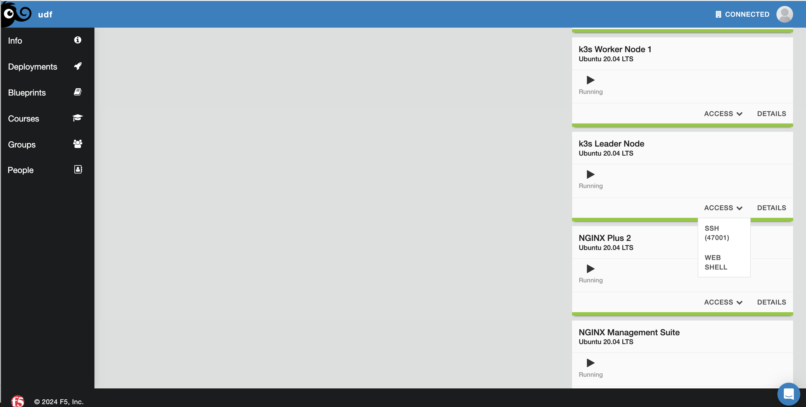
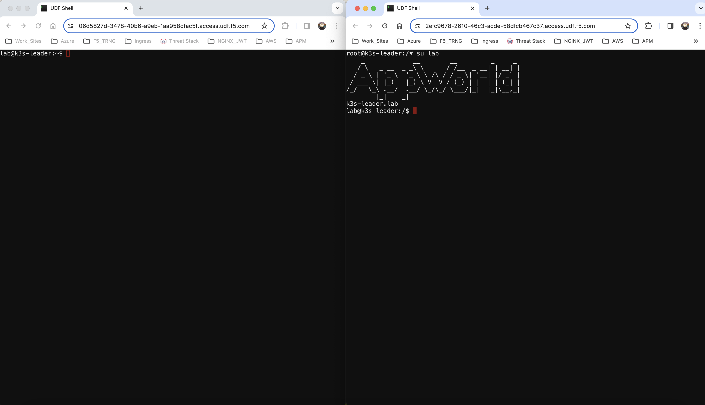

Bonus lab
=========
For this lab, you want to run a split screen of the Jumphost web shell and the Leader node web shell. To access the Leader node shell

Once the leader node shell comes up, it will be on user *root*. Please run the command ``su lab`` to switch to the *lab* user.

On the Leader node web shell you'll monitor the *test* namespace for events (in real time)

.. code-block:: bash
   :caption: Events

   kubectl get events -n test --watch

On the Jumphost web shell you'll create a new deployment

.. code-block:: bash 
   :caption: Deployment 

   kubectl create deployment roller-deploy --image=nginx:1.20 --replicas=3 -n test

On your events shell you should see Kubernetes creating the Replica Set, the pod and Kubelet pulling the image and getting the container running. A replica set resides
inside a deployment. Remember on our deployment we specified the *replica* count? A replica set ensures that a specified number of pod replicas are running at any given time. 

In this lab you will perform a rolling update to the deployment *roller-deploy*. This rolling update should not impact traffic however, we will not be testing for that.

On the Leader Node shell you can now escape the *watch* by using ``Control + C``

With the deployment up and running, you can now see Kubernetes has assigned it a version:

.. code-block:: bash
   :caption: History Command

   kubectl rollout history deploy/roller-deploy -n test

.. code-block:: bash
   :caption: History Output

    lab@k3s-leader:/$ kubectl rollout history deploy/roller-deploy -n test
    deployment.apps/roller-deploy 
    REVISION  CHANGE-CAUSE
    1         <none>

On the Leader node shell, you will now need to *describe* the deployment as some specific information is needed. From the output, find the **Labels** value. This will be used in the next step.
kubectl describe deploy/roller-deploy -n test 

.. code-block:: bash
   :caption: Output
   :emphasize-lines: 5, 15

   kubectl describe deploy/roller-deploy -n test
   Name:                   roller-deploy
   Namespace:              test
   CreationTimestamp:      Wed, 10 Jan 2024 15:49:02 -0500
   Labels:                 app=roller-deploy
   Annotations:            deployment.kubernetes.io/revision: 1
   Selector:               app=roller-deploy
   Replicas:               3 desired | 3 updated | 3 total | 3 available | 0 unavailable
   StrategyType:           RollingUpdate
   MinReadySeconds:        0
   RollingUpdateStrategy:  25% max unavailable, 25% max surge
   Pod Template:
     Labels:  app=roller-deploy
     Containers:
      nginx:
       Image:        nginx:1.20
       Port:         <none>
       Host Port:    <none>
       Environment:  <none>
       Mounts:       <none>
     Volumes:        <none>
   Conditions:
     Type           Status  Reason
     ----           ------  ------
     Available      True    MinimumReplicasAvailable
     Progressing    True    NewReplicaSetAvailable
   OldReplicaSets:  <none>
   NewReplicaSet:   roller-deploy-5c754bcfb8 (3/3 replicas created)
   Events:
     Type    Reason             Age   From                   Message
     ----    ------             ----  ----                   -------
     Normal  ScalingReplicaSet  18m   deployment-controller  Scaled up replica set roller-deploy-5c754bcfb8 to 3

On the Leader node shell, you will now *watch* the roller-deploy *deployment* based on the **--selector** value. This is the value of the Labels from above. Pod names will change during an upgrade so we can
*discover* new pods based on labels. Please also make note of the *Containers name* field above.

.. code-block:: bash
   :caption: Output

   lab@k3s-leader:/$ k get pod --selector app=roller-deploy -n test --watch
   NAME                             READY   STATUS    RESTARTS   AGE
   roller-deploy-5c754bcfb8-cv48x   1/1     Running   0          17m
   roller-deploy-5c754bcfb8-dldd8   1/1     Running   0          17m
   roller-deploy-5c754bcfb8-x68v4   1/1     Running   0          17m

On the Jumphost shell, you will now update the container image in your deployment from **nginx:1.20** to **nginx:1.24**. In this command you will tell Kubernetes to set a new image for the container
named *nginx* in the deployment named *roller-deploy* to **nginx:1.24**.

.. code-block:: bash
   :caption: Update Image

   kubectl set image deploy/roller-deploy nginx=nginx:1.24 -n test

Output observed on the Leader node shell after image update:

.. code-block:: bash
   :caption: Output

   ab@k3s-leader:/$ k get pod --selector app=roller-deploy -n test --watch
   NAME                             READY   STATUS    RESTARTS   AGE
   roller-deploy-5c754bcfb8-cv48x   1/1     Running   0          26m
   roller-deploy-5c754bcfb8-dldd8   1/1     Running   0          26m
   roller-deploy-5c754bcfb8-x68v4   1/1     Running   0          26m
   roller-deploy-69fd54884d-w62fk   0/1     Pending   0          0s
   roller-deploy-69fd54884d-w62fk   0/1     Pending   0          0s
   roller-deploy-69fd54884d-w62fk   0/1     ContainerCreating   0          0s
   roller-deploy-69fd54884d-w62fk   1/1     Running             0          6s
   roller-deploy-5c754bcfb8-x68v4   1/1     Terminating         0          30m
   roller-deploy-69fd54884d-6czjh   0/1     Pending             0          0s
   roller-deploy-69fd54884d-6czjh   0/1     Pending             0          0s
   roller-deploy-69fd54884d-6czjh   0/1     ContainerCreating   0          0s
   roller-deploy-5c754bcfb8-x68v4   0/1     Terminating         0          30m
   roller-deploy-5c754bcfb8-x68v4   0/1     Terminating         0          30m
   roller-deploy-5c754bcfb8-x68v4   0/1     Terminating         0          30m
   roller-deploy-69fd54884d-6czjh   1/1     Running             0          5s
   roller-deploy-5c754bcfb8-dldd8   1/1     Terminating         0          30m
   roller-deploy-69fd54884d-2m7vk   0/1     Pending             0          0s
   roller-deploy-69fd54884d-2m7vk   0/1     Pending             0          0s
   roller-deploy-69fd54884d-2m7vk   0/1     ContainerCreating   0          0s
   roller-deploy-5c754bcfb8-dldd8   0/1     Terminating         0          30m
   roller-deploy-5c754bcfb8-dldd8   0/1     Terminating         0          30m
   roller-deploy-5c754bcfb8-dldd8   0/1     Terminating         0          30m
   roller-deploy-69fd54884d-2m7vk   1/1     Running             0          5s
   roller-deploy-5c754bcfb8-cv48x   1/1     Terminating         0          30m
   roller-deploy-5c754bcfb8-cv48x   0/1     Terminating         0          30m
   roller-deploy-5c754bcfb8-cv48x   0/1     Terminating         0          30m
   roller-deploy-5c754bcfb8-cv48x   0/1     Terminating         0          30m

From the above output you can see the original 3 nodes were running. Once you set a new image Kubernetes went to work creating a new pod, assigning the pod to a node and 
letting Kubelet do its job. Once the new pod/container are running, Kubernetes now begins to terminate one of the older pods running the old version of **nginx:1.20**.
This is because we specified 3 replicas in our deployment. Kubernetes will continue this very process until 3 new pods with new container images are running, and our
3 old versions are terminated.

Let's focus back on the Jumphost shell and check the rollout history:

.. code-block:: bash
   :caption: Rollout History

   kubectl rollout history deploy/roller-deploy -n test

You will now see the *newest* revision to your history

.. code-block:: bash
   :caption: Output 
   :emphasize-lines: 4,5

   lab@k3s-leader:~$ kubectl rollout history deploy/roller-deploy -n test
   deployment.apps/roller-deploy 
   REVISION  CHANGE-CAUSE
   1         <none>
   2         <none>

Staying on the Jumphost, you'll now rollback to revision 1 which was our **nginx:1.20** image.

.. code-block:: bash
   :caption: Rollout Undo

   kubectl rollout undo deploy/roller-deploy -n test --to-revision=1

Once this command runs you should observer in the Leader node shell (if you have not stopped the watch command), the same process of Kubernetes turning up a new pod and container
with the new image and then terminating the old one. You should now see the revision history increment to 3.

.. code-block:: bash
   :caption: Rollout History

   kubectl rollout history deploy/roller-deploy -n test

One last useful command to show is how to add an *annotation* to your deployment and why. A Kubernetes annotation is a key-value pair, somewhat like labels, used to add 
non-structured data to your object. Annotations are not used to identify the object, like we have with labels, but rather to describe. In this example, you'll add an 
annotation to the deployment to *explain* that you've upgraded the deployment image used. This will show up the **CHANGE-CAUSE** section from *rollout history* command
you ran.

.. code-block:: bash
   :caption: Annotation 

   kubectl annotate deploy/roller-deploy -n test kubernetes.io/change-cause="container image to nginx:1.24"

Now if you run the history command again, you'll notice your revision note is included.

.. code-block:: bash
   :caption: Rollout History

   kubectl rollout history deploy/roller-deploy -n test

Official Documentation

- `Kubernetes Replica Set <https://kubernetes.io/docs/concepts/workloads/controllers/replicaset/>`_
- `Kubernetes Rolling Update <https://kubernetes.io/docs/tutorials/kubernetes-basics/update/update-intro/>`_
- `Kubernetes Annotations <https://kubernetes.io/docs/concepts/overview/working-with-objects/annotations/>`_