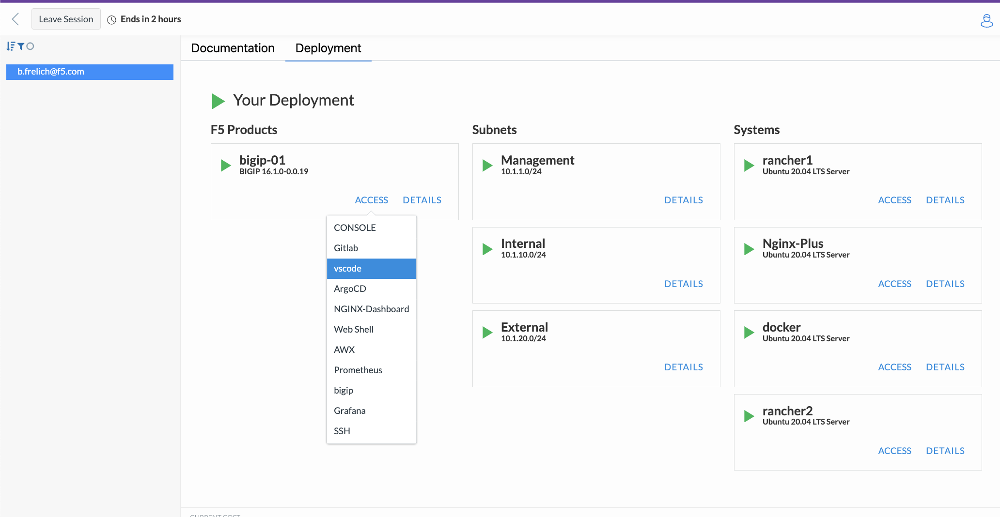

Lab Modules
===========

Module 1
--------

**1.1 Code - VS Code**
----------------------
Having a developer IDE like Visual Studio Code is crucial for a smooth CI/CD process. It serves as the "control center" tool, enabling developers to write, test, and debug code effortlessly. It offers handy features like code highlighting, auto-completion, and linting. Plus, its compatibility with source control (like GitLab, which we use in this lab) simplifies managing and versioning your code. This integration speeds up development and ensures more reliable deployments.

In our lab, VS Code is essential for managing NGINX and NGINX App Protect (NAP) in a CI/CD flow. It facilitates easy handling of NGINX configurations and NAP Security Policies, which are file-based. The integration with GitLab allows for smooth editing and managing of configurations, enhancing the Infrastructure as Code (IaC) and application protection processes.

.. note:: [Insert steps to open and explore VS Code]

**1.2 Version control - GitLab**
---------------------------------
Source control tools like Git are vital in an IaC CI/CD workflow. They provide:

- **Version Control**: Organizes code and tracks changes over time. It acts as a central collaboration hub.
- **Collaboration**: Streamlines teamwork with features for branching, merging, code reviews, and discussions, ensuring high-quality deployments.

In our lab, GitLab helps manage NGINX configurations and NAP configurations, including security policy files. This integration ensures efficient testing and deployment without switching between tools.

.. note:: [Insert steps to open and explore GitLab repo]

.. note:: Remember to skip Warning window by pressing "Remind me again in 3 days"

**1.3 Automation and Testing - GitLab**
---------------------------------------
We're using GitLab's Pipelines for automation in our lab, linking all CI/CD workflow components. Combined with Webhooks, it promotes NAP Security Policy changes into our Kubernetes-based Application Environment.

- **GitLab Pipelines**: Automates tasks upon specific repository events.
- **Webhooks**: Trigger pipelines in response to repository changes, ensuring reliable and efficient deployment.

Note on testing: We're bypassing third-party testing tools like Selenium. However, NGINX Plus and NGINX App Protect have built-in configuration validation, plus NGINX Plus features hitless reloads for seamless deployments.

.. note:: [Please open and explore GitLab Pipeline]

**1.4 Continuous Deployment tool for Kubernetes - ArgoCD**
----------------------------------------------------------
ArgoCD, a GitOps tool for Kubernetes, automates application deployment to match Git repository states. It offers:

- **Continuous Deployment**: Ensures Kubernetes cluster state aligns with Git-defined states.
- **Self-Healing**: Corrects deviations in the Kubernetes cluster.
- **Visibility and UI**: Provides an interface for managing applications, their health, and status.

Integrating NGINX App Protect with Kubernetes and ArgoCD streamlines security management in our CI/CD landscape.

.. note:: [Insert steps to open and explore GitLab Pipeline]

**1.5 Logging and Metrics - NGINX Dashboard, Elastic, & Grafana**
-----------------------------------------------------------------
Observability is essential in our lab's IaC CI/CD workflow. We use Elastic for NGINX App Protect logs and capture real-time metrics in Grafana. The NGINX Dashboard offers an alternative for viewing telemetry. This setup is crucial for monitoring the impact of new security policy deployments, providing immediate feedback and ensuring the integrity of our CI/CD pipeline.

.. note:: [Insert steps to open and explore Grafana & NGINX Dashboard]

Module 2
--------

.. note:: [Insert Steps to make, commit, observe, and iterate changes in NGINX App Protect Security Policy Code to enhance application protection in Kubernetes]
