NGINX App Protect WAF Dashboard
===============================

Let's go over the dashboard for NGINX App Protect WAF. 

The overall solution uses Logstash to receive logs from NGINX App Protect, process them and finally store them in Elasticsearch indexes. Grafana retrieves the logs from the 
Elastic indexes and helps us visualize them.

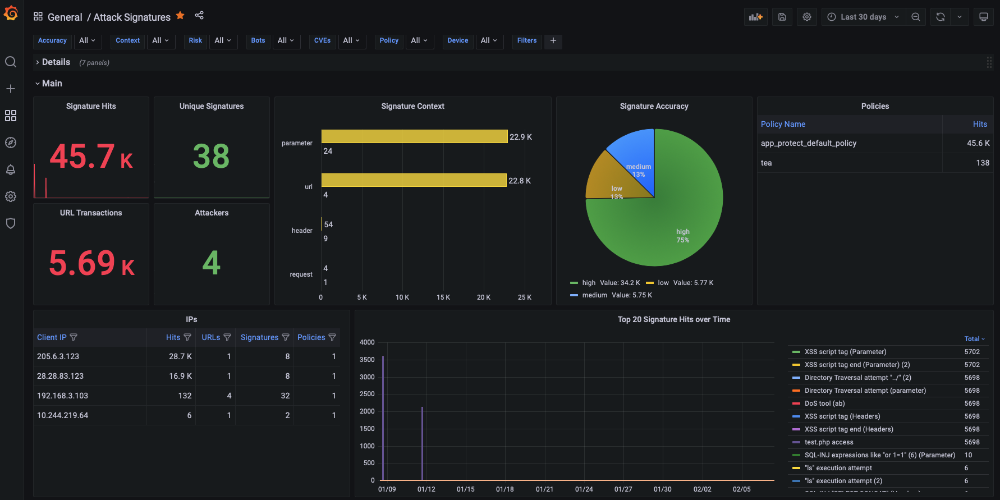

Table of Contents

- [Available Dashboards](#available-dashboards)
- [Generating Attacks](#generating-attacks)

Available Dashboards
--------------------

Main Dashboard

The main dashboard that provides an overview of all the violations that have been logged by NGINX App Protect WAF. From this table you can navigate to the other dashboards like SupportID, by clicking on the links. Some of the graphs/tables 
included in this dashboard are:

- Attacks recorded and mitigated
- Violation categories
- Attacks over time
- Mitigated Bots 
- GeoMap
- Attacks per URL
- Attack Signature detected
- Bot activity per IP/Country
- Bot activity per Policy/Device
- CVEs and Threat Campaigns
- Logs


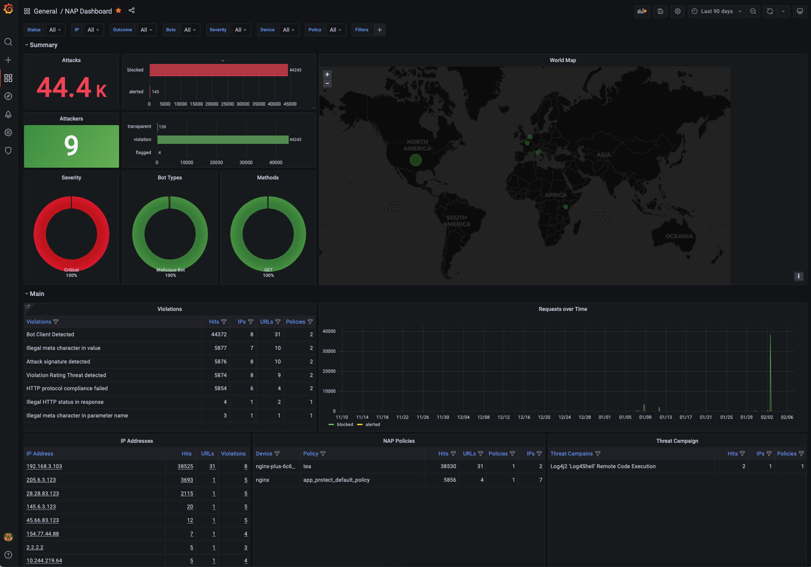

Attack Signature Dashboard
--------------------------

The Attack Signature dashboard provides all details for the signatures that were triggered by NGINX App Protect WAF. Some of the graphs/tables included in this dashboard are:

- Signature Hits
- Signature Accuracy and Risk
- Signatures per Context 
- Signature details 
- Signatures per URL/IP/Policy
- Parameter Names and Values
- Header Names and Values
- Cookies Names and Values
- Logs

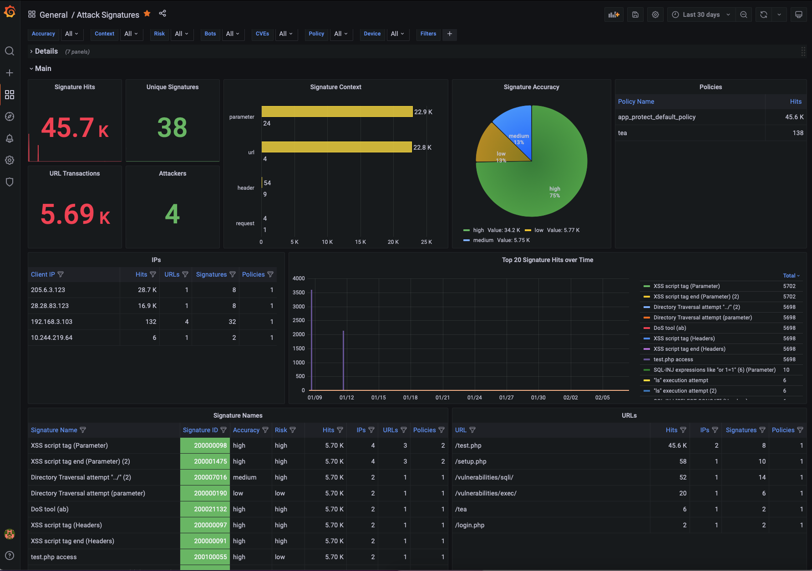


Bot Dashboard
-------------

The Bot Dashboard provides all details for the Bot activity that was logged by NGINX App Protect WAF. Some of the graphs/tables included in this dashboard are:

- Bot Types
- Bot Categories
- Bot Activity over time
- Mitigated Bots 
- Bot activity per URL
- Bot activity per IP/Country
- Bot activity per Policy/Device
- Logs

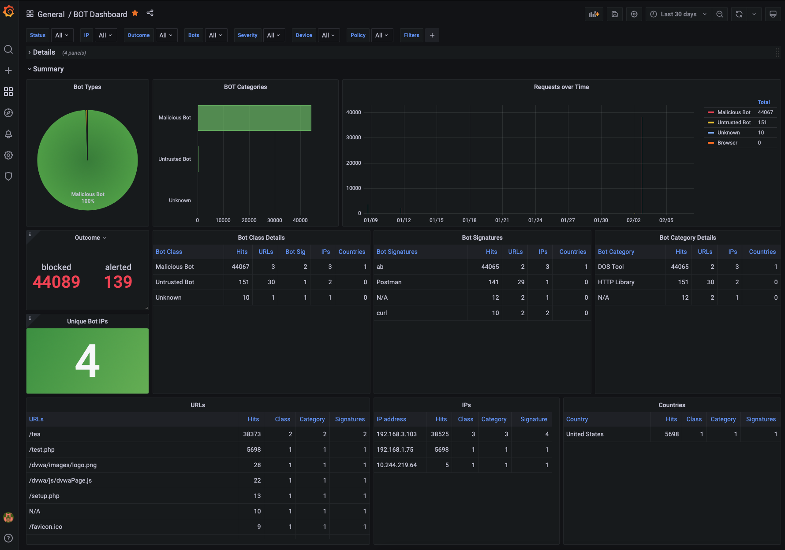

SupportID Dashboard
-------------------

The SupportID Dashboard provides all details for a specific transaction that was logged by NGINX App Protect WAF. These include the following:

- Client/Server Information (Client IP/Port, Server IP/Port, X-Forwared-For, etc)
- Violation Details (Outcome, Request Status, Outcome Reson, etc)
- Bot Details (Bot Classm Bot Category, Bit Signature, etc)
- Device Details (NAP Device name, Vritual Server Name)
- Signatures Triggered
- Treat Campaign triggered
- Violation list
- Many more

It also includes both the original and decoded Elasticsearch indices for better troubleshooting.

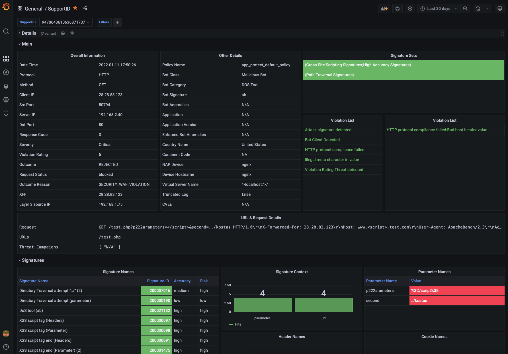


Dashboards under development
----------------------------

The following dashboard are currently under development and should be released shortly:

- File Type Violations
- Header/Cookie Violations
- Parameter Violations
- Evasion Techniques
- HTTP Protocol Compliance
- URL Violations

Generating attacks
------------------

In the following section we will generate multiple attacks so that the dashboards get populated with meaningful data that we can review.

To run the demos, use the terminal on VS Code. VS Code is under the `bigip-01` on the `Access` drop-down menu. Click <a href="https://raw.githubusercontent.com/F5EMEA/oltra/main/vscode.png"> here </a> to see how.*


#. Change the working directory to `monitoring`.

.. code:: bash

    cd ~/oltra/use-cases/app-protect/monitoring


Deploy and protect a web application  

#. Create the application deployment and service in namespace `nap`:

   .. code:: bash
   
      kubectl create namespace nap
      kubectl apply -f app.yml


#. Create the App Protect policy.

   .. code:: bash

      kubectl apply -f appolicy.yml

#. Create log configuration resource:

   .. code:: bash

      kubectl apply -f log.yml


#. Create the policy to reference the AP Policy, the AP Log profile and the log destination.

   .. code:: bash

      kubectl apply -f policy.yml

#. Create the VirtualServer resource:

   .. code:: bash

      kubectl apply -f virtual-server.yml

#. Send a request to the application.

   .. code:: bash

      curl http://nap-monitor.f5k8s.net/

   .. code:: bash

      #####################  Expected output  #######################
      Server address: 10.244.140.109:8080
      Server name: nap-monitor-7586895968-r26zn
      Date: 12/Sep/2022:14:12:25 +0000
      URI: /
      Request ID: 0495d6a17797ea9776120d5f4af10c1a


Step 2. Execute malicious requests to the application  

Now, let's try to send a malicious request to the application:


#.  SQL Injection (encoded)

   .. code:: bash

      curl "http://nap-monitor.f5k8s.net/index.php?password=0%22%20or%201%3D1%20%22%0A"

#.  SQL Injection

   .. code:: bash

      curl "http://nap-monitor.f5k8s.net/index.php?password==0'%20or%201=1'"

#. SQL Injection

   .. code:: bash

      curl "http://nap-monitor.f5k8s.net/index.php?id=%'%20or%200=0%20union%20select%20null,%20version()%23"

#. Cross Site Scripting

   .. code:: bash

      curl "http://nap-monitor.f5k8s.net/index.php?username=<script>"

#. Command Injection

   .. code:: bash
      curl "http://nap-monitor.f5k8s.net/index.php?id=0;%20ls%20-l"


The expected output  for all the previous requests is the following:
``` <html><head><title>Request Rejected</title></head><body>The requested URL was rejected........ ```


Step 3. Review Logs 

Login to Grafana (credentials **admin/Ingresslab123**)

.. image:: images/login.png


Go to **Dashboards->Browse**

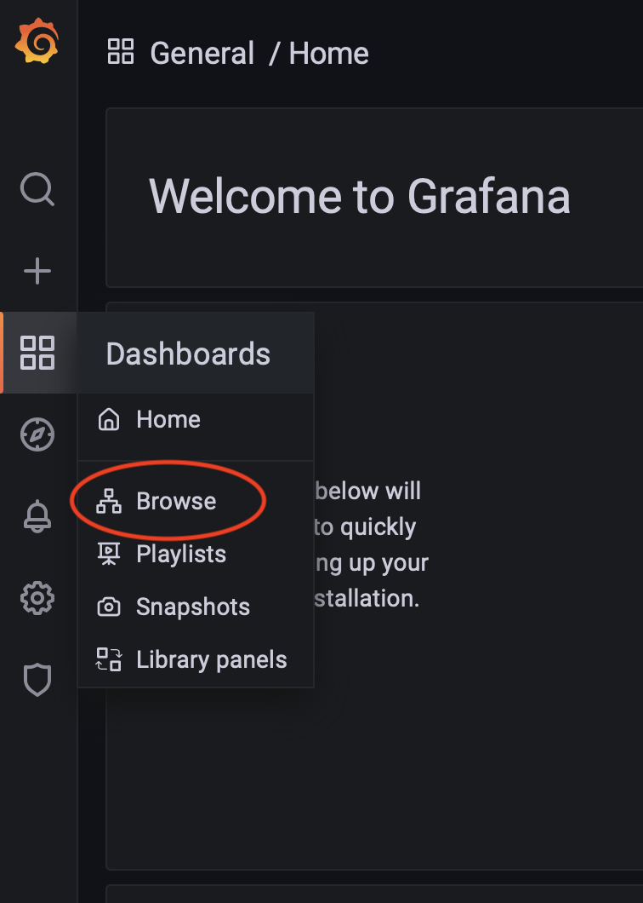


Select the NAP Dashboards that can be located under the NGINX folder

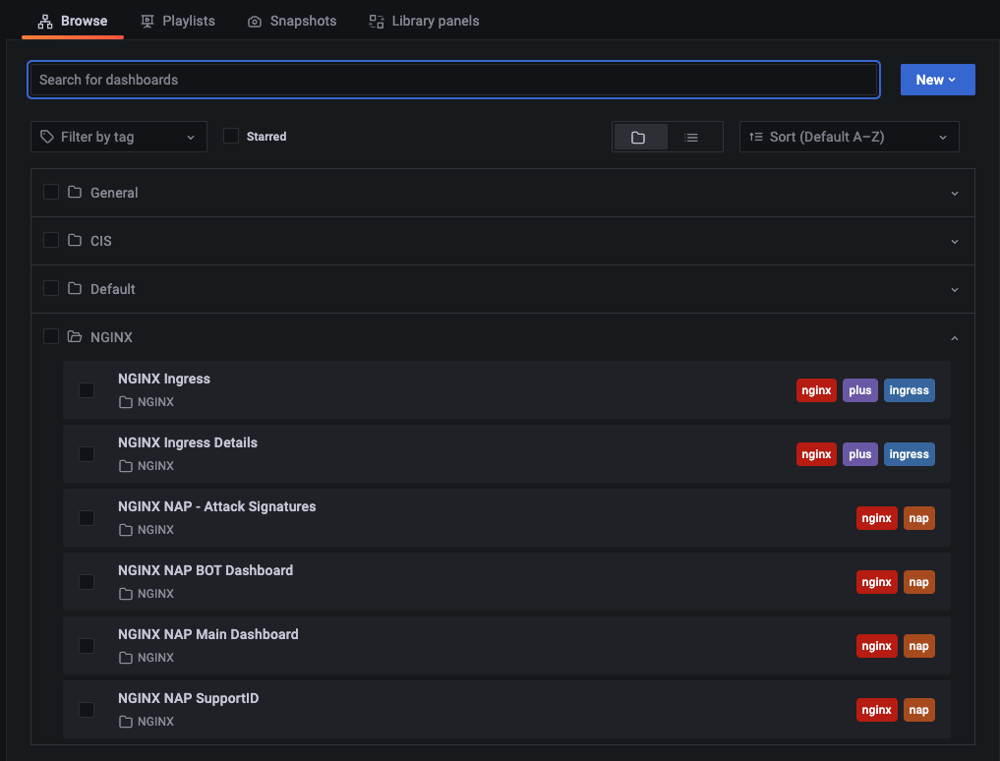


Navigate through the different Dashboards to review the attacks.


Zero to Hero! Maximizing ROI via Ratings Based Templates
--------------------------------------------------------
Ratings based template policies combine multiple threats to help reduce the operational cost of tuning a WAF policy in order to protect your applications.

In the following section we will generate multiple attacks to understand how the default ratings based templates provide a higher level of efficacy while reducing false positives. This allows you to implement blocking mode early in the application deployment lifecycle and trust that you won't be buried in sifting through logs.

To run the demos, use the terminal on VS Code. VS Code is under the `bigip-01` on the `Access` drop-down menu. Click <a href="https://raw.githubusercontent.com/F5EMEA/oltra/main/vscode.png"> here </a> to see how.*

Go to **Dashboards->NAP->Main Dashboard**

Note the count in the Severity Box:

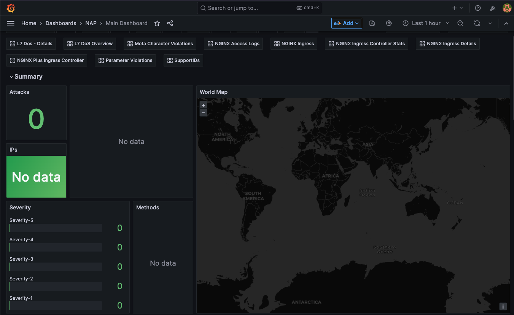

#. Return to the working directory to `monitoring` in Visual Studio Code.

.. code:: bash

    cd ~/oltra/use-cases/app-protect/monitoring

In the terminal window execute the following command and observe the count in the dashboard.

.. code:: bash

   for i in {1..50}; do curl "http://nap-ingress2.f5k8s.net/?a=b=0xF0"; done

Were the attacks blocked by the WAF? Hint: Did the server response include a support ID?

Examine the dashboard and examine the 'Main' Dashboard and notice how the additional 50 requests were categorized. Why was it not blocked?

Next in the terminal window execute the following command.

.. code:: bash

   for i in {1..50}; do curl "http://nap-ingress2.f5k8s.net/intranet/"; done

Were the attacks blocked by the WAF? Hint: See above!

Examine the dashboard and examine the 'Main' and the 'Attack Signatures' Dashboards and notice how the additional 50 requests were categorized.

If you scroll to the bottom of the 'Attack Signatures' Dashboard you can see the 'URL / Request violations details'

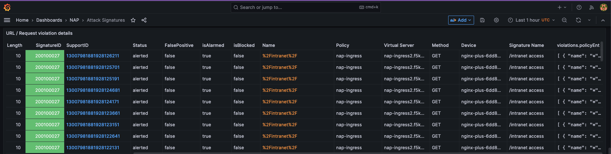

Clicking on a "Support ID" will launch another screen to provide more details.

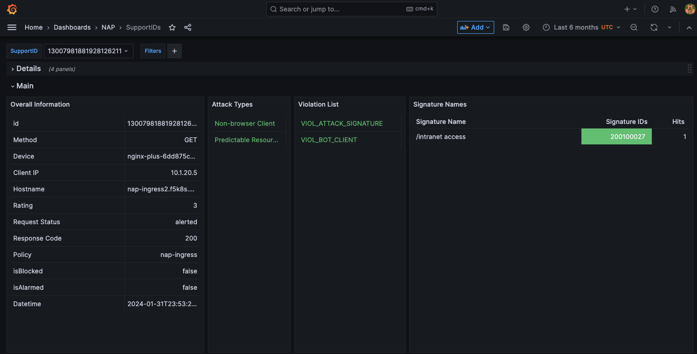

What triggered the violation? What was the violation rating? Why was it blocked or not blocked?

.. code:: bash

   for i in {1..50}; do curl "http://nap-ingress2.f5k8s.net/etc/security/password"; done

Were the attacks blocked by the WAF? Hint: Are you seeing a trend here?

Once again examine the dashboard results.

Now let's combine all of these requests in to one.

.. code:: bash

   for i in {1..50}; do curl "http://nap-ingress2.f5k8s.net/intranet/?a=/etc/security/passwd&b=%f0"; done

Now examine the results. Were the requests blocked? Discussion.

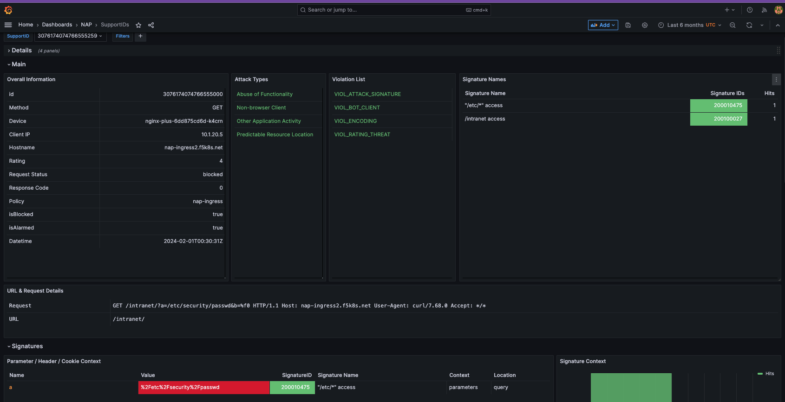

Also note, the VIOL_BOT_CLIENT. How do you think this was detected? Let's try and fool it by changing the "user-agent" to a regular browser.

.. code:: bash

   for i in {1..50}; do curl -H "user-agent: Mozilla/5.0 (Windows NT 10.0; Win64; x64) AppleWebKit/537.36 (KHTML, like Gecko) Chrome/88.0.4324.182 Safari/537.36" "http://nap-ingress2.f5k8s.net/intranet/?a=/etc/security/passwd&b=%f0"; done

Examine the different violation log details in Kibana.

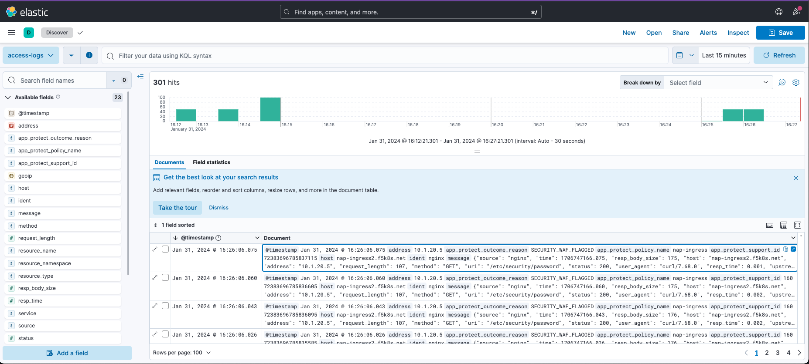

This completes the lab.