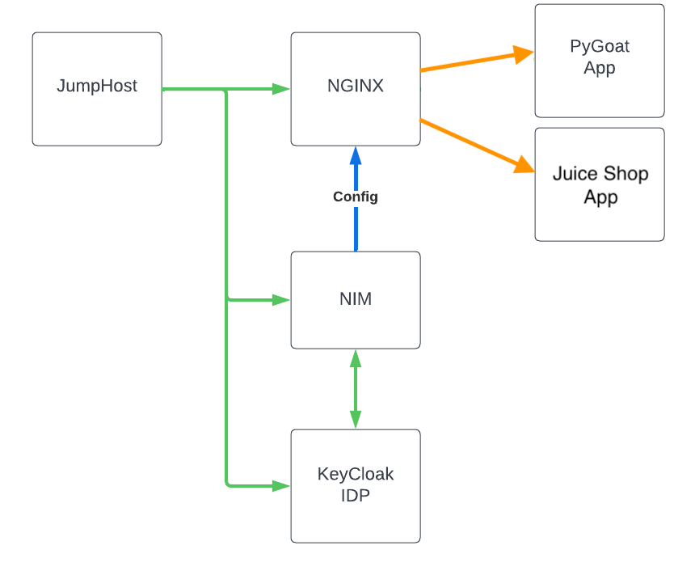

Introduction
============

The goal of this lab is to provide an introduction to the NIM templating system by walking through a few use cases that personas in a typical organization might want to implement. The lab will provide pre-built templates for your use. Authoring templates is out of scope for this lab.

The UDF lab consists of:

•	A VM with NIM installed
•	A VM with KeyCloak to provide single sign-on to NIM using OIDC
•  A VM hosting a workload, specifically the OWASP PyGoat application
•	A VM hosting NGINX and Agent, managed by NIM
•	A JumpHost VM with a virtual FireFox instance for accessing the web interfaces used in this lab

.. toctree::
   :maxdepth: 1
   :caption: Content:
   :glob:

   intro
   module*/module*
