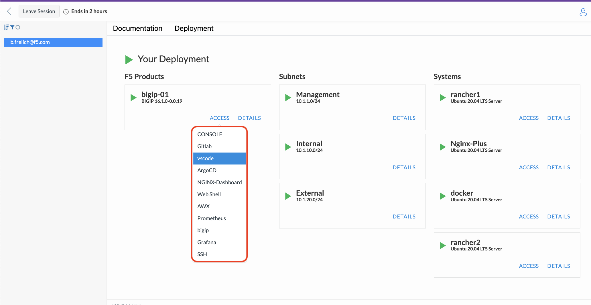

Intro - UDF pattern deployment
================================

In order to begin you will need to go to F5's Unified Development Framework (UDF) site and launch the apropriate course. The following will walk you through that process.

UDF Pattern deployment steps
----------------------------
To access the UDF course for this class follow the instructions below.

   #. Open a web browser and head to the following link `Unified Demonstration Framework <https://udf.f5.com/>`_.
   #. Click on the Non-F5 Users selection.
   #. Login with the provided access.
   #. In the left navigation bar select Courses.
   #. Type "NIM Templates" in the search bar under the Content tab.
   #. Select the Details button on the title screen.
   #. Click the Details button on the blueprint in the lower right.
   #. Select the Deploy option.
   #. Select the Start option.
   #. In the pop up window set the Autostop Duration to 4 hours.
   #. Leave everything else default and click start.

.. note:: The UDF pattern will take a few minutes to stand up. In the meantime feel free to read through the Documentaion section of the pattern.

Getting Started
===============

The infrastructure is pre-built in UDF for your use and includes the following
components:

The Jumphost (**bigip-01** host) is already setup with all access methods required to complete
the lab. **Run all lab activities accessing via BIGIP**.

Lab Topology and Credentials
-----------------------------

User follwoing credentials for access during this lab:

+----------------+-------------+-------------------------------+
|| **Component** || **Access** ||                              |
||               ||            ||                              |
+================+=============+===============================+
| **GitLab**     | Web Access  | ``root`` / ``Ingresslab123``  |
+----------------+-------------+-------------------------------+
| **ArgoCD**     | Web Access  | ``admin`` / ``Ingresslab123`` |
+----------------+-------------+-------------------------------+
| **Grafana**    | Web Access  | ``admin`` / ``Ingresslab123`` |
+----------------+-------------+-------------------------------+
| **VSCode**     | Web Access  | no credentials                |
+----------------+-------------+-------------------------------+

.. note:: Access to the VSCode compponent may require to accept "Trust" in the parent folder 'home', please do so.

    .. image:: ../images/lab1_1.png

.. note:: For access to the Gitlab compenent please ignore warning for now and press "Remind me in 3 days" to continue.

Recap
-----
You now have the following:

   - Logged into the UDF portal
   - A working UDF pattern
   - Access to the key Lab components
