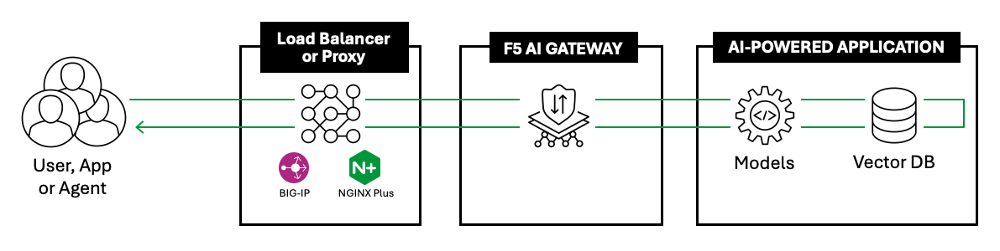

Introduction
============

What is Generative AI?
----------------------

Generative AI (Gen AI) is a class of artificial intelligence systems
designed to generate new content, such as text, images, audio, video,
and even code, based on patterns learned from existing data. Moving beyond traditional
AI, which focused primarily on classification and prediction tasks,
generative AI creates original output that mimics human creativity.

What are Large Language Models (LLMs)?
^^^^^^^^^^^^^^^^^^^^^^^^^^^^^^^^^^^^^^

A Large Language Model (LLM) is a type of artificial intelligence system
that is trained to understand, generate, and manipulate human language
at a large scale. LLMs are built using machine learning techniques,
particularly deep learning, and they are a subset of AI technologies.
Machine Learning (ML) is a subset of AI where machines learn from data
to improve their performance on specific tasks without being explicitly
programmed. Deep learning is a subset of ML that uses neural networks
with many layers (hence “deep”) to model complex patterns in data.

**Architecture** – The backbone of LLMs is the transformer architecture,
which uses attention mechanisms to focus on relevant parts of the input
text.

**Training** – LLMs are trained on enormous corpora of text data (e.g.,
books, websites, and documents) using techniques like unsupervised
learning (predicting missing words or sequences) and fine-tuning
(training on specific tasks with labeled data).

**Inference** – Once trained, LLMs can generate predictions or responses
by continuing a sequence of text based on their learned knowledge.

As AI continues to grow at a very fast rate, the need for AI in business
environment is rapidly increasing. The need for helpful AI tools, like
chatbots or assistants, for customers to interact with and ask questions to,
has significantly increased the need for AI in business. It also
presents a challenge in properly securing and observing AI traffic in
todays environments.

Overview of AI Gateway
----------------------

F5 **AI Gateway** is a specialized platform designed to route, protect,
and manage generative AI traffic between clients and Large Language
Model (LLM) backends. It addresses the unique challenges posed by AI
applications, particularly their non-deterministic nature and the need
for bidirectional traffic monitoring.

The main AI Gateway functions are:

Core
^^^^

The **Core** performs the following tasks:

-  Performs Authn/Authz checks, such as validating JWTs and inspecting
   request headers.
-  Parses and performs basic validation on client requests.
-  Applies processors to incoming requests, which may modify or reject
   the request.
-  Selects and routes each request to an appropriate LLM backend,
   transforming requests/responses to match the LLM/client schema.
-  Applies **Processors** to the response from the LLM backend, which may
   modify or reject the response.
-  Optionally, stores an auditable record of every request/response and
   the specific activity of each processor. These records can be
   exported to AWS S3 or S3-compatible storage.
-  Generates and exports observability data via OpenTelemetry
-  Prevents malicious inputs from reaching LLM backends
-  Ensures safe LLM responses to clients
-  Protects against sensitive information leaks
-  Providing comprehensive logging of all requests and responses

Processors
^^^^^^^^^^

A **Processor** runs separately from the core and can perform one or more of
the following actions on a request or response:

-  **Modify**: A processor may rewrite a request or response. For
   example, by redacting credit card numbers.
-  **Reject**: A processor may reject a request or response, causing the
   core to halt processing of the given request/response.
-  **Annotate**: A processor may add tags or metadata to a
   request/response, providing additional information to the
   administrator. The core can also select the LLM backend based on
   these tags.

| Each processor provides specific protection or transformation
  capabilities to AI Gateway. For example, a processor can detect and
  remove Personally Identifiable Information (PII) from the input or
  output of the AI model.
| F5 AI Gateway enables organizations to confidently deploy AI
  applications anywhere. Easily ensure security, scalability, and
  reliability for your AI implementation. AI Gateway inspects inbound
  prompts and outbound responses to prevent unexpected outcomes or
  critical data leakage. Customizable observation, protection, and
  management of AI interactions help improve the usability of AI
  applications and simplifies compliance.

What are the use cases for AI Gateway?
^^^^^^^^^^^^^^^^^^^^^^^^^^^^^^^^^^^^^^

AIGW acts as a hub for integration and streamlining of AI applications
with AI services (OpenAI, Anthropic, Mistral, Ollama, etc.). Now that we
have an understanding of what AI Gateway is and how it works we will
need to achieve the below architecture.

General use cases:

-  Prompt injections: Detect and block any prompt injections or
   jailbreaks

   -  Prompt management
   -  Prompt templates
   -  RBAC for LLM providers (only access certain LLMs)
   -  Prompt leakage: block before it gets to LLM

-  Prompt-based routing

   -  Cost effective routing
   -  Best-fit model routing

-  Model hallucination prevention
-  Load balancing (failover, circuit breaking)
-  Rate limiting
-  AuthN/AuthZ
-  Centrally manage credentials (such as API keys to AI services)
-  PII Leakage / Data leakage: Accidental leakage of personal
   information from LLM (i.e. financial, health care information)

   -  Email address
   -  Social Security Number (SSN)
   -  Date of birth
   -  Credit card numbers
   -  Data exfiltration

Where does AI Gateway fit in the data flow?
^^^^^^^^^^^^^^^^^^^^^^^^^^^^^^^^^^^^^^^^^^^

|AIGW archi|
F5 AI Gateway should be architected behind a proxy (i.e. BIG-IP, NGINX). This proxy can then manage Layer 7 traffic and provide WAF protections before traffic reached AIGW. Once traffic reaches AIGW, it is handling the AI specific traffic and focuses on analyzing the prompt and taking required action based on AIGW's configuration.

