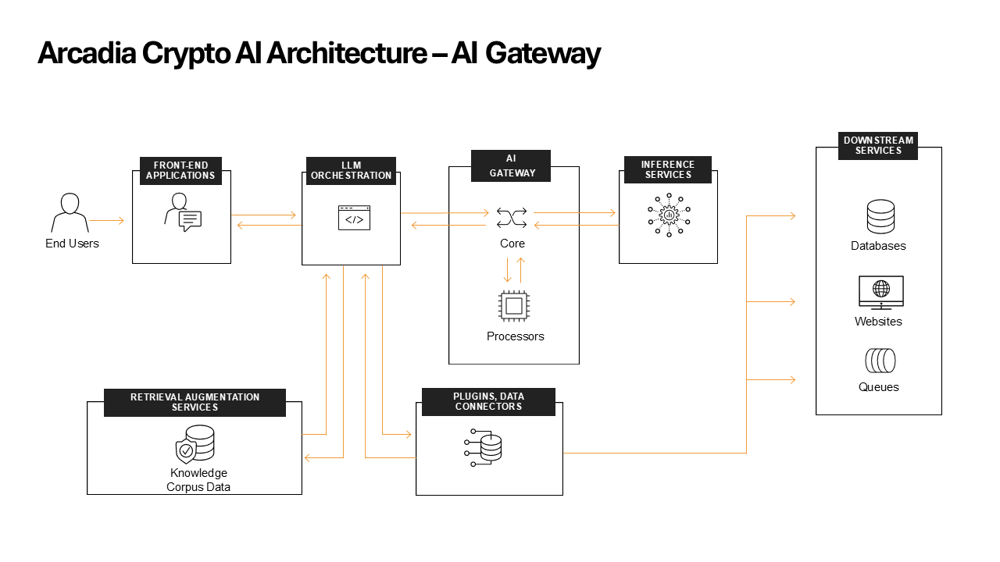

Module 3 - Understanding the AI Assistant application flow
==========================================================

Let's start by explaining the different functions. We will focus only on
the most relevant parts of the flow.

Arcadia Crypto's application architecture
-----------------------------------------

**Front End Application**

This is the **AI Assistant** chatbot that you will be interacting with.

**AI Orchestrator**

The AI Orchestrator acts as the central hub of the entire AI system,
managing the flow of information between various components. Here's a
detailed look at its functions:

-  **Request Handling**: It receives and processes user queries,
   preparing them for further processing.
-  **LLM Interaction**: The Orchestrator sends the constructed prompt to
   Ollama (Inference Service) and receives its responses.
-  **Response Formatting**: It processes the LLM's output, potentially
   formatting or filtering it before sending it back to the user.
-  **State Management**: The Orchestrator maintains the state of the
   conversation, ensuring continuity across multiple user interactions.
-  **Error Handling**: It manages any errors or exceptions that occur
   during the process, ensuring graceful failure modes.

**Inference Services**

Inference services will run a model in order to generation predictions. This lab uses Ollama, a popular open source solution for inference.
Ollama facilitates the local execution of large language models (LLMs) such as Llama 2, Mistral, and in our case
LLama 3.1 8B. The key features of Ollama:

-  **Local Execution**: Users can run powerful language models directly
   on their machines, enhancing privacy and control over data.
-  **Model Customization**: Ollama supports the creation and
   customization of models, allowing users to tailor them for specific
   applications, such as chatbots or summarization tools.
-  **User-Friendly Setup**: The tool provides an intuitive interface for
   easy installation and configuration on macOS, Linux and Windows.
-  **Diverse Model Support**: Ollama supports a variety models, making it
   versatile for different natural language processing tasks.
-  **Open Source**: Ollama is an open-source platform, which means its
   source code is publicly available, allowing for community
   contributions and transparency.

The traffic is passing from the **Front End Application** to the **AI Orchestrator** where the conversation chat is maintained.
The **AI Orchestrator** will pass the chat to **Ollama** through the **AI Gateway** which will perform the security inspection 
both on the request and the response.

Understanding the AI Gateway initial config
-------------------------------------------

To find the initial configuration for AI Gateway, go to your VS Code tab and navigate to the **Explorer**, open the **aigw_configs**
folder and find ``initial_config.yaml``.

   .. image:: images/01.png

First we define what is the endpoint of the **inference service** that hosts the LLM.

   .. code:: yaml

      services:
       - name: ollama
           executor: http
           config:
           endpoint: "http://ollama_public_ip:11434/api/chat"
           schema: ollama-chat 

Next we need to define a **profile** that points to the service.

   .. code:: yaml

      profiles:
       - name: default
           services:
           - name: ollama

Next we define a **policy** and attach the profile to it.

   .. code:: yaml

      policies:
       - name: arcadia_ai_policy
           profiles:
           - name: default

Lastly, we combine everything with a **route** which is the entry point that the AI Gateway is listening on.

   .. code:: yaml

      routes:
       - path: /api/chat
           policy: arcadia_ai_policy
           timeoutSeconds: 600
           schema: openai

The final configuration will look as the following and is currently applied to the AI Gateway:

   .. code:: yaml

      routes:
       - path: /api/chat
           policy: arcadia_ai_policy
           timeoutSeconds: 600
           schema: openai

       # What policy is applied to the route
       policies:
       - name: arcadia_ai_policy
           profiles:
           - name: default

       # To what LLM endpoint we forward the request to
       services:
       - name: ollama
           executor: http
           config:
           endpoint: "http://ollama_public_ip:11434/api/chat"
           schema: ollama-chat

       # What do we do with the request, at the moment we just forward it
       profiles:
       - name: default
           services:
           - name: ollama

Interact with the AI Assistant and review the logs
--------------------------------------------------

Go ahead and ask the **AI Assistant** a question.

   .. image:: images/02.png

Then review the **AI Gateway** logs from the **AI Gateway Web Shell** tab you previously opened. Your previously run
command should continue to show you new log entries. You may need to scroll to the bottom of the screen in order to
see them. If you are back at the terminal prompt, run the ``docker logs aigw-aigw-1 -f`` command again to view the logs.

   ::

      2025/01/12 13:58:19 INFO service selected name=http/
      2025/01/12 13:58:19 INFO executing http service
      2025/01/12 13:58:24 INFO service response name=http/ result="map[status:200 OK]"

