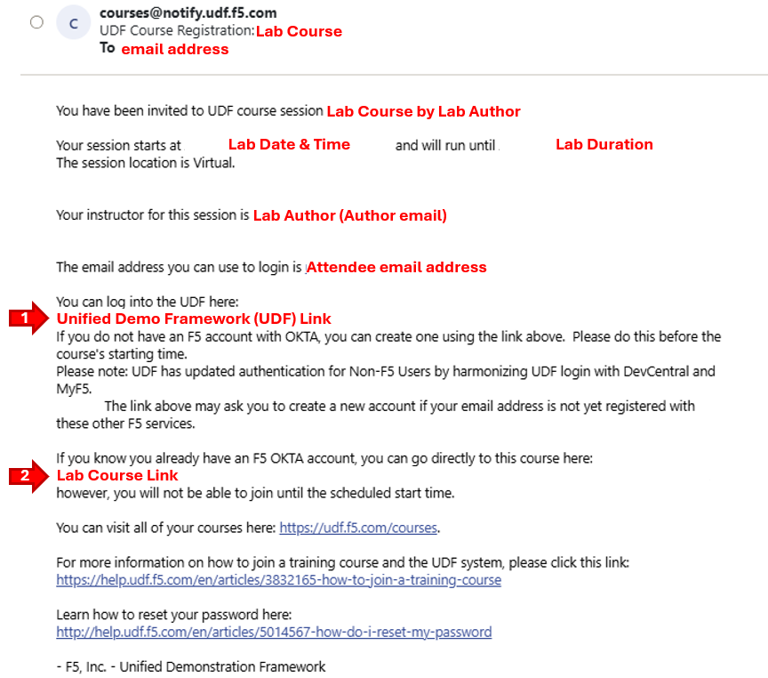
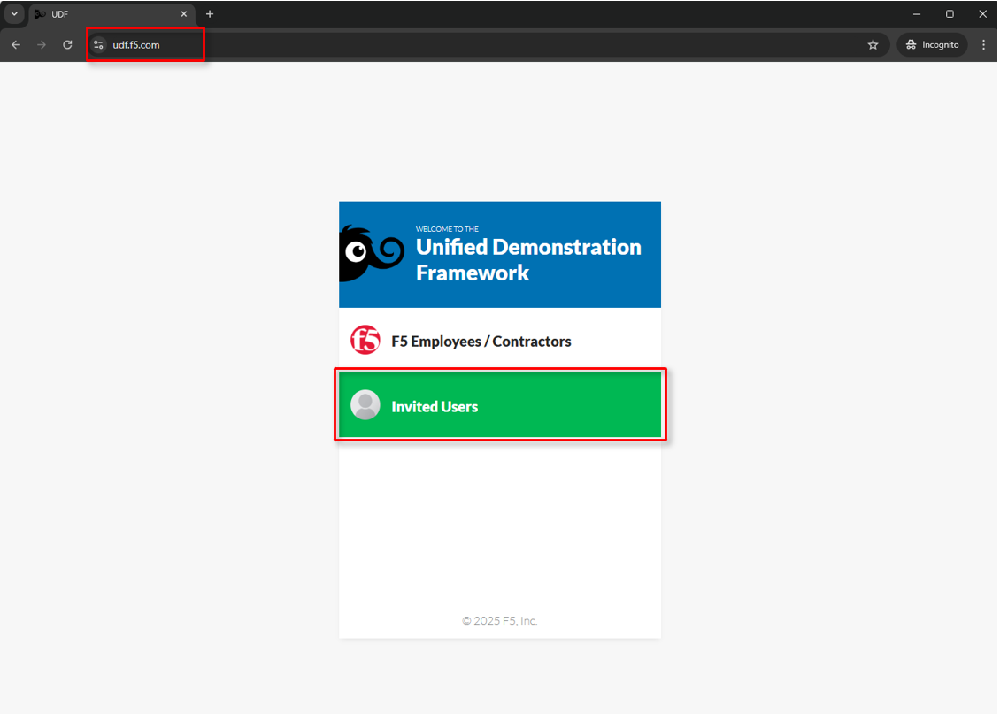
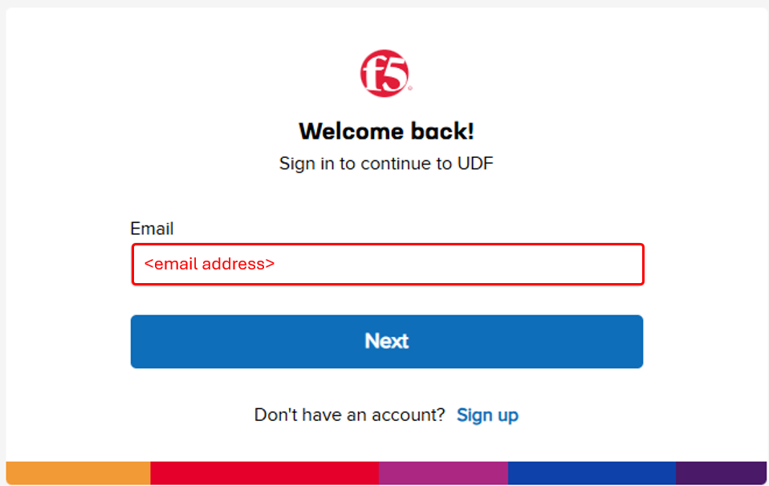
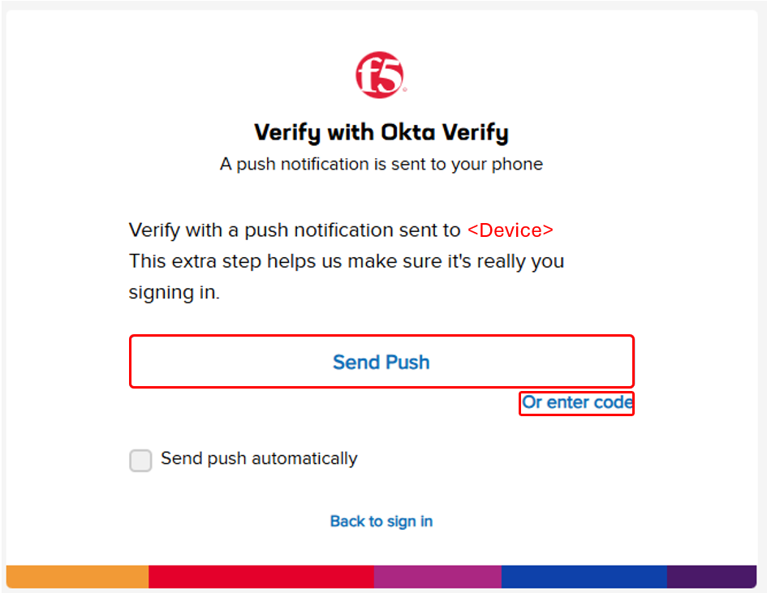
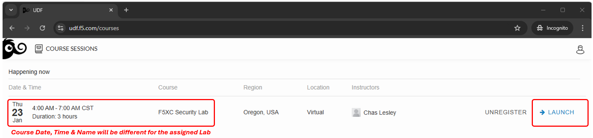
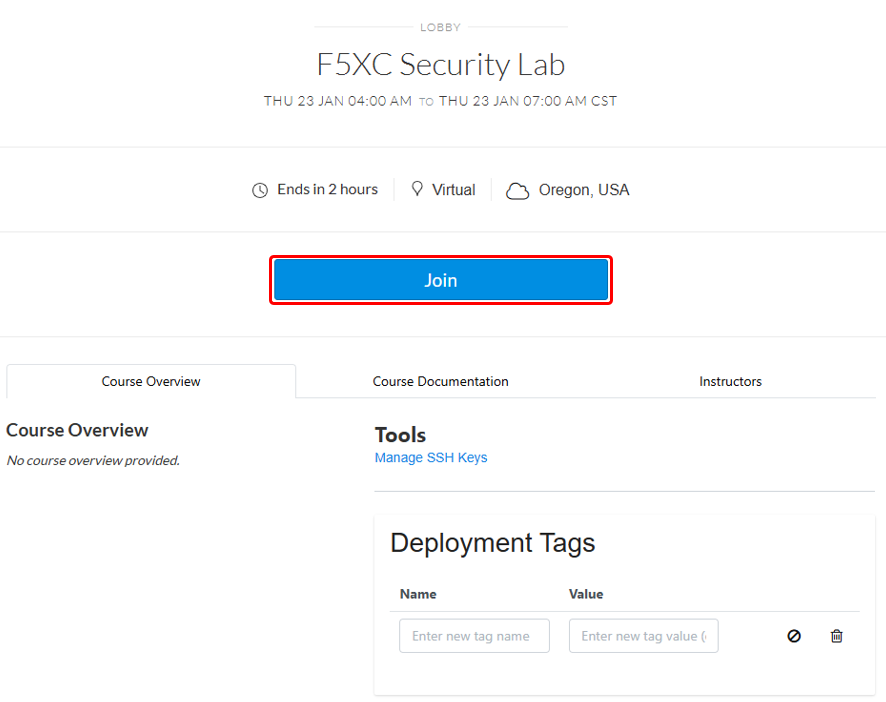
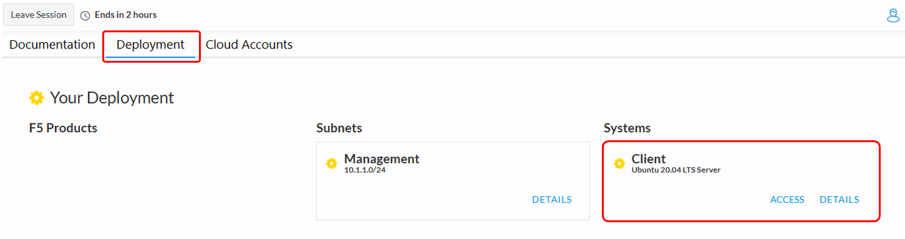
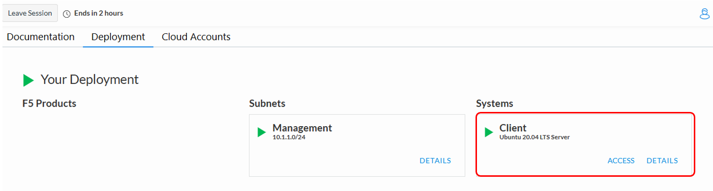

Accessing the lab
#################

Lab attendees should have received an invitation email to the lab environment based on the submitted registration email. Please check email and spam folders if it has not been received. If you have not received an email, please contact a member of the lab team.  

Course/Lab Invitation
~~~~~~~~~~~~~~~~~~~~~

+----------------------------------------------------------------------------------------------+
| Course/Lab Attendees will receive an email similar to the graphic displayed in this section. |
| The email will come from courses@notify.udf.f5.com.                                          |
|                                                                                              |
| As attendees maybe registered for several lab/courses, ensure the corrcetly identified course|
| is selected.  Use either the first or second link position (indicated by arrows) based on    |
| the attendee's F5 UDF (Unified Demo Framework) Account Status.                               |
|                                                                                              |
| # **New UDF Users**                                                                          |
| # **Returning UDF Users going directly to Course**                                           |
|                                                                                              |
| .. note::                                                                                    |
|    *Note The steps for new UDF Users or the steps for resetting UDF User account passwords*  |
|    *are not shown. Please contact a member of the lab team if further assistance is needed.* |
+----------------------------------------------------------------------------------------------+
| |intro001|                                                                                   |
+----------------------------------------------------------------------------------------------+

Accessing UDF (F5 Unified Demo Framework)
~~~~~~~~~~~~~~~~~~~~~~~~~~~~~~~~~~~~~~~~~

+----------------------------------------------------------------------------------------------+
| The following will guide attendees through the initial Lab environment access within F5 UDF. |
| Following the instructions from the Course/Lab invitation above, attendees will be prompted  |
| to login at  https://udf.f5.com                                                              |
|                                                                                              |
| .. note::                                                                                    |
|    *Note The steps for new UDF Users or the steps for resetting UDF User account passwords*  |
|    *are not shown. Please contact a member of the lab team if further assistance is needed.* |
+----------------------------------------------------------------------------------------------+
| |intro002|                                                                                   |
+----------------------------------------------------------------------------------------------+

+----------------------------------------------------------------------------------------------+
| Attendees will be prompted to enter their UDF account, password and complete MFA as shown.   |
| MFA must be completed by either selecting **Send Push** or **Enter Code**.                   |
|                                                                                              |
| .. note::                                                                                    |
|    *MFA process will very based on the MFA integration selected for the UDF Account. OKTA*   |
|    *Verify is shown.*                                                                        |
+----------------------------------------------------------------------------------------------+
| |intro003|                                                                                   |
|                                                                                              |
| |intro004|                                                                                   |
|                                                                                              |
| |intro005|                                                                                   |
+----------------------------------------------------------------------------------------------+

+----------------------------------------------------------------------------------------------+
| Attendees will then be presented their scheduled course sessions. Locate the course/lab with |
| the appropriate **Date**, **Time** and **Name** and then click **Launch**.                   |
+----------------------------------------------------------------------------------------------+
| |intro006|                                                                                   |
+----------------------------------------------------------------------------------------------+

+----------------------------------------------------------------------------------------------+
| Once redirected to the selected Course/Lab, click the **Join** button.                       |
+----------------------------------------------------------------------------------------------+
| |intro007|                                                                                   |
+----------------------------------------------------------------------------------------------+

+----------------------------------------------------------------------------------------------+
| The Lab environment window will now be displayed.  Click on the **Documentation** tab in the |
| horizontal navigation links.          |
|                                                                                              |
| In approximately 5-7 minutes the associated **yellow gear** starting icon will change to a   |
| **green arrow** (running) icon and attendees will proceed to the next section of steps.      |
|                                                                                              |
| .. note::                                                                                    |
|    *Your specific lab environment may vary from the graphics shown below.                    |
|                                                                                              |
+----------------------------------------------------------------------------------------------+
| |intro008|                                                                                   |
|                                                                                              |
| |intro009|                                                                                   |
+----------------------------------------------------------------------------------------------+

.. |intro004| image:: ../pictures/intro-04.png
   :width: 800px

