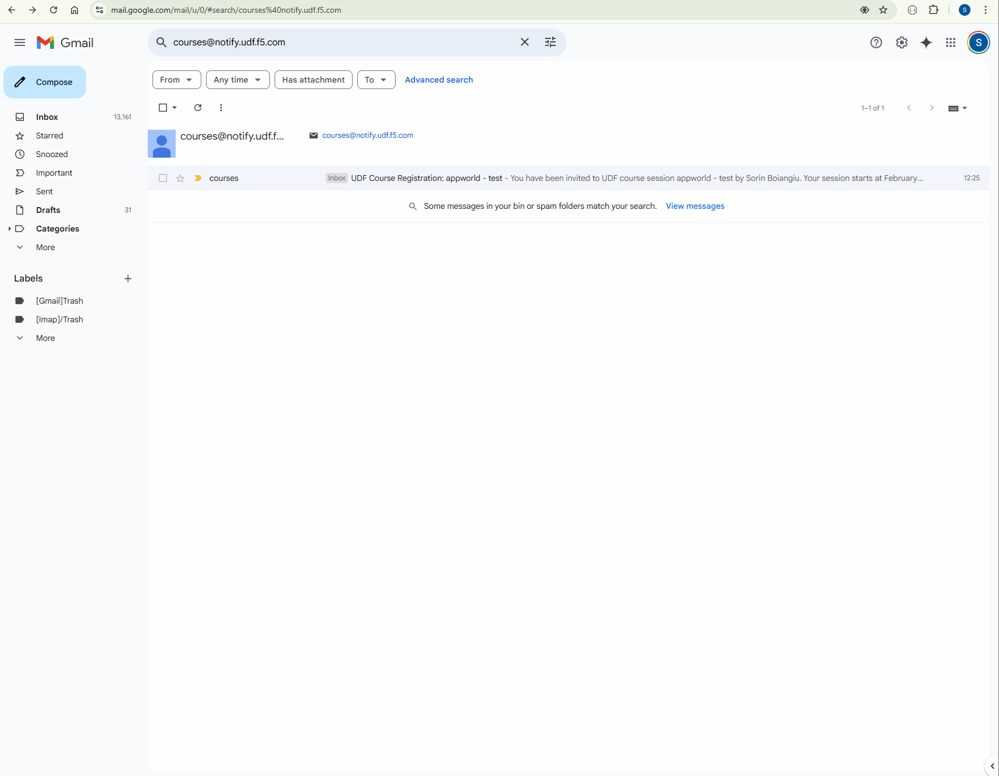

Accessing the lab
#################

Lab attendees should have received an invitation email to the lab environment based on the submitted registration email. Please check email and spam folders if it has not been received. If you have not received an email, please contact a member of the lab team.  

Course/Lab Attendees will receive an email from **courses@notify.udf.f5.com**.

Click on the link bellow **You can log into the UDF here:**.

Attendees will be prompted to enter their UDF account, password and complete MFA as shown. The MFA depends on how you have registered to **MyF5**.

Attendees will then be presented their scheduled course sessions. Locate the course/lab with the appropriate **Date**, **Time** and **Name** and then click **Launch**.

Once redirected to the selected Course/Lab, click the **Join** button.

The Lab environment window will now be displayed.  Click on the **Deployment** tab in the horizontal navigation links.

In approximately 5-7 minutes the associated **yellow gear** starting icon will change to a **green arrow** (running) icon and attendees will proceed to the next section of steps. 

