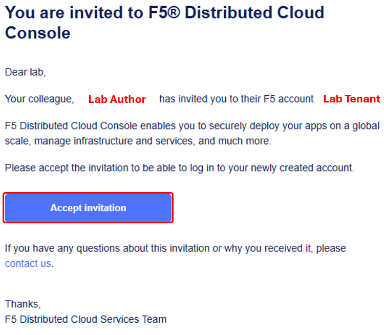
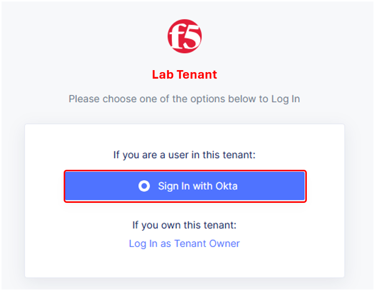
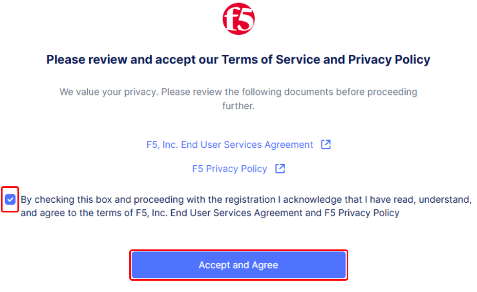
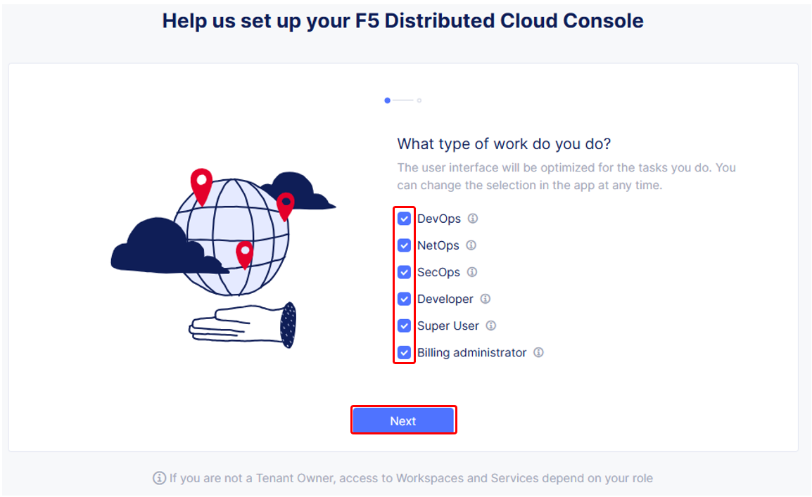
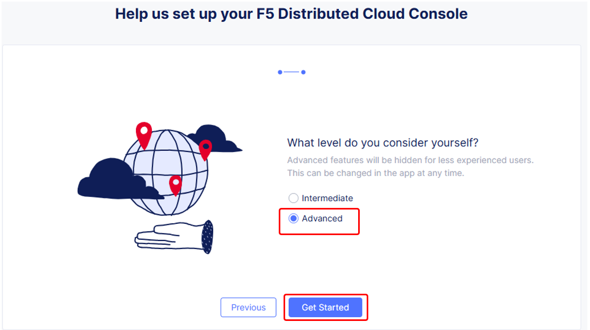
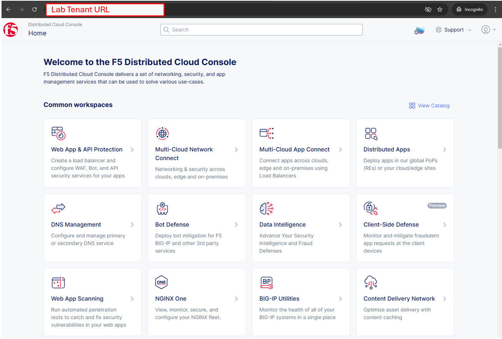

Accessing F5 Distributed Cloud console
######################################

+----------------------------------------------------------------------------------------------+
| Following the state change of the **Client System** to a **green arrow** (running) icon,     |
| attendees will receive a second email as shown below.  Click the **Accept invitation**       |
| button.                                                                                      |
|                                                                                              |
| .. note::                                                                                    |
|    *Alternatively, attendees can also access the F5 Distributed Cloud Tenant directly via a* |
|    *URL provided by the lab team as needed.*                                                 |
+----------------------------------------------------------------------------------------------+
| |intro010|                                                                                   |
+----------------------------------------------------------------------------------------------+

+----------------------------------------------------------------------------------------------+
| The initial logon prompt will be presented.  Click **Sign on with Okta** to proceed.  SSO    |
| will process and onboarding to the tenant will proceed.                                      |
+----------------------------------------------------------------------------------------------+
| |intro011|                                                                                   |
+----------------------------------------------------------------------------------------------+

+----------------------------------------------------------------------------------------------+
| Next the **Terms of Service and Privacy Policy** will display, check the box and then click  |
| **Accept and Agree**.                                                                        |
|                                                                                              |
| In the following screen, Select all persona roles and click **Next**. This allows attendees  |
| to see all the various configurations. Personas can be changed anytime later within the      |
| console if desired.                                                                          |
|                                                                                              |
| In the next screen, click **Advanced** to expose more menu options and then **Get Started**  |
| to begin. You can change this setting after logging in as well.                              |
|                                                                                              |
| .. note::                                                                                    |
|    *Several Guidance ToolTips or Notices may appear.  Attendees can safely close these out*  |
|    *in order to begin the lab.*                                                              |
+----------------------------------------------------------------------------------------------+
| |intro012|                                                                                   |
|                                                                                              |
| |intro013|                                                                                   |
|                                                                                              |
| |intro014|                                                                                   |
+----------------------------------------------------------------------------------------------+

+----------------------------------------------------------------------------------------------+
| Attendees will now be presented the Home page of the F5 Distributed Cloud Console with all   |
| the workspaces, features and services available.                                             |
+----------------------------------------------------------------------------------------------+
| |intro015|                                                                                   |
+----------------------------------------------------------------------------------------------+

