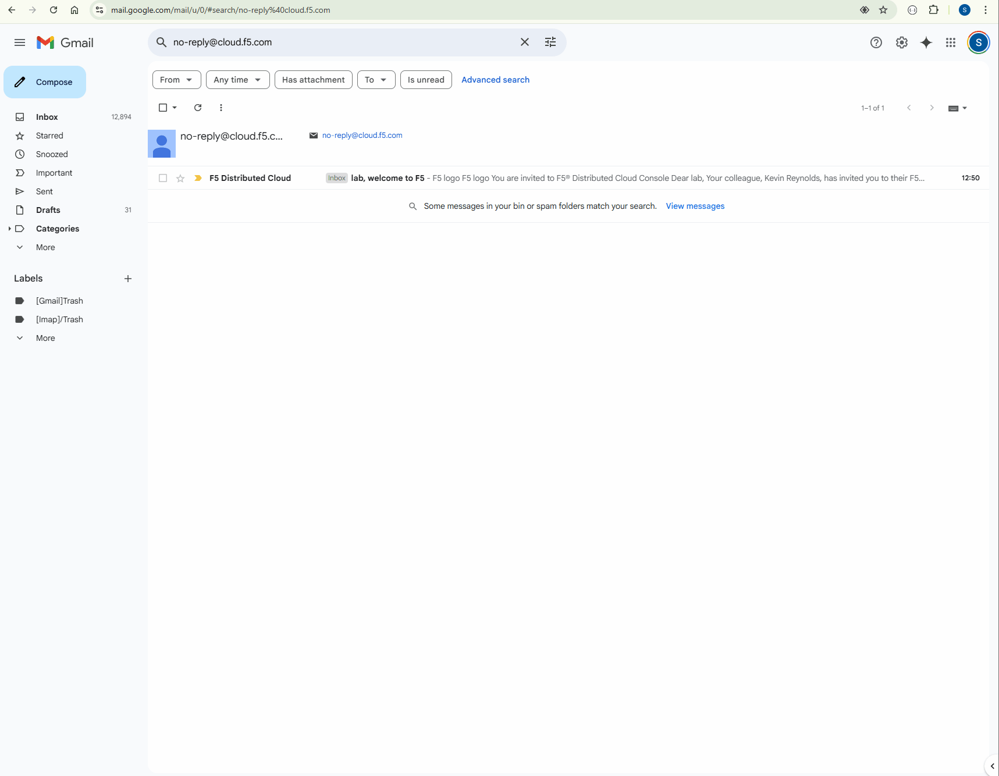

Accessing F5 Distributed Cloud console
######################################

Now we will need to access the **F5 Distributed Cloud** console.

You should have received and email invitation from **no-reply@cloud.f5.com**.

Click the **Accept invitation** in the email.

The initial logon prompt will be presented.  Click **Sign on with Okta** to proceed. SSO will process and onboarding to the tenant will proceed.  

Next the **Terms of Service and Privacy Policy** will display, check the box and then click **Accept and Agree**.

In the following screen, select all persona roles and click **Next**. 

In the next screen, click **Advanced** to expose more menu options and then **Get Started** to begin.

Attendees will now be presented the Home page of the F5 Distributed Cloud Console with all the workspaces, features and services available.

