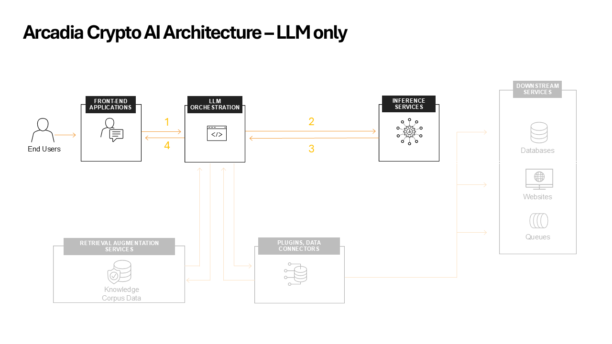

LLM only
########

Let's start by explaining the different functions.

**AI Orchestrator**

The AI Orchestrator acts as the central hub of the entire AI system, managing the flow of information between various components. Here's a detailed look at its functions:

* **Request Handling**: It receives and processes user queries, preparing them for further processing.
* **LLM Interaction**: The Orchestrator sends the constructed prompt to Ollama (the LLM) and receives its responses.
* **Response Formatting**: It processes the LLM's output, potentially formatting or filtering it before sending it back to the user.
* **State Management**: The Orchestrator  maintains the state of the conversation, ensuring continuity across multiple user interactions.
* **Error Handling**: It manages any errors or exceptions that occur during the process, ensuring graceful failure modes.

**Ollama ( Inference Services )**

Ollama is an advanced AI tool that facilitates the local execution of large language models (LLMs), such as Llama 2, Mistral, and in our case LLama 3.1 8B.
The key Features of Ollama:

* **Local Execution**: Users can run powerful language models directly on their machines, enhancing privacy and control over data.
* **Model Customization**: Ollama supports the creation and customization of models, allowing users to tailor them for specific applications, such as chatbots or summarization tools.
* **User-Friendly Setup**: The tool provides an intuitive interface for easy installation and configuration, currently supporting macOS and Linux, with Windows support planned for the future.
* **Diverse Model Support**: Ollama supports various models, including Llama 2, uncensored Llama, Code Llama, and others, making it versatile for different natural language processing tasks.
* **Open Source**: Ollama is an open-source platform, which means its source code is publicly available, allowing for community contributions and transparency.

Understading the interactions
-----------------------------

Go to the **AI Assistant** start a new conversation and ask him the bellow question.

::

    How should I approch investing in crypto ?

1. **User** sends question to **LLM Orchestrator**
2. **LLM Orchestrator** forwards the user prompt to the **LLM**
3. **LLM** returns response to **LLM Orchestrator**
4. **ALLM Orchestrator** sends the **LLM** response back to the **user**

This is the most **basic interaction** with the **LLM**. The **LLM** response is generated based only from the **training data**.