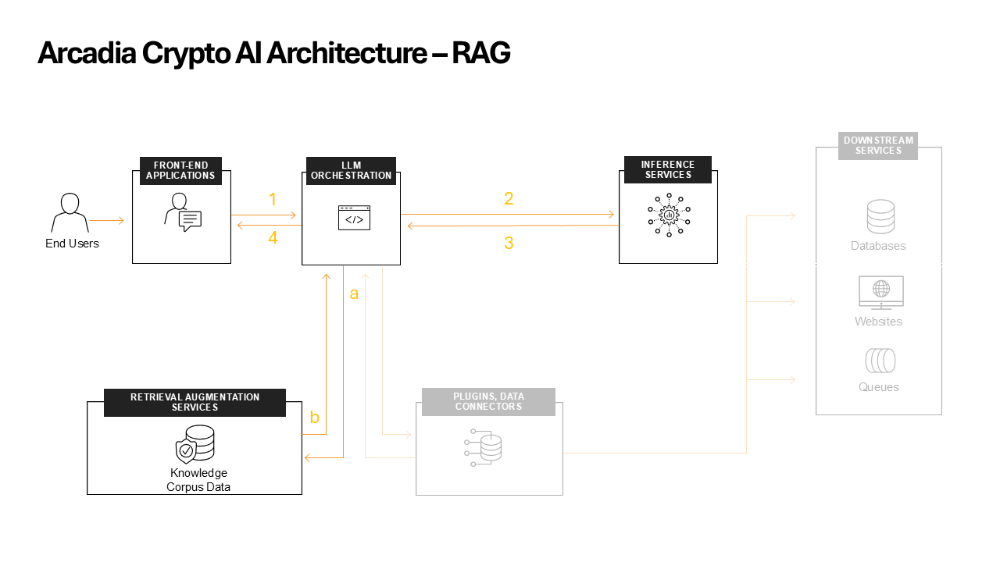

RAG implementation
##################

Let's start by explaining the different functions.

**RAG (Retrieval-Augmented Generation)**  

RAG is a crucial component that enhances the AI's ability to provide accurate and contextually relevant responses. Here's a detailed breakdown of its function:

* **Purpose**: RAG combines the power of large language models with the ability to retrieve specific, up-to-date information from a knowledge base.
* **Knowledge Base**: RAG maintains a repository of information relevant to Arcadia Crypto. This could include details about cryptocurrencies, trading strategies, market trends, company policies, and user guides.
* **Information Retrieval**: When a user query is received, RAG searches its knowledge base for the most relevant pieces of information. It can return up to 5 chunks of contextual data related to the query.
* **Vector Embeddings**: RAG likely uses vector embeddings to represent both the user's query and the documents in its knowledge base. This allows for efficient semantic search, finding information that's conceptually related even if it doesn't contain exact keyword matches.
* **Ranking Algorithm**: RAG employs a sophisticated ranking algorithm to determine which pieces of information are most relevant to the user's query. This ensures that the most pertinent information is provided to the AI model.
* **Dynamic Updates**: The RAG system can be updated regularly to include new information, ensuring that the AI always has access to the latest data about Arcadia Crypto and the cryptocurrency market.

**LLM Orchestrator**

The AI Orchestrator has additional roles when using the RAG system:

* **RAG Integration**: The Orchestrator sends user queries to the RAG system to retrieve relevant contextual information.
* **Prompt Construction**: It combines the user's query with the contextual information from RAG and any necessary system prompts to create a comprehensive input for the language model.

Understanding the interactions
------------------------------

Go to the **AI Assistant** start a new conversation and ask him the bellow question, did you find out who the CEO is?

::

    Who is the Arcadia CEO?

The reason we couldn't find out who the CEO is is because is because the LLM doesn't have specific knowldge about Arcadia Crypto and we also haven't provided more information through the RAG system.
Now, let's add data to the RAG system.

1. Download `companyinfo`_ file which contains Arcadia Crypto specific information.

.. _companyinfo: ../../../_static/company_info.txt

2. Browse to `Arcadia RAG system <http://arcadia-re-$$makeId$$.lab-sec.f5demos.com/v1/ai-rag/>`_ and upload the **companyinfo** file

3. Enter :code:`Who is the Arcadia CEO?` in the **Query** and click **Send**.
   You will see up to 5 different text blocks of relevant information. This is the same information that the **AI Orchestrator** will retrive for this prompt

4. Reset the chat with the **AI Assistant** and ask the question again. Did you get any relevant information this time?

1. **User** sends question to **AI Orchestrator**
2. **LLM Orchestrator** queries the **RAG** with the user prompt to get **contextual data**
3. **RAG** responds with up to 5 chunks of **contextual data**
4. **LLM Orchestrator** combines the **prompt + contextual data** and sends it to the **LLM** 
5. **LLM** returns response to **LLM Orchestrator**
6. **LLM Orchestrator** sends the **LLM** response back to the **user**

When using RAG systems, we can enhance the overall knowledge of the LLM with specific information.