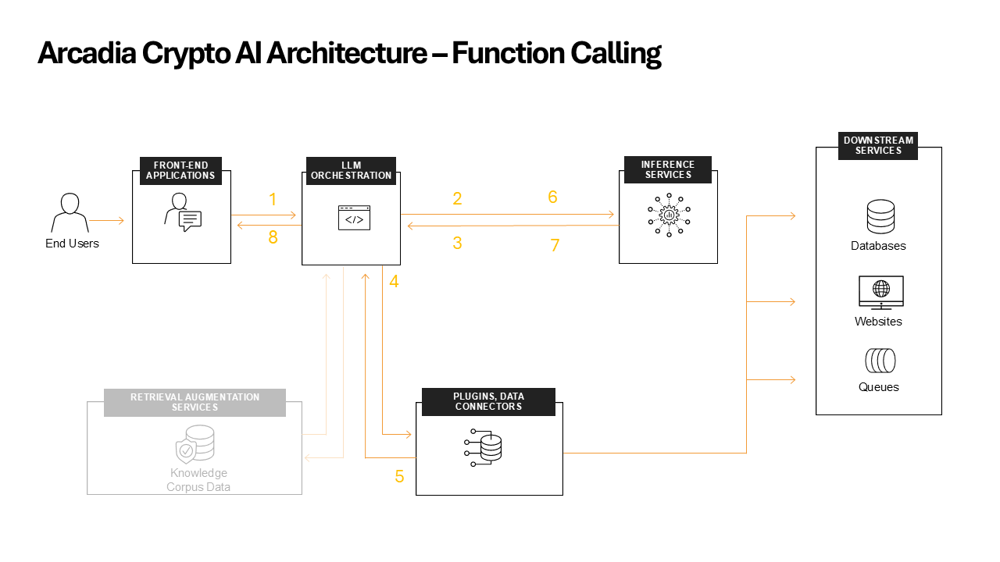

Function calling
################

Let's start by explaining the different functions.

**LLM Orchestrator**

The LLM Orchestrator has additional roles when using it with LLM function calling:

* **Function Calling**: When the LLM indicates a need for additional information, the Orchestrator manages API calls to relevant microservices (e.g., Users, Stocks) to fetch real-time data.

**Ollama (the LLM)**

If the LLM which is hosted on the Ollama is the brain function calling is give it a body with hands and legs.

* **Function Calling**: When the LLM determines that it needs additional information to provide an accurate response, it can request specific data through function calls. For example, it might request current cryptocurrency prices or user account information.

What is function calling
------------------------

Function calling in AI refers to the ability of a language model to recognize when it needs to execute a specific function or API call to retrieve or process information that it doesn't inherently have. Instead of generating a response based solely on its training data, the AI can request external data or computations to enhance its response.
Key aspects of function calling:

* **Recognition**: The AI recognizes the need for external data or computation.
* **Specification**: It specifies which function needs to be called and with what parameters.
* **Integration**: The AI integrates the result of the function call into its response generation process.

Use Cases for Function Calling in Arcadia Crypto:

**Real-time Account Information:**
* Function: get_user_data
* Use Case: When a user asks about their account balance or portfolio, the AI can call this function to fetch up-to-date information from the Users microservice.
* Example: "What's my current account balance?"

**Current Cryptocurrency Prices:**

* Function: get_all_stock_prices
* Use Case: For queries about current market prices or to provide trading advice, the AI can fetch real-time cryptocurrency prices.
* Example: "What's the current price of Bitcoin?"

**Transaction History:**

* Function: get_user_transactions
* Use Case: When users inquire about their trading history or performance, this function can retrieve their recent transactions.
* Example: "Show me my last 5 trades."

Understading the interactions
-----------------------------

Go to the **AI Assistant** start a new conversation and ask him the bellow question.

::

    How many bitcoins to I have?

1. **User** sends question to **AI Orchestrator**
2. **LLM Orchestrator** combines the prompt + contextual data ( not shown in the diagram ) and sends it to the **LLM**
3. **LLM** decides that it needs to know how much cash the users has and responses by asking the **LLM Orchestrator** to run **get_user_data** with the relevant account ID
4. **LLM Orchestrator** runs the **get_user_data** which is an API call to the **users** microservice and gets the user balance
5. The internal app microservice respond to the API call with the relevant **user** data
6. **LLM Orchestrator**  sends the retrieved user data to the **LLM** for final processing
7. Based on all the information provided so far the **LLM** returns the response to **LLM Orchestrator**
8. **LLM Orchestrator** sends the **LLM** response back to the **user**

Bot joke to make things clear :)
--------------------------------

Why did the LLM join a gym?

It had a great brain, but its function calling was weak!

The trainer said, "Your neural networks are impressive, but your API calls need work. Let's get those data-fetching muscles bulked up!"

So the LLM started a rigorous routine:

* Monday: 100 GET requests
* Tuesday: 50 POST call push-ups
* Wednesday: 30-minute CRUD-io
* Thursday: High-Intensity Interval Token-ing
* Friday: REST day (but not the API kind!)

After a few weeks, the LLM was no longer just a floating head of knowledge. It had a body of functions that could grab real-world data, legs that could run complex calculations, and hands that could manipulate information with ease.

Now when users ask it questions, it doesn't just think - it acts! It's not just artificially intelligent, it's functionally fit!

Remember folks, a healthy LLM needs both a strong mind and active functions. Don't skip API day!