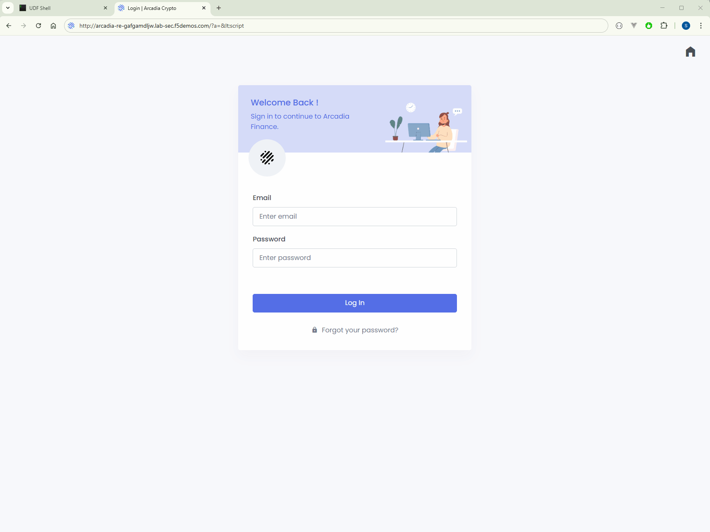

Testing the App Security
########################

We will go through testing steps to verify that our application has been successfully protected.

.. _Arcadia XSS Attack: http://arcadia-re-$$makeId$$.lab-sec.f5demos.com/?a=<script>

1. Let's test the **Web Application Firewall**, browse to `Arcadia XSS Attack`_.  

   The request will be blocked due to the XSS attack by the **Web Application Firewall**.

2. Test the **API protection**:

   a) Browse to `Arcadia non existing endpoint <http://arcadia-re-$$makeId$$.lab-sec.f5demos.com/v1/api>`_.      

      The request will be blocked because the **Path** is not defined in the enforced OpenAPI schema.  

   b) In the **Jumphost** **Webshell** run the bellow cURL command.  

      The request will be blocked because the **email** is defined OpenAPI schema as a string and not as a number.  

      .. code-block:: none

         curl -H "Content-Type: application/json;charset=UTF-8" \
           --data-raw "{\"email\":112233,\"password\":\"bitcoin\"}" \
           http://arcadia-re-$$makeId$$.lab-sec.f5demos.com/v1/login        

3. Test that the **ChatBot** is protected from mallicious Bots. In the **Jumphost** **Webshell** run the bellow cURL commands.  

   Bot protection will block the request as it understands that this request is coming from a **Bot**.  

   .. code-block:: none

     # Login and get JWT token
     JWT_TOKEN=$(curl -s -X POST "http://arcadia-re-$$makeId$$.lab-sec.f5demos.com/v1/login" \
         -H "Content-Type: application/json" \
         -d '{"email":"sorin@nginx.com","password":"nginx"}' \
         | grep -o '"jwt":"[^"]*' | cut -d'"' -f4)

     echo "JWT Token: $JWT_TOKEN"

     # Send a message to AI chat
     curl -s -X POST "http://arcadia-re-$$makeId$$.lab-sec.f5demos.com/v1/ai/chat" \
         -H "Content-Type: application/json" \
         -H "Authorization: Bearer $JWT_TOKEN" \
         -d '{"newQuestion":"Tell me about the current market trends for cryptocurrencies."}'

4. Go and inspect the **Security Logs**

   .. image:: ../pictures/07.gif
      :align: center
      :class: bordered-gif  

5. **IMPORTANT NOTE** Because we enabled Bot protection when you browse the next time to the Arcadia application you need to either disable the browser cache or clear it in order to make sure the browser is loading the Bot protection JavaScripts.      