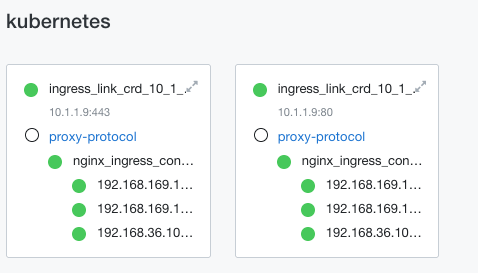
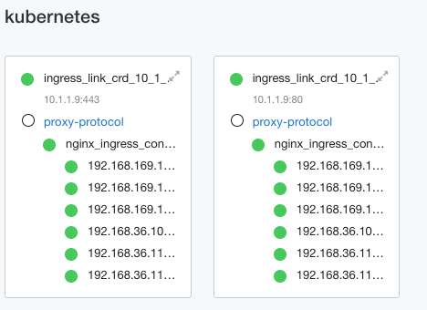

Lab 1.1 - NGINX Ingress Controller Scaling
==========================================

In this lab you will scale up and down the NGINX Ingress Controller (NIC) deployment and verify the F5 IngressLink configuration updates
the BIG-IP's pool members.

Open BIG-IP Network Map
-----------------------

1. Open the TMUI window from the previous exercise (or open it by clicking **TMUI** in the **Access** dropdown for the F5 BIG-IP).

2. Navigate to **Local Traffic >> Network Map**. A new tab will open. You should see two pools for the ingress controller.
If you don't, select the **kubernetes** partition from the dropdown near the upper-left corner below the F5 logo.

Scale Up NGINX Ingress Controller Deployment
--------------------------------------------

1. Access the shell for the Ubuntu server. It should be open from the previous lab.

2. Set the default namespace to ``nginx-ingress``.

.. code-block:: bash

    kubectl config set-context --current --namespace nginx-ingress

3. Verify the current number of NIC Pods. It should be three.

.. code-block:: bash

    kubectl get pods -o wide

**Output**

.. code-block:: console

    ubuntu@ubuntu:~$ kubectl get pods -o wide
    NAME                                        READY   STATUS    RESTARTS      AGE   IP                NODE        NOMINATED NODE   READINESS GATES
    nginx-ingress-controller-8649794698-frz8k   1/1     Running   2 (23h ago)   23h   192.168.169.157   k8s-node2   <none>           <none>
    nginx-ingress-controller-8649794698-g5cfs   1/1     Running   2 (23h ago)   23h   192.168.36.100    k8s-node1   <none>           <none>
    nginx-ingress-controller-8649794698-w4xd9   1/1     Running   2 (23h ago)   23h   192.168.169.160   k8s-node2   <none>           <none>

4. Scale the NIC deployment to six pods.

.. code-block:: bash

    kubectl scale deployment --replicas=6 nginx-ingress-controller

5. Verify the pods are scaled.

.. code-block:: bash

    kubectl get pods -o wide

**Output**

.. code-block:: console

    ubuntu@ubuntu:~$ kubectl get pods -o wide
    NAME                                        READY   STATUS    RESTARTS      AGE   IP                NODE        NOMINATED NODE   READINESS GATES
    nginx-ingress-controller-8649794698-frz8k   1/1     Running   2 (23h ago)   24h   192.168.169.157   k8s-node2   <none>           <none>
    nginx-ingress-controller-8649794698-g5cfs   1/1     Running   2 (23h ago)   24h   192.168.36.100    k8s-node1   <none>           <none>
    nginx-ingress-controller-8649794698-g6l6j   1/1     Running   0             94s   192.168.169.164   k8s-node2   <none>           <none>
    nginx-ingress-controller-8649794698-m8pxk   1/1     Running   0             94s   192.168.36.118    k8s-node1   <none>           <none>
    nginx-ingress-controller-8649794698-w4xd9   1/1     Running   2 (23h ago)   24h   192.168.169.160   k8s-node2   <none>           <none>
    nginx-ingress-controller-8649794698-xzh2l   1/1     Running   0             94s   192.168.36.114    k8s-node1   <none>           <none>

Verify BIG-IP Pools
-------------------

1. Switch back to the **Network Map** tab and refresh it. You should see additional pool members for the new NIC pods.
Keep refreshing until you see all the new pool members.

Scale Down NGINX Ingress Controller Deployment
----------------------------------------------

1. Open the shell for the Ubuntu server and scale down the NIC deployment back to 3 replicas.

.. code-block:: bash

    kubectl scale deployment --replicas=3 nginx-ingress-controller

2. Verify the pods are scaled down.

.. code-block:: bash

    kubectl get pods -o wide

**Output**

.. code-block:: console

    ubuntu@ubuntu:~$ kubectl get pods -o
    NAME                                        READY   STATUS    RESTARTS      AGE   IP                NODE        NOMINATED NODE   READINESS GATES
    nginx-ingress-controller-8649794698-frz8k   1/1     Running   2 (23h ago)   24h   192.168.169.157   k8s-node2   <none>           <none>
    nginx-ingress-controller-8649794698-g5cfs   1/1     Running   2 (23h ago)   24h   192.168.36.100    k8s-node1   <none>           <none>
    nginx-ingress-controller-8649794698-w4xd9   1/1     Running   2 (23h ago)   24h   192.168.169.160   k8s-node2   <none>           <none>

Verify BIG-IP Pools
-------------------

1. Switch back to the **Network Map** tab and refresh it. You should see the additional pool members disappear as they are scaled down by Kubernetes.
