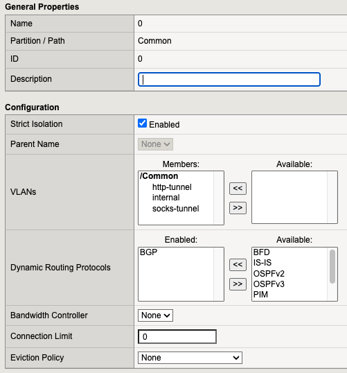

Module 1 - Review IngressLink and NGINX Ingress Controller Configuration
========================================================================

In this module you will review the `F5 IngressLink <https://clouddocs.f5.com/containers/latest/userguide/ingresslink/>`__ configuration.
IngressLink is a special mode of `BIG-IP Container Ingress Services <https://clouddocs.f5.com/containers/latest/>`__ that automatically populates BIG-IP pool members with the endpoints for NGINX Ingress Controller.

Review Kubernetes BGP Configuration
-----------------------------------

1. Access the shell for the Ubuntu box by clicking **Web Shell** in the **Access** dropdown for the Ubuntu server.

2. Change to the **ubuntu** user and confirm the Kubernetes cluster is running and ``calicoctl`` is configured:

.. code-block:: sh

    sudo -u ubuntu -i
    kubectl get nodes
    calicoctl get nodes

**Output**

.. code-block:: console

    root@ubuntu:/# sudo -u ubuntu -i
    ubuntu@ubuntu:~$ kubectl get nodes
    NAME         STATUS   ROLES           AGE    VERSION
    k8s-master   Ready    control-plane   362d   v1.30.10
    k8s-node1    Ready    <none>          362d   v1.30.10
    k8s-node2    Ready    <none>          362d   v1.30.10
    ubuntu@ubuntu:~$ calicoctl get nodes
    NAME
    k8s-master
    k8s-node1
    k8s-node2

3. Review Calico's BGP configuration using ``calicoctl``:

.. code-block:: sh

    calicoctl get bgppeer

**Output**

.. code-block:: console

    ubuntu@ubuntu:~$ calicoctl get bgppeer
    NAME                    PEERIP     NODE       ASN
    bgppeer-global-bigip1   10.1.1.9   (global)   64512

Note the peer IP which is set to the self IP of the BIG-IP and the ASN which is set to a private value (64512).

Review IngressLink Configuration
--------------------------------

1. Change to the ``nginx-ingress`` namespace and review the IngressLink configuration:

.. code-block:: sh

    kubectl config set-context --current --namespace nginx-ingress
    kubectl get ingresslink -o yaml

**Output**

.. code-block:: console

    ubuntu@ubuntu:~$ kubectl config set-context --current --namespace nginx-ingress
    Context "kubernetes-admin@kubernetes" modified.
    ubuntu@ubuntu:~$ kubectl get ingresslink -o yaml
    apiVersion: v1
    items:
    - apiVersion: cis.f5.com/v1
    kind: IngressLink
    metadata:
        annotations:
        kubectl.kubernetes.io/last-applied-configuration: |
            {"apiVersion":"cis.f5.com/v1","kind":"IngressLink","metadata":{"annotations":{},"name":"nginx-ingress","namespace":"nginx-ingress"},"spec":{"iRules":["/Common/proxy-protocol"],"selector":{"matchLabels":{"app":"ingresslink"}},"virtualServerAddress":"10.1.1.9"}}
        creationTimestamp: "2026-01-21T23:41:57Z"
        generation: 2
        name: nginx-ingress
        namespace: nginx-ingress
        resourceVersion: "572369"
        uid: 08f989ec-342d-4ae6-b9fd-7ffc855178a3
    spec:
        bigipRouteDomain: 0
        iRules:
        - /Common/proxy-protocol
        selector:
        matchLabels:
            app: ingresslink
        virtualServerAddress: 10.1.1.9
    status:
        lastUpdated: "2026-02-11T16:22:19Z"
        status: OK
        vsAddress: 10.1.1.9
    kind: List
    metadata:
    resourceVersion: ""

Note the ``spec`` section. IngressLink has been configured to build a virtual server on the BIG-IP that:

* listens on ``10.1.1.9`` (ports 80 and 443)
* adds an iRule to insert a `PROXY Protocol <https://www.haproxy.org/download/1.8/doc/proxy-protocol.txt>`__ header
* configures pool members to match the endpoints of a service with an ``app: ingresslink`` label (this is the NGINX Ingress Controller service)

Review NGINX Ingress Controller Configuration
---------------------------------------------

1. Review the NGINX Ingress Controller service using ``kubectl``:

.. code-block:: sh

    kubectl get service nginx-ingress-controller -o yaml

Notice an ``app: ingresslink`` label has been applied to service. The ``IngressLink`` object reviewed in the previous section
looks for this label when selecting endpoints to add to the BIG-IP pool.

.. code-block:: yaml

  labels:
    app: ingresslink

2. Review the NGINX Ingress Controller Deployment configuration using ``kubectl``:

.. code-block:: sh
    
    kubectl get deployment nginx-ingress-controller -o yaml

Review the container arguments and note the ``ingresslink`` reference to the IngressLink object reviewed in the previous section.
Also note the reference to the ``nginx-config`` configMap:

.. code-block:: yaml

   - -nginx-configmaps=$(POD_NAMESPACE)/nginx-config
   - -ingresslink=nginx-ingress

Review the ``nginx-config`` configMap:

.. code-block:: sh
    
    kubectl get configmap nginx-config -o yaml

PROXY Protocol support is enabled in the configMap:

.. code-block:: yaml

    proxy-protocol: "True"
    real-ip-header: proxy_protocol

Leave the web shell open. It will be used in the next lab.

Review BIG-IP BGP Configuration
-------------------------------

1. Access the BIG-IP TMUI by clicking **TMUI** in the **Access** dropdown for the F5 BIG-IP.

2. Login using *admin* and *!appworld* for the username and password, respectively.

3. Navigate to **Network >> Route Domains**, click on **0**, and confirm that BGP has been added to the dynamic routing protocols. Leave TMUI open for future exercises.

4. Access the BIG-IP TMSH by clicking **Web Shell** in the **Access** dropdown for the F5 BIG-IP.

5. Run ``imish`` to drop into the imish shell, then run ``enable`` and ``show running-config`` to review the BGP configuration.

.. code-block:: sh

    imish
    enable
    show running-config

**Output**

.. code-block:: console

    [root@ip-10-1-1-9:Active:Standalone] config # imish
    ip-10-1-1-9.us-west-2.compute.internal[0]>enable
    ip-10-1-1-9.us-west-2.compute.internal[0]#show running-config
    !
    no service password-encryption
    !
    log syslog
    !
    router bgp 64512
    bgp graceful-restart restart-time 120
    neighbor calico-k8s peer-group
    neighbor calico-k8s remote-as 64512
    neighbor 10.1.1.4 peer-group calico-k8s
    neighbor 10.1.1.5 peer-group calico-k8s
    neighbor 10.1.1.6 peer-group calico-k8s
    !
    line con 0
    login
    line vty 0 39
    login
    !
    end

Note that the ASN (64512) matches the value retrieved from ``calicoctl`` in the previous section, and that the IP addresses of the Kubernetes nodes are configured as neighbors.

1. For each Kubernetes node, run ``show ip bgp neighbor <node-ip> routes`` to review the node's advertised pod CIDR.

.. code-block:: sh

    show ip bgp neighbor 10.1.1.4 routes
    show ip bgp neighbor 10.1.1.5 routes
    show ip bgp neighbor 10.1.1.6 routes

**Output**

.. code-block:: console

    ip-10-1-1-9.us-west-2.compute.internal[0]>show ip bgp neighbor 10.1.1.4 routes 
    BGP table version is 4, local router ID is 10.1.1.9
    Status codes: s suppressed, d damped, h history, * valid, > best, i - internal, l - labeled
                S Stale
    Origin codes: i - IGP, e - EGP, ? - incomplete

    Network          Next Hop            Metric     LocPrf     Weight Path
    *>i192.168.235.192/26
                        10.1.1.4                 0        100          0 i

    Total number of prefixes 1
    ip-10-1-1-9.us-west-2.compute.internal[0]>show ip bgp neighbor 10.1.1.5 routes 
    BGP table version is 4, local router ID is 10.1.1.9
    Status codes: s suppressed, d damped, h history, * valid, > best, i - internal, l - labeled
                S Stale
    Origin codes: i - IGP, e - EGP, ? - incomplete

    Network          Next Hop            Metric     LocPrf     Weight Path
    *>i192.168.36.64/26 10.1.1.5                 0        100          0 i

    Total number of prefixes 1
    ip-10-1-1-9.us-west-2.compute.internal[0]>show ip bgp neighbor 10.1.1.6 routes 
    BGP table version is 4, local router ID is 10.1.1.9
    Status codes: s suppressed, d damped, h history, * valid, > best, i - internal, l - labeled
                S Stale
    Origin codes: i - IGP, e - EGP, ? - incomplete

    Network          Next Hop            Metric     LocPrf     Weight Path
    *>i192.168.169.128/26
                        10.1.1.6                 0        100          0 i

    Total number of prefixes 1

2. Type **exit** and push Enter to return to bash. Feel free to close the web shell. Leave TMUI open. It will be used in the next lab.

In the next lab you will see F5 IngressLink in action as you scale the NGINX Ingress Controller deployment.

.. toctree::
   :maxdepth: 1
   :glob:

   lab*
