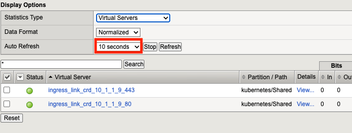
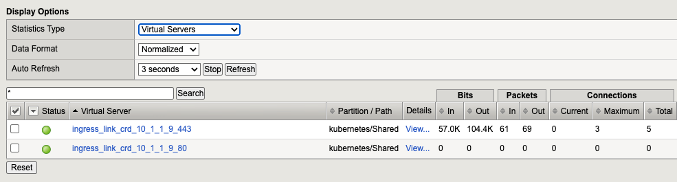

Module 2 - Basic Ingress Controller
====================================

This module demonstrates how to publish two sample applications using:

- URI-based routing
- TLS offload

Connect to Ubuntu Server and set Environment Variables
------------------------------------------------------

Access the shell for the Ubuntu box by clicking **Web Shell** in the **Access** dropdown for the Ubuntu server. Then change to the **ubuntu** user.

.. code-block:: sh

   sudo -u ubuntu -i

Now set variables to point to the IngressLink virtual server:

.. code-block:: bash

   export NIC_IP=10.1.1.9
   export HTTP_PORT=80
   export HTTPS_PORT=443

Check NGINX Ingress Controller IP address, HTTP and HTTPS ports:

.. code-block:: bash

   echo -e "NIC address: $NIC_IP\nHTTP port  : $HTTP_PORT\nHTTPS port : $HTTPS_PORT"

**Output**

.. code-block:: console

   ubuntu@ubuntu:~$ echo -e "NIC address: $NIC_IP\nHTTP port  : $HTTP_PORT\nHTTPS port : $HTTPS_PORT"
   NIC address: 10.1.1.9
   HTTP port  : 80
   HTTPS port : 443

Change to Lab Directory
------------------------

.. code-block:: bash

   cd ~/NGINX-Ingress-Controller-Lab/labs/1.basic-ingress

Deploy Sample Applications
---------------------------

Deploy two sample web applications (coffee and tea):

.. code-block:: bash

   kubectl apply -f 0.cafe.yaml

Verify that all pods are in the ``Running`` state:

.. code-block:: bash

   kubectl get all

Output should be similar to:

.. code-block:: console

   NAME                          READY   STATUS    RESTARTS   AGE
   pod/coffee-56b44d4c55-4v6jp   1/1     Running   0          32s
   pod/coffee-56b44d4c55-gdgdw   1/1     Running   0          32s
   pod/tea-596697966f-cc4zj      1/1     Running   0          28m
   pod/tea-596697966f-hbt7x      1/1     Running   0          28m
   pod/tea-596697966f-mhd9k      1/1     Running   0          28m

   NAME                 TYPE        CLUSTER-IP      EXTERNAL-IP   PORT(S)   AGE
   service/coffee-svc   ClusterIP   172.20.10.229   <none>        80/TCP    28m
   service/kubernetes   ClusterIP   172.20.0.1      <none>        443/TCP   2d23h
   service/tea-svc      ClusterIP   172.20.169.88   <none>        80/TCP    28m

   NAME                     READY   UP-TO-DATE   AVAILABLE   AGE
   deployment.apps/coffee   2/2     2            2           32s
   deployment.apps/tea      3/3     3            3           28m

   NAME                                DESIRED   CURRENT   READY   AGE
   replicaset.apps/coffee-56b44d4c55   2         2         2       32s
   replicaset.apps/tea-596697966f      3         3         3       28m

Configure TLS
-------------

Create TLS certificate and key to be used for TLS offload:

.. code-block:: bash

   kubectl apply -f 1.cafe-secret.yaml

Publish Using Ingress Resource
-------------------------------

Publish ``coffee`` and ``tea`` through NGINX Ingress Controller using the ``Ingress`` resource:

.. code-block:: bash

   kubectl apply -f 2.cafe-ingress.yaml

Check the newly created ``Ingress`` resource:

.. code-block:: bash

   kubectl get ingress

Output should be similar to:

.. code-block:: console

   NAME           CLASS   HOSTS              ADDRESS   PORTS     AGE
   cafe-ingress   nginx   cafe.example.com             80, 443   13s

Test application access (see `Test Applications Access`_ below).

Delete the ``Ingress`` resource:

.. code-block:: bash

   kubectl delete -f 2.cafe-ingress.yaml

Publish Using VirtualServer Custom Resource
--------------------------------------------

Publish ``coffee`` and ``tea`` through NGINX Ingress Controller using the ``VirtualServer`` Custom Resource Definition:

.. code-block:: bash

   kubectl apply -f 3.cafe-virtualserver.yaml

Check the newly created ``VirtualServer`` resource:

.. code-block:: bash

   kubectl get vs -o wide

You may get a warning like the following:

.. code-block:: console

   Warning: short name "vs" could also match lower priority resource virtualservers.k8s.nginx.org
   No resources found in default namespace.

This is because both NGINX Ingress Controller and Container Ingress Services define a ``VirtualServer`` Custom Resource that registers ``vs`` as a short name.
You can confirm this with ``kubectl``:

.. code-block:: bash

   kubectl api-resources | grep vs

You can see ``VirtualServer`` custom resources exist in both the ``cis.f5.com/v1`` and ``k8s.nginx.org/v1`` API groups.

.. code-block:: console

   ubuntu@ubuntu:~/NGINX-Ingress-Controller-Lab/labs/1.basic-ingress$ kubectl api-resources | grep vs
   virtualservers                      vs           cis.f5.com/v1                     true         VirtualServer
   virtualserverroutes                 vsr          k8s.nginx.org/v1                  true         VirtualServerRoute
   virtualservers                      vs           k8s.nginx.org/v1                  true         VirtualServer

We can avoid this warning by using the full resource name with the group:

.. code-block:: bash

   kubectl get virtualservers.k8s.nginx.org -o wide

Output should be similar to:

.. code-block:: console

   NAME   STATE   HOST               IP         EXTERNALHOSTNAME   PORTS      AGE
   cafe   Valid   cafe.example.com   10.1.1.9                      [80,443]   10m

Test application access (see `Test Applications Access`_ below).

Test Applications Access
-------------------------

Open BIG-IP Virtual Server Statistics
~~~~~~~~~~~~~~~~~~~~~~~~~~~~~~~~~~~~~

Access the BIG-IP TMUI by clicking **TMUI** in the **Access** dropdown for the F5 BIG-IP (login using *admin* and *!appworld*).
Navigate to **Local Traffic >> Virtual Servers >> Statistics >> Virtual Server**. Change to the **kubernetes** partition using the dropdown in the upper-right corner.

Then set the Auto Refresh to 10 seconds.

Use the statistics to help confirm requests are processed by the BIG-IP.

Access Coffee Application
~~~~~~~~~~~~~~~~~~~~~~~~~~

We will use ``curl`` with the ``--insecure`` option to turn off certificate verification of our self-signed 
certificate and the ``--connect-to`` option to set the Host header and SNI of the request to ``cafe.example.com``.

.. code-block:: bash

   curl --insecure --connect-to cafe.example.com:$HTTPS_PORT:$NIC_IP https://cafe.example.com:$HTTPS_PORT/coffee

Output should be similar to:

.. code-block:: console

   Server address: 192.168.36.95:8080
   Server name: coffee-56b44d4c55-57mll
   Date: 03/Apr/2025:17:52:49 +0000
   URI: /coffee
   Request ID: 955d316d90c3204040b07e00fe497bc8

Access Tea Application
~~~~~~~~~~~~~~~~~~~~~~~

.. code-block:: bash

   curl --insecure --connect-to cafe.example.com:$HTTPS_PORT:$NIC_IP https://cafe.example.com:$HTTPS_PORT/tea

Output should be similar to:

.. code-block:: console

   Server address: 192.168.169.147:8080
   Server name: tea-596697966f-pnkqk
   Date: 03/Apr/2025:17:53:24 +0000
   URI: /tea
   Request ID: e4ffa71cff7fbf8d8dd3e36ce8e99085

Review BIG-IP Statistics
~~~~~~~~~~~~~~~~~~~~~~~~

In TMUI, confirm the virtual server has processed requests and that statistics have increased:

Optionally, click the checkboxes next to the virtual servers and click the **Reset** button to reset the statistics.

Cleanup
-------

Delete the lab resources:

.. code-block:: bash

   kubectl delete -f .

.. note::
   
   You should get one expected error when trying to delete ``2.cafe-ingress.yaml``.
