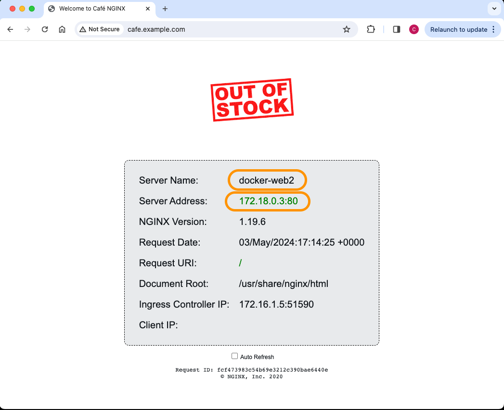
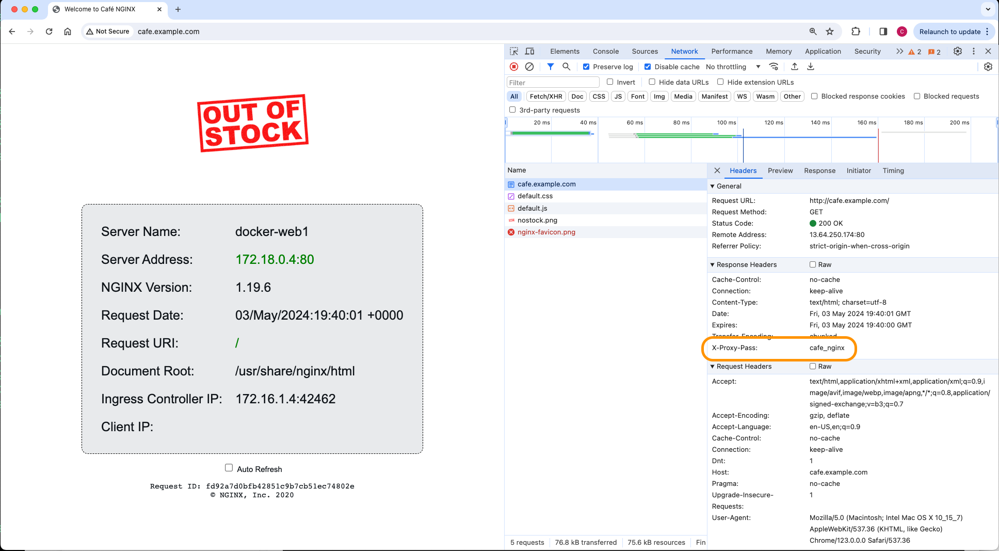
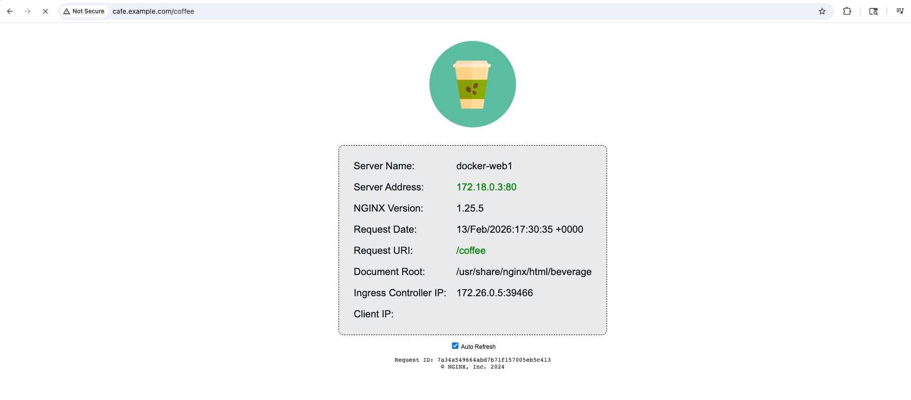
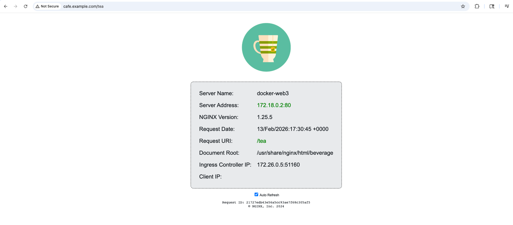

Module 2: Advanced Traffic Management with NGINX for Azure
=======================================================

Overview
--------

Welcome to **Lab 2**. In this session of **"Mastering cloud-native app
delivery: Unlocking advanced capabilities and use cases with F5’s
ADCaaS,"** we move beyond basic connectivity to functional load
balancing.

In this module, you will configure your NGINX for Azure instance to
route traffic to a backend application running on a pre-provisioned
Linux workload using the Azure Portal.

--------------

.. _building_construction-pre-provisioned-infrastructure:

🏗️ Pre-provisioned Infrastructure
---------------------------------

To focus specifically on NGINX configuration, the following backend
resources have been pre-deployed for you:

- **Ubuntu VM:** A Linux virtual machine running a Dockerized "Cafe"
  application.

--------------

.. _rocket-lab-exercises:

🚀 Lab Exercises
----------------

Configure NGINX for Azure to Load Balance Docker Containers
~~~~~~~~~~~~~~~~~~~~~~~~~~~~~~~~~~~~~~~~~~~~~~~~~~~~~~~~~~~

In this section, we will configure NGINX for Azure to load balance
traffic to the Docker containers running on your Ubuntu VM.

=========== ======== ============
NGINX aaS   Docker   Cafe Demo
=========== ======== ============
|NGINX aaS| |Docker| |Nginx Cafe|
=========== ======== ============

.. _1-access-the-configuration-editor:

1. Access the Configuration Editor
^^^^^^^^^^^^^^^^^^^^^^^^^^^^^^^^^^

1. Open the **Azure Portal** and navigate to your **NGINXaaS**.
2. Click on your NGINX for Azure resource (usually named **nginx4a**),
   which will open the Overview section.
3. From the left pane, click on **NGINX Configuration** under the
   Settings section.

.. _2-create-the-upstream-configuration:

2. Create the Upstream Configuration
^^^^^^^^^^^^^^^^^^^^^^^^^^^^^^^^^^^^

1. Click on **+ New File** to create a new NGINX config file.
2. Name the new file: ``/etc/nginx/conf.d/cafe-docker-upstreams.conf``.

..

   **Important:** You must use the full Linux ``/directory/filename``
   path for every config file. The Azure Portal does not support
   drag-and-drop.

3. Copy and paste the following contents into the editor:

.. code:: nginx

   # Nginx 4 Azure, Cafe Nginx Demo Upstreams
   # cafe-nginx servers
   #
   upstream cafe_nginx {
       zone cafe_nginx 256k;
       
       # These correspond to the ports exposed by the Docker containers
       server n4a-ubuntuvm:81;
       server n4a-ubuntuvm:82;
       server n4a-ubuntuvm:83;

       keepalive 32;
   }

4. Click Submit to save this part of the configuration.

.. _3-create-the-virtual-server-configuration:

3. Create the Virtual Server Configuration
^^^^^^^^^^^^^^^^^^^^^^^^^^^^^^^^^^^^^^^^^^

1. Click + New File again.

2. Name the second file: ``/etc/nginx/conf.d/cafe.example.com.conf``.

3. Copy and paste the following contents into the editor:

.. code:: nginx

    # Nginx 4 Azure - Cafe Nginx HTTP
   server {
     
     listen 80;      # Listening on port 80

     server_name cafe.example.com;   # Set hostname to match in request
     status_zone cafe.example.com;   # Metrics zone name

     access_log  /var/log/nginx/cafe.example.com.log main;
     error_log   /var/log/nginx/cafe.example.com_error.log info;

     location / {
         proxy_pass http://cafe_nginx;        # Proxy and load balance to the upstream group
         add_header X-Proxy-Pass cafe_nginx;  # Custom verification header
     }
   }

4. Click Submit to save.

.. _4-create-a-mime-types-file:

4. Create a Mime Types file
^^^^^^^^^^^^^^^^^^^^^^^^^^^

1. A mime.types file is required for the NGINX server configuration
2. Click + New File again.
3. Name the new file: ``/etc/nginx/mime.types``.
4. Copy and paste the following contents into the editor:

.. code:: nginx

   types {
       text/html                             html htm shtml;
       text/css                              css;
       text/xml                              xml;
       image/gif                             gif;
       image/jpeg                            jpeg jpg;
       application/x-javascript              js;
       application/atom+xml                  atom;
       application/rss+xml                   rss;

       text/mathml                           mml;
       text/plain                            txt;
       text/vnd.sun.j2me.app-descriptor      jad;
       text/vnd.wap.wml                      wml;
       text/x-component                      htc;

       image/png                             png;
       image/tiff                            tif tiff;
       image/vnd.wap.wbmp                    wbmp;
       image/x-icon                          ico;
       image/x-jng                           jng;
       image/x-ms-bmp                        bmp;
       image/svg+xml                         svg svgz;
       image/webp                            webp;

       application/java-archive              jar war ear;
       application/mac-binhex40              hqx;
       application/msword                    doc;
       application/pdf                       pdf;
       application/postscript                ps eps ai;
       application/rtf                       rtf;
       application/vnd.ms-excel              xls;
       application/vnd.ms-powerpoint         ppt;
       application/vnd.wap.wmlc              wmlc;
       application/vnd.google-earth.kml+xml  kml;
       application/vnd.google-earth.kmz      kmz;
       application/x-7z-compressed           7z;
       application/x-cocoa                   cco;
       application/x-java-archive-diff       jardiff;
       application/x-java-jnlp-file          jnlp;
       application/x-makeself                run;
       application/x-perl                    pl pm;
       application/x-pilot                   prc pdb;
       application/x-rar-compressed          rar;
       application/x-redhat-package-manager  rpm;
       application/x-sea                     sea;
       application/x-shockwave-flash         swf;
       application/x-stuffit                 sit;
       application/x-tcl                     tcl tk;
       application/x-x509-ca-cert            der pem crt;
       application/x-xpinstall               xpi;
       application/xhtml+xml                 xhtml;
       application/zip                       zip;

       application/octet-stream              bin exe dll;
       application/octet-stream              deb;
       application/octet-stream              dmg;
       application/octet-stream              eot;
       application/octet-stream              iso img;
       application/octet-stream              msi msp msm;

       audio/midi                            mid midi kar;
       audio/mpeg                            mp3;
       audio/ogg                             ogg;
       audio/x-m4a                           m4a;
       audio/x-realaudio                     ra;

       video/3gpp                            3gpp 3gp;
       video/mp4                             mp4;
       video/mpeg                            mpeg mpg;
       video/quicktime                       mov;
       video/webm                            webm;
       video/x-flv                           flv;
       video/x-m4v                           m4v;
       video/x-mng                           mng;
       video/x-ms-asf                        asx asf;
       video/x-ms-wmv                        wmv;
       video/x-msvideo                       avi;
   }

.. _5-update-the-main-nginx-configuration:

5. Update the Main NGINX Configuration
^^^^^^^^^^^^^^^^^^^^^^^^^^^^^^^^^^^^^^

1. You must now include these new files into your main nginx.conf.

2. Select the ``nginx.conf`` file in the editor file tree.

3. Replace the existing content with the following:

.. code:: nginx

   # Nginx 4 Azure - Default - Updated Nginx.conf
   user nginx;
   worker_processes auto;
   worker_rlimit_nofile 8192;
   pid /run/nginx/nginx.pid;

   events {
       worker_connections 4000;
   }

   error_log /var/log/nginx/error.log error;

   http {
       include /etc/nginx/mime.types;
       log_format  main  '$remote_addr - $remote_user [$time_local] "$request" '
                         '$status $body_bytes_sent "$http_referer" '
                         '"$http_user_agent" "$http_x_forwarded_for"';
                         
       access_log off;
       server_tokens "";
       
       server {
           listen 80 default_server;
           server_name localhost;
           location / {
               root /var/www;
               index index.html;
           }
       }

       # Load the modular files created in previous steps
       include /etc/nginx/conf.d/*.conf;
       include /etc/nginx/includes/*.conf;
   }

3. Click the Submit button. NGINX will validate your configuration. If
   successful, it will reload with your new settings.

Test your Nginx for Azure configuration
~~~~~~~~~~~~~~~~~~~~~~~~~~~~~~~~~~~~~~~

1. For easy access your new website, update your local system's DNS
   ``/etc/hosts`` file. You will add the hostname ``cafe.example.com``
   and the Nginx for Azure Public IP address, to your local system DNS
   hosts file for name resolution. Your Nginx for Azure Public IP
   address can be found in your Azure Portal, under ``n4a-publicIP``.
   Use vi tool or any other text editor to add an entry to
   ``/etc/hosts`` as shown below:

   .. code:: bash

      cat /etc/hosts

      127.0.0.1 localhost
      ...

      # Nginx for Azure testing
      11.22.33.44 cafe.example.com

      ...

   where

   - ``11.22.33.44`` replace with your ``n4a-publicIP`` resource IP
     address.

2. Once you have updated the host your /etc/hosts file, save it and quit
   vi tool.

3. Using a new Terminal, send a curl command to
   ``http://cafe.example.com``, what do you see ?

   .. code:: bash

      curl -I http://cafe.example.com

   .. code:: bash

      ##Sample Output##
      HTTP/1.1 200 OK
      Date: Thu, 04 Apr 2024 21:36:30 GMT
      Content-Type: text/html; charset=utf-8
      Connection: keep-alive
      Expires: Thu, 04 Apr 2024 21:36:29 GMT
      Cache-Control: no-cache
      X-Proxy-Pass: cafe_nginx

   You should see a 200 OK Response. Did you see the ``X-Proxy-Pass``
   header - set to the Upstream block name?

4. Now try access to your cafe application with a Browser. Open Chrome,
   and nagivate to ``http://cafe.example.com``. You should see an
   ``Out of Stock`` image, with a gray metadata panel, filled with
   names, IP addresses, URLs, etc. This panel comes from the Docker
   container, using Nginx $variables to populate the gray panel fields.
   If you Right+Click, and Inspect to open Chrome Developer Tools, and
   look at the Response Headers, you should be able to see the
   [STRIKEOUT:Server and] ``X-Proxy-Pass Headers`` set
   [STRIKEOUT:respectively].

|Cafe Out of Stock|

Click Refresh serveral times. You will notice the ``Server Name`` and
``Server Ip`` fields changing, as N4A is round-robin load balancing the
three Docker containers - docker-web1, 2, and 3 respectively. If you
open Chrome Developer Tools, and look at the Response Headers, you
should be able to see the Server and X-Proxy-Pass Headers set
respectively.

|Cafe Inspect|

Try http://cafe.example.com/coffee and http://cafe.example.com/tea in
Chrome, refreshing several times. You should find Nginx for Azure is
load balancing these Docker web containers as expected.

|Cafe_coffee|

|Cafe tea|

**Congratulations!!** You have just completed launching a simple web
application with Nginx for Azure, running on the Internet, with just a
VM, Docker, and 2 config files for Nginx for Azure. That pretty easy,
not so hard now, was it?

`Continue to Lab3 <../module3/lab3.rst>`__

.. |NGINX aaS| image:: images/nginx-azure-icon.png
.. |Docker| image:: images/docker-icon.png
.. |Nginx Cafe| image:: images/cafe-icon.png

