.. _azure-montoring--logging-analytics:

Module 3:Azure Montoring / Logging Analytics
===========================================

Introduction
------------

In this lab, you will explore Azure based monitoring and Logging
capabilities. You will create the basic access log_format within NGINX
for Azure resource. As the basic log_format only contains a fraction of
the information, you will then extend it and create a new log_format to
include much more information, especially about the Upstream backend
servers. You will add access logging to your NGINX for Azure resource
and finally capture/see those logs within Azure monitoring tools.

=========== ========
NGINX aaS   Docker
=========== ========
|NGINX aaS| |Docker|
=========== ========

Learning Objectives
-------------------

By the end of the lab you will be able to:

- Enable basic log format within NGINX for Azure resource

- Create enhance log format with additional logging metrics

- Test access logs within log analytics workspace

- Explore Azure Monitoring for NGINX for Azure

Pre-Requisites
--------------

- Within your NGINX for Azure resource, you must have enabled sending
  metrics to Azure monitor.

- You must have created ``Log Analytics workspace``.

- You must have created an Azure diagnostic settings resource that will
  stream the NGINX logs to the Log Analytics workspace.

- See ``Lab1`` for instructions if you missed any of the above steps.

.. raw:: html

    

Enable basic log format
~~~~~~~~~~~~~~~~~~~~~~~

1. Within Azure portal, open your resource group and then open your
   NGINX for Azure resource (nginx4a). From the left pane click on
   ``Settings > NGINX Configuration``. This should open the
   configuration editor section. Open ``nginx.conf`` file.

   |NGINX Config|

2. You will notice in previous labs, you have added the default basic
   log format inside the ``http`` block within the ``nginx.conf`` file
   as highlighted in above screenshot. You will make use of this log
   format initially to capture some useful metrics within NGINX logs.

   .. code:: nginx

      log_format main '$remote_addr - $remote_user [$time_local] "$request" '
                      '$status $body_bytes_sent "$http_referer" '
                      '"$http_user_agent" "$http_x_forwarded_for"';

3. Update the ``access_log`` directive to enable logging. Within this
   directive, you will pass the full path of the log file (eg.
   ``/var/log/nginx/access.log``) and also the ``main`` log format
   referenced above. Click on ``Submit`` to apply the changes.

   .. code:: nginx

      access_log  /var/log/nginx/access.log  main;

   |Access log update|

4. In subsequent sections you will test out the logs inside log
   analytics workspace.

Create enhance log format with additional logging metrics
~~~~~~~~~~~~~~~~~~~~~~~~~~~~~~~~~~~~~~~~~~~~~~~~~~~~~~~~~

In this section you will create an extended log format which you will
use with ``cafe.example.com`` server's access log.

1. Within the NGINX for Azure resource (nginx4a), open the
   ``Settings > NGINX Configuration`` pane.

2. Within the ``nginx.conf`` file, in the http context (just after the
   “log_format main” directive), add a new extended log format named
   ``main_ext`` as shown in the below screenshot. Click on ``Submit`` to
   save the config file

   .. code:: nginx

      # Extended Log Format
      log_format  main_ext    'remote_addr="$remote_addr", '
                              '[time_local=$time_local], '
                              'request="$request", '
                              'status="$status", '
                              'http_referer="$http_referer", '
                              'body_bytes_sent="$body_bytes_sent", '
                              'Host="$host", '
                              'sn="$server_name", '
                              'request_time=$request_time, '
                              'http_user_agent="$http_user_agent", '
                              'http_x_forwarded_for="$http_x_forwarded_for", '
                              'request_length="$request_length", '
                              'upstream_address="$upstream_addr", '
                              'upstream_status="$upstream_status", '
                              'upstream_connect_time="$upstream_connect_time", '
                              'upstream_header_time="$upstream_header_time", '
                              'upstream_response_time="$upstream_response_time", '
                              'upstream_response_length="$upstream_response_length", ';

   |Extended log format add|

3. Once the extended log format has been created, open
   ``cafe.example.com.conf`` file and update the ``access_log`` to make
   use of the extended log format as shown in the below screenshot. Be
   sure ``access_log`` is not still set to main in
   /etc/nginx/nginx.conf. If it is, comment that line out by adding a
   “#” to the beginning of the line. Click on ``Submit`` to apply the
   changes.

   .. code:: nginx

      access_log  /var/log/nginx/cafe.example.com.log main_ext;

   |cafe access log format update|

4. In the next section, you will test out the extended log format within
   inside log analytics workspace.

Test the access logs within log analytics workspace
~~~~~~~~~~~~~~~~~~~~~~~~~~~~~~~~~~~~~~~~~~~~~~~~~~~

1. To test out access logs, generate some traffic on your
   ``cafe.example.com`` server.

2. You can generate some traffic using your local Docker Desktop. Start
   and run the ``WRK`` load generation tool from a container using below
   command to generate traffic:

   Make request to the default server block which is using the ``main``
   log format for access logging by running below command.

   .. code:: bash

      sudo docker run --name wrk --rm elswork/wrk -t4 -c200 -d1m --timeout 2s http://$MY_N4A_IP

   Make request to the ``cafe.example.com`` server block which is using
   the ``main_ext`` log format for access logging by running below
   command.

   .. code:: bash

      sudo docker run --name wrk --rm elswork/wrk -t4 -c200 -d1m --timeout 2s -H 'Host: cafe.example.com'  http://$MY_N4A_IP/coffee

3. Within Azure portal, open your NGINX for Azure resource (nginx4a).
   From the left pane click on ``Monitoring > Logs``. (If you receive a
   pop-up tutorial window you can dismiss it.) ``NGINXaaS`` may already
   be selected as the Resource type in the top-middle of the page. If
   not, Select Resource type from drop down and then type in NGINXaaS in
   the search box. This should open a new Query pane. Select
   ``Resource type`` from drop down and then type in ``nginx`` in the
   search box. This should show all the sample queries related to NGINX
   for Azure. Under ``Show NGINXaaS access logs`` click on ``Run``
   button

   |nginx4a logs|

4. This should open a ``new query`` window, which is made up of a query
   editor pane at the top and query result pane at the bottom as shown
   in the below screenshot.

   |default query|

      **NOTE:** The logs may take couple of minutes to show up. If the
      results pane doesn't show the logs then wait for a minute and then
      click on the ``Run`` button to run the query again.

5. Azure makes use of Kusto Query Language(KQL) to query logs. Have a
   look in the `references <#references>`__ section to learn more about
   KQL.

6. You will modify the default query to show logs for
   ``cafe.example.com`` server block. Update the default query with the
   below query in the query editor pane. Click on the ``Run`` button to
   execute the query.

   .. code:: kql

      // Show NGINXaaS access logs 
      // A list of access logs sorted by time. 
      NGXOperationLogs
      | where FilePath == "/var/log/nginx/cafe.example.com.log"
      | sort by TimeGenerated desc
      | project TimeGenerated, FilePath, Message
      | limit 100

   |cafe query|

7. Within the Results pane, expand one of the logs to look into its
   details. You can also hover your mouse over the message to show the
   message details as shown in below screenshot. Note that the message
   follows the ``main_ext`` log format.

   |cafe query details|

8. You can save the custom query if you wish by clicking on the ``Save``
   button and then selecting ``Save as query``. Within the
   ``Save as query`` pane provide a query name and optional description
   and then finally click on ``Save`` button.

   |cafe query save|

Explore Azure Monitoring for NGINX for Azure
~~~~~~~~~~~~~~~~~~~~~~~~~~~~~~~~~~~~~~~~~~~~

1.  Now generate some steady traffic using your local Docker Desktop.
    Start and run the ``WRK`` load generation tool from a container
    using below command to generate traffic:

    .. code:: bash

       sudo docker run --name wrk --rm elswork/wrk -t4 -c200 -d30m --timeout 2s http://cafe.example.com/coffee

    The above command would run for 30 minutes and send request to
    ``http://cafe.example.com/coffee`` using 4 threads and 200
    connections.

2.  Within Azure portal, open your NGINX for Azure resource (nginx4a).
    From the left pane click on ``Monitoring > Metrics``. This should
    open a new Chart pane as shown in below screenshot.

    |default chart|

3.  For the first chart, within **Metric Namespace** drop-down, select
    ``NGINXaaS standard metrics``. For the **mMtric** drop-down, select
    ``Server zone HTTP requests``. For the **Aggregation** , select
    ``Sum``.

    Click on the **Apply Splitting** button. Within the **Values**
    drop-down, select ``server_zone``. From top right change the **Time
    range** to ``Last 30 minutes`` and click on ``Apply``. This should
    generate a chart similar to the below screenshot.

    |server zone request chart|

4.  You will now save this chart in a new custom dashboard. Within the
    chart pane, click on ``Save to dashboard > Pin to dashboard``.

    Within the ``Pin to dashboard`` pane, select the ``Create new`` tab
    to create your new custom dashboard. Provide a name for your custom
    dashboard. Once done click on ``Create and pin`` button to finish
    dashboard creation.

    |Create Dashboard|

5.  To view your newly created dashboard, within Azure portal, search
    for ``Dashboard`` and select ``Dashboard hub``.

    This should open the ``Dashboard hub`` page. From the top drop-down
    select your custom dashboard name (``Nginx4a Dashboard``\ in the
    screenshot). This should open your custom dashboard which includes
    the pinned server request chart.

    |show dashboard|

6.  Now you will add some more charts to your newly created dashboard.
    Navigate back to NGINX for Azure resource (nginx4a) and from the
    left pane click on ``Monitoring > Metrics``.

7.  Within the chart pane, click on **Metric Namespace** drop-down and
    select ``nginx upstream statistics``. For the **metrics** drop-down,
    select ``plus.http.upstream.peers.response.time``. For the
    **Aggregation** drop-down, select ``Avg``.

    Click on the **Add filter** button. Within the **Property**
    drop-down, select ``upstream``. Leave the **Operator** to ``=``. In
    **values** drop-down, ``cafe_nginx``.

    Click on the **Apply Splitting** button. Within the **Values**
    drop-down, select ``upstream``. From top right change the **Time
    range** to ``Last 30 minutes`` and click on ``Apply``. This should
    generate a chart similar to below screenshot.

    |upstream response time chart|

8.  You will now pin this chart to your custom dashboard. Within the
    chart pane, click on ``Save to dashboard > Pin to dashboard``.

    Within the ``Pin to dashboard`` pane, by default the ``Existing``
    tab should be open with your recently created dashboard selected.
    Click on ``Pin`` button to pin the chart to your dashboard.

    |pin upstream chart|

9.  Navigate back to ``Dashboard`` resource within Azure portal and
    select your dashboard. You will notice that the chart that you
    recently pinned shows up in your dashboard.

    |upstream chart dashboard|

    You can also edit your dashboard by clicking on the pencil icon to
    reposition/resize charts as per your taste.

10. Please look into the `References <#references>`__ section to check
    the metric catalog and explore various other metrics available with
    NGINX for Azure. Feel free to play around and pin multiple metrics
    to your dashboard.

.. raw:: html

    

**This completes Lab3.**

References:
-----------

- `NGINX As A Service for
  Azure <https://docs.nginx.com/nginxaas/azure/>`__

- `Kusto Query
  Language <https://learn.microsoft.com/en-us/azure/data-explorer/kusto/query/tutorials/learn-common-operators>`__

- `NGINX Metrics
  catalog <https://docs.nginx.com/nginxaas/azure/monitoring/metrics-catalog/>`__

.. raw:: html

    

.. |NGINX aaS| image:: images/nginx-azure-icon.png
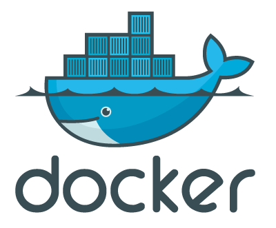
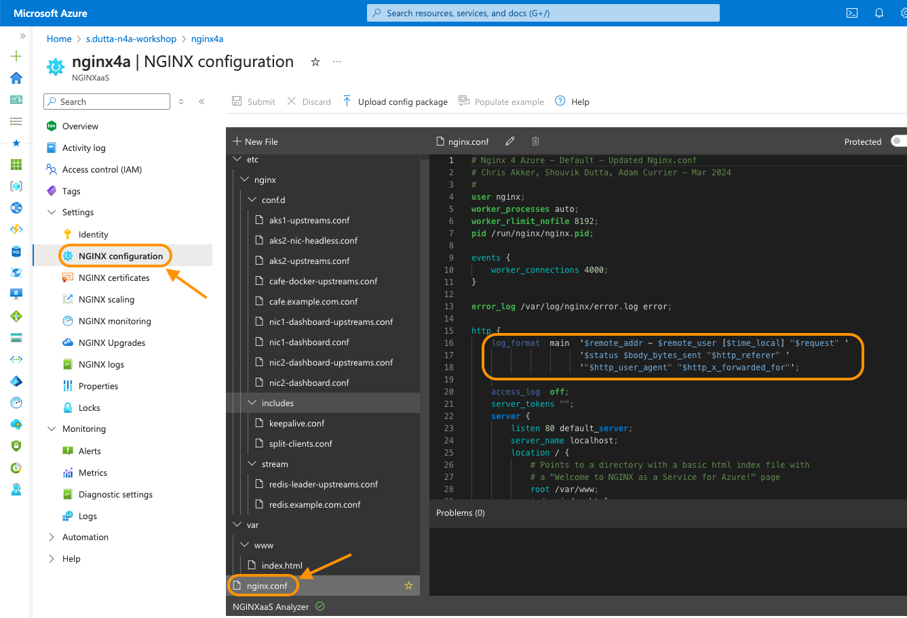
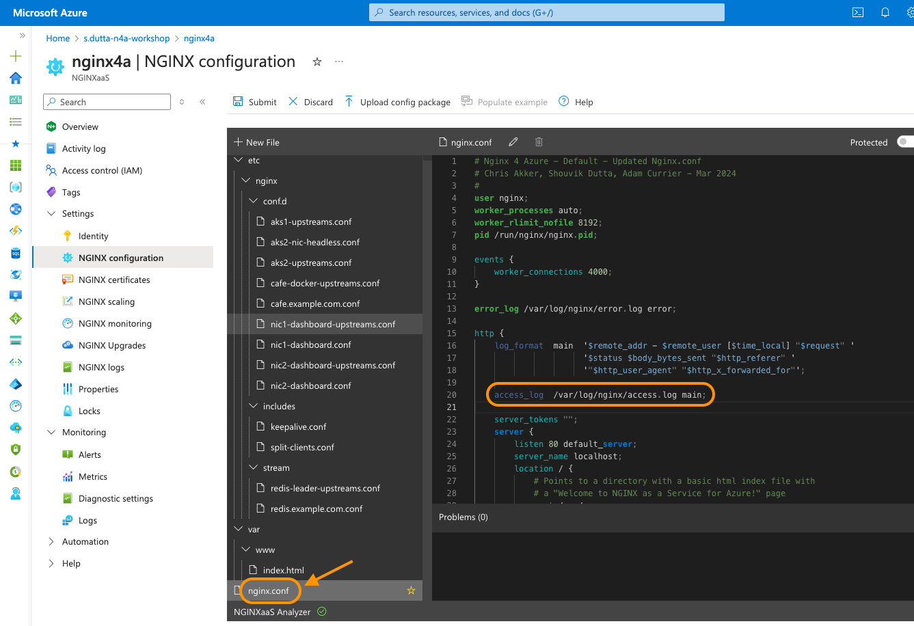
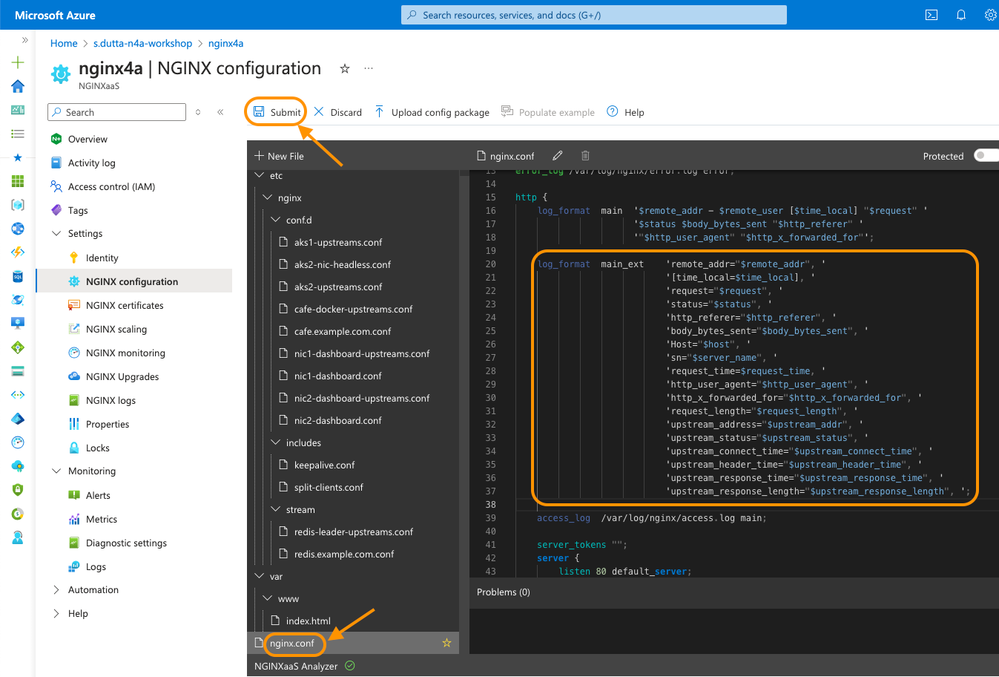
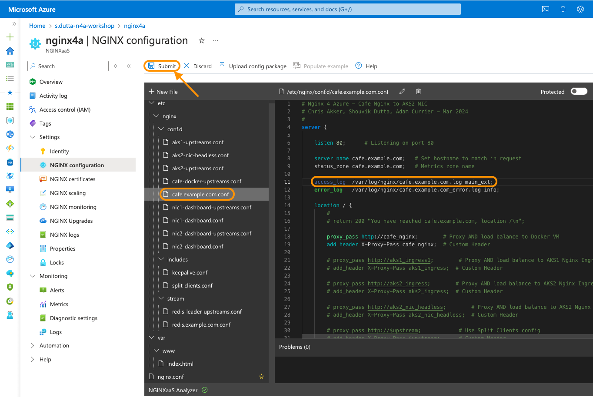
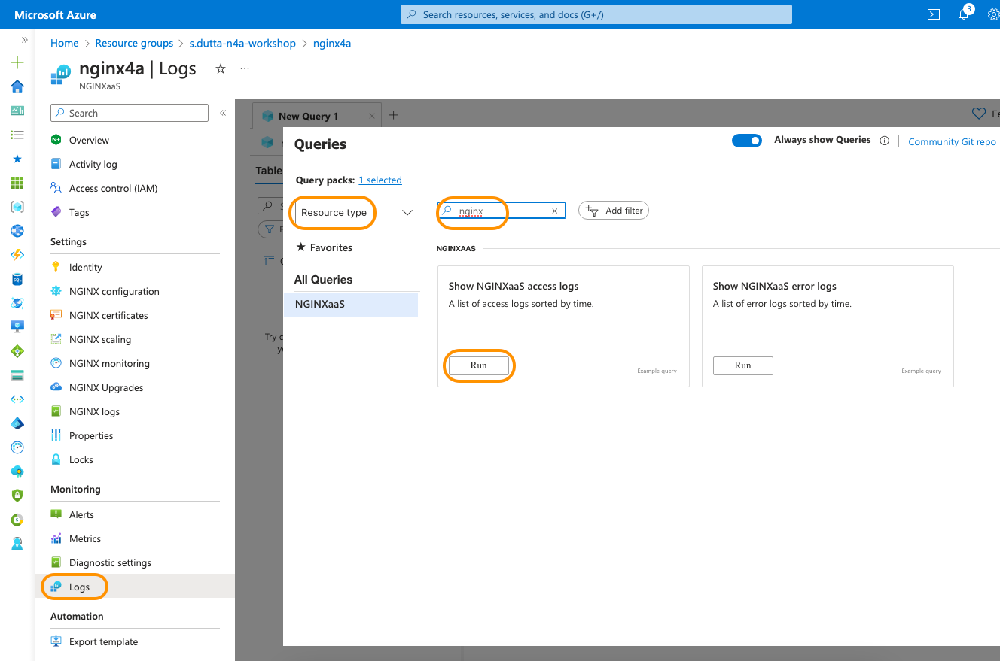
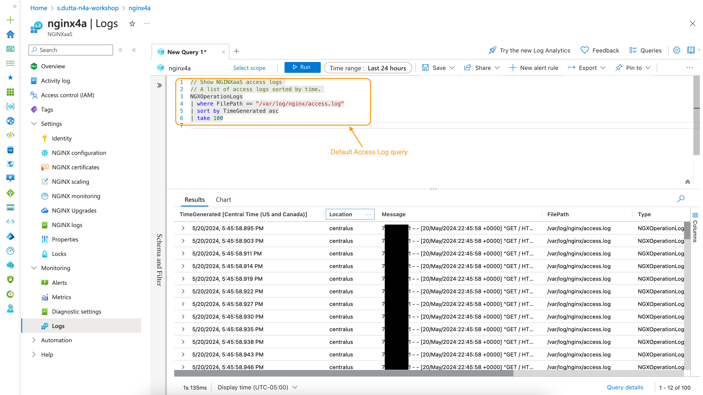
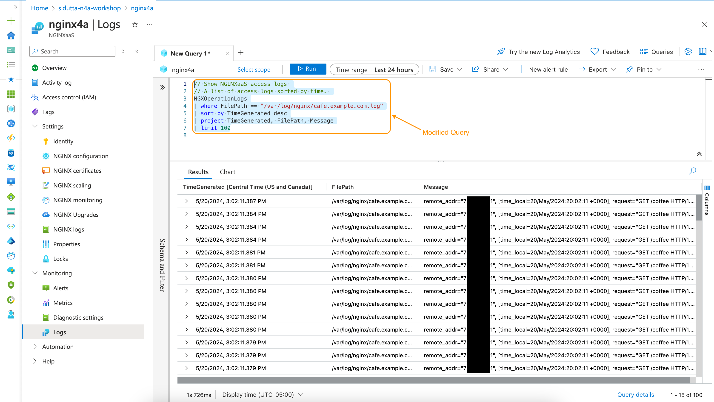
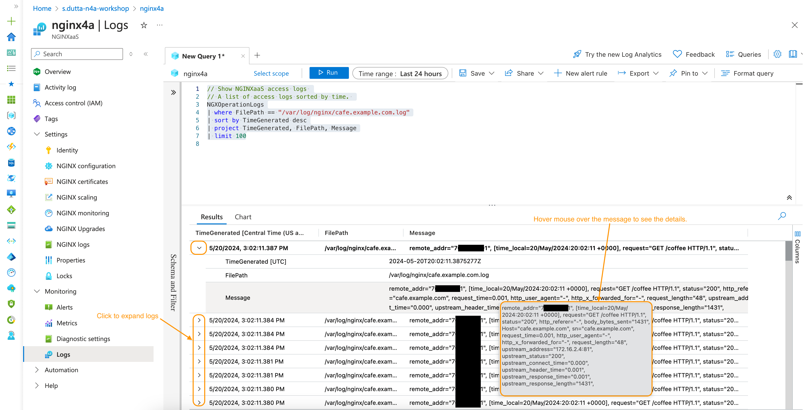
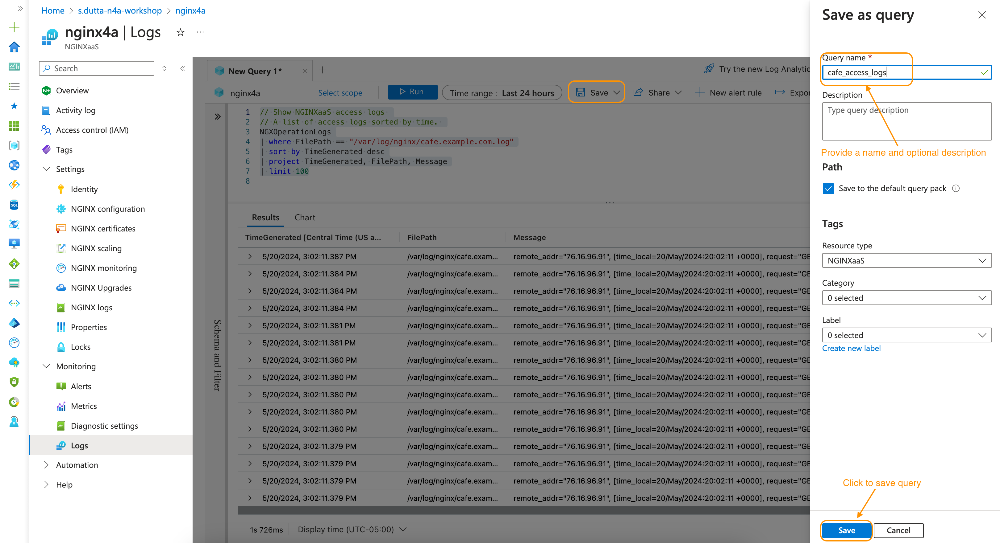
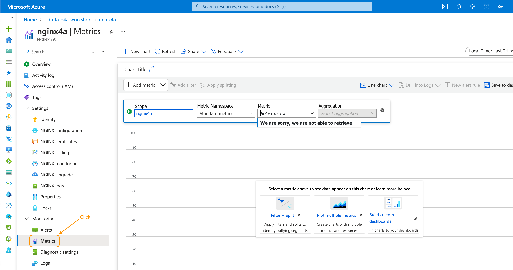
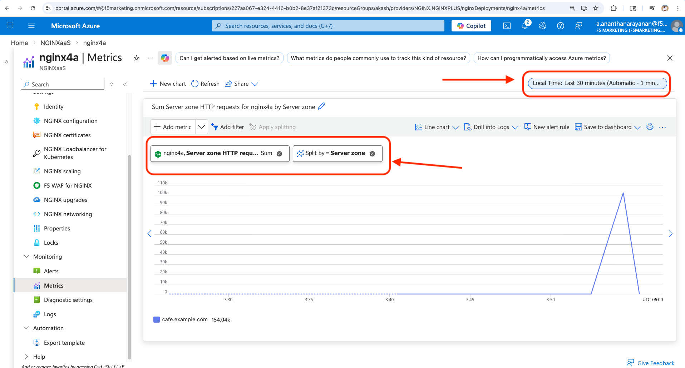
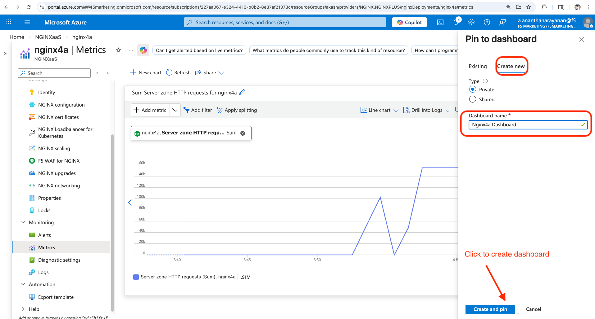
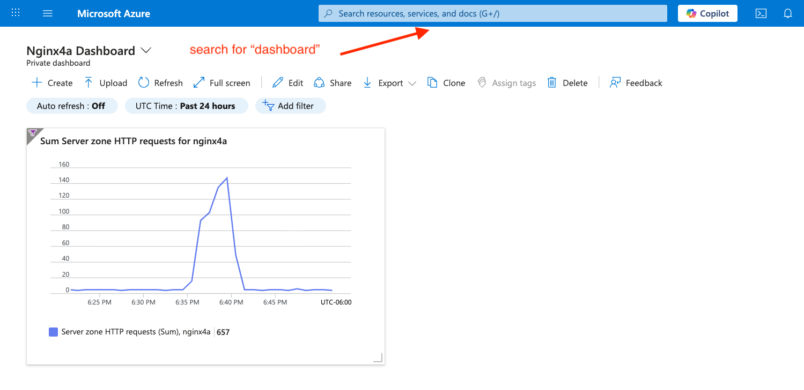
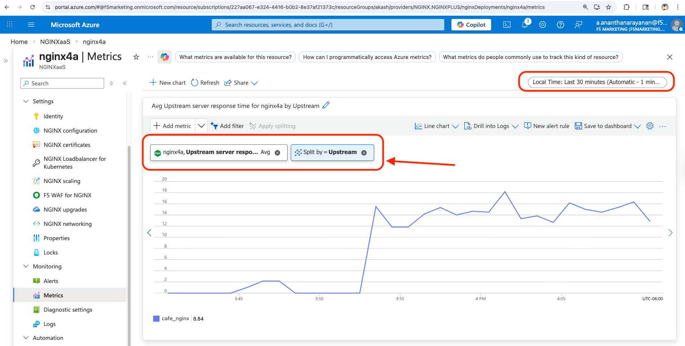
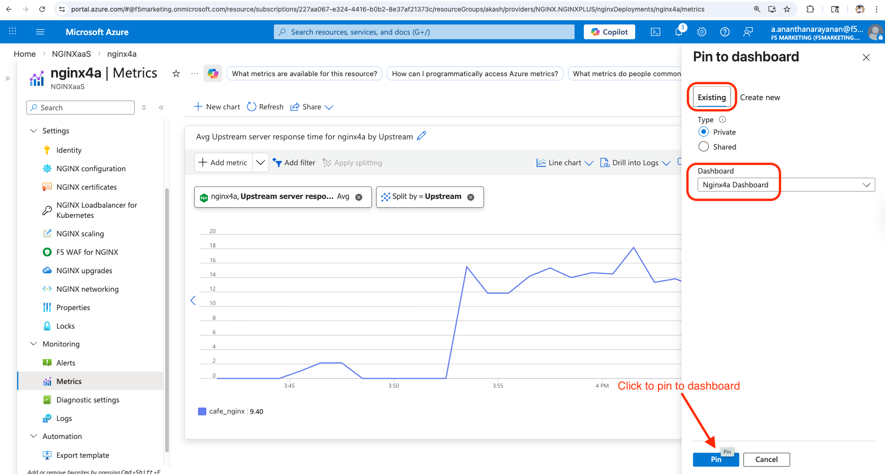
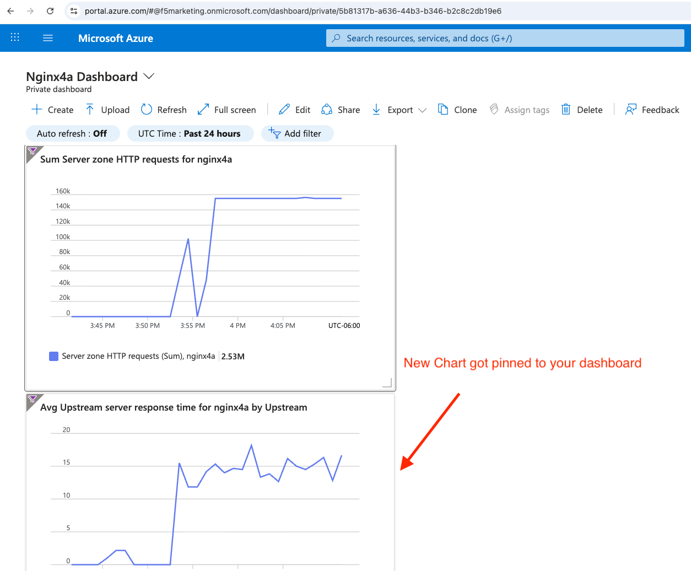
