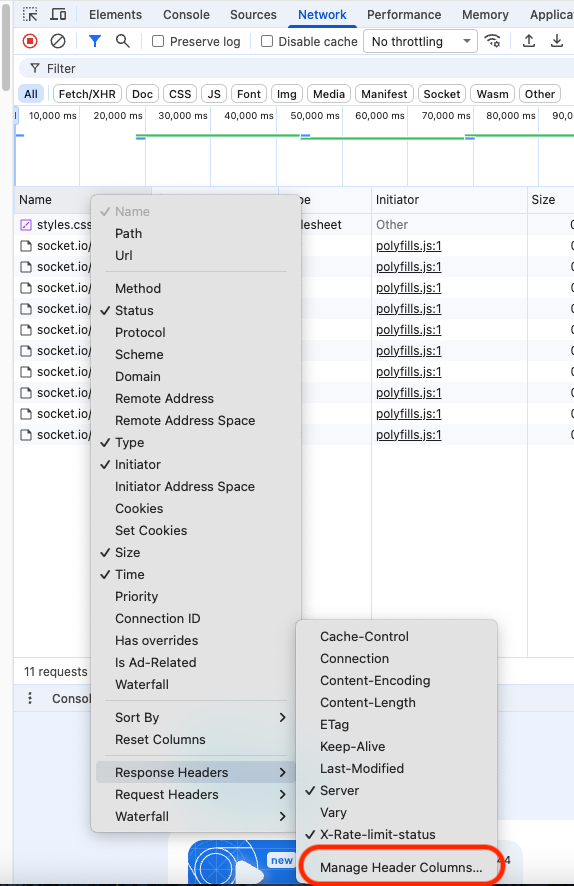
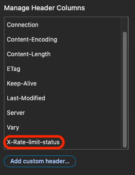
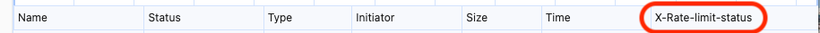
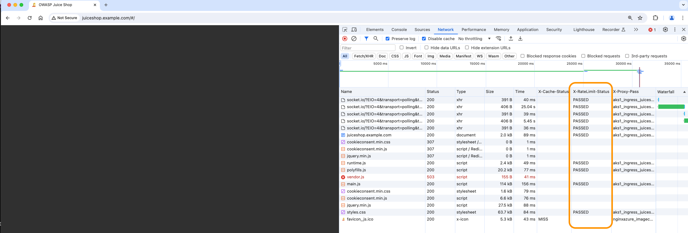
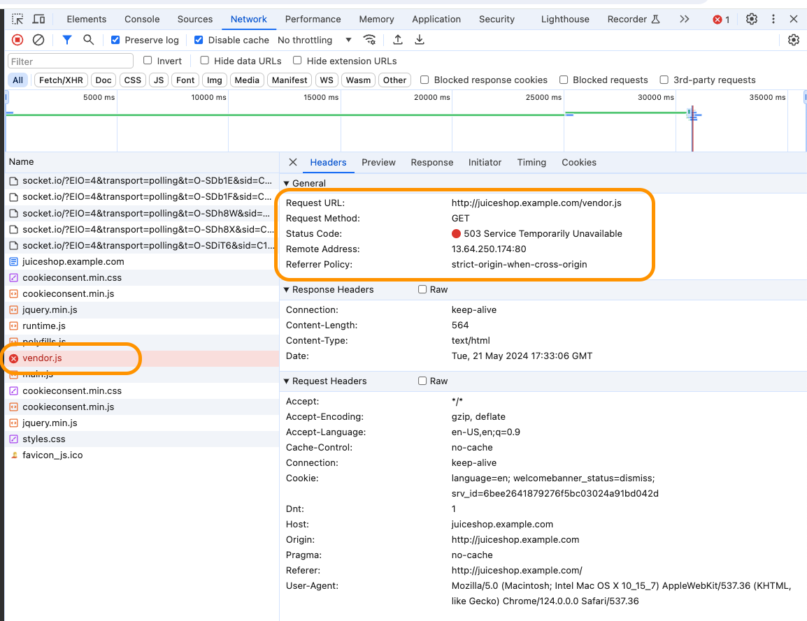
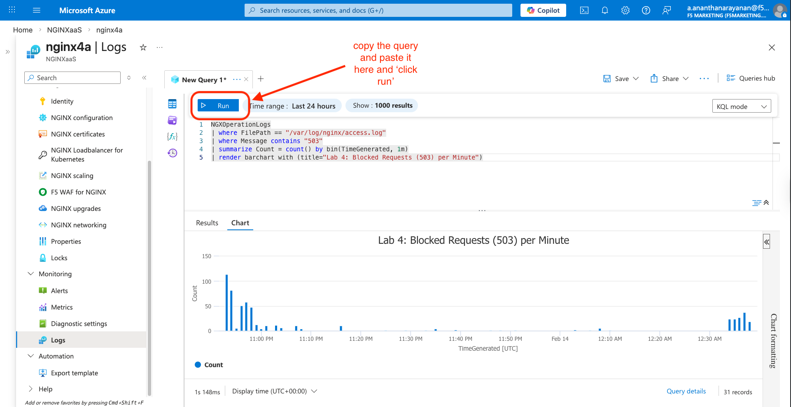

Lab 4: Protecting Applications with Rate Limiting
=================================================

Overview
--------

Welcome to **Lab 4**. In this module of **"Mastering cloud-native app
delivery,"** we focus on application resilience. You will protect the
**OWASP Juice Shop** application from brute-force attempts and DoS-like
traffic patterns by implementing **NGINX Rate Limiting**.

--------------

.. _building_construction-pre-provisioned-infrastructure:

🏗️ Pre-provisioned Infrastructure
---------------------------------

The following resources are prepared for this lab:

- **Ubuntu VM:** Running OWASP Juice Shop in a Docker container on
  **Port 3000**.

--------------

.. _rocket-lab-exercises:

🚀 Lab Exercises
----------------

Task 1: Create the Rate Limit Zones
~~~~~~~~~~~~~~~~~~~~~~~~~~~~~~~~~~~

Instead of cluttering the main configuration, we will create a dedicated
file for our limit definitions. You will see 4 different Rate Limits
defined, using the limit_req_zone directive. This directive creates an
Nginx memory zone where the limit Keys and counters are stored. When a
request matches a Key, the counter is incremented. If no key exists, it
is added to the zone and the counter is incremented, as you would
expect. Keys are ephemeral, they are lost if you restart Nginx, but are
preserved during an Nginx Reload.

Example: limit_req_zone $binary_remote_addr zone=limitone:10m rate=1r/s;

A. The first parameter, $binary_remote_addr is the Key used in the
memory zone for tracking. In this example, the client's IP Address in
binary format is used. Binary being shorter, using less memory, than a
dot.ted.dec.imal IP Address string. You can use whatever Key $variable
you like, as long as it is an Nginx $variable available when Nginx
receives an HTTP request - like a cookie, URL argument, HTTP Header, TLS
Serial Number, etc. There are literally hundreds of request $variables
you could use, and you can combine multiple $variables together.

B. The second parmater, zone=limitXYZ:10m, is the name of the zone, and
the size is 10MB. You can define larger memory zones if needed, 10MB is
a good starting point. Each zone must have a unique name, which matches
the actual limit being defined in this example. The size needed depends
on how many Keys are stored.

- limitone is the zone for 1 request/second
- limit10 is the zone for 10 requests/second
- limit100 is the zone for 100 requests/second
- limit1000 is the zone for 1,000 requests/second

C. The third parameter is the actual Rate Limit Value, expressed as r/s
for requests/second.

You can define as many zones as you need, as long as you have enough
memory for it. You can use a zone more than once in an Nginx
configuration. You can see the number of requests that are being counted
in each limit zone with Azure Monitoring. You can also use Nginx Logging
$variables to track when Limits are being counted and used for the
request. You will create an HTTP Header that will also show you the
limit status of the request when Nginx sends back the response. So you
will have very good visibility into how/when the limits are being used.

1. In the Azure Portal, go to your NGINX for Azure resource.

2. Select NGINX configuration -> Edit.

3. Click + New File and name it: /etc/nginx/includes/rate-limits.conf.

4. Copy and paste the following standard definitions:

.. code:: nginx

   ## Define HTTP Request Limit Zones
   limit_req_zone $binary_remote_addr zone=limitone:10m rate=1r/s;
   limit_req_zone $binary_remote_addr zone=limit10:10m rate=10r/s;
   limit_req_zone $binary_remote_addr zone=limit100:10m rate=100r/s;
   limit_req_zone $binary_remote_addr zone=limit1000:10m rate=1000r/s;

Task 2: Apply the Rate Limits
~~~~~~~~~~~~~~~~~~~~~~~~~~~~~

1. Now, create a new file named /etc/nginx/conf.d/juiceshop.conf and
   apply the limit to the location block:

.. code:: nginx

     upstream juiceshop_backend {
       # Added a zone here too; it helps with Azure Metrics visibility for Upstreams
       zone juiceshop_backend 64k;
       server n4a-ubuntuvm:3000;
   }

   server {
       listen 80;
       server_name juiceshop.example.com;
       status_zone juiceshop.example.com; 

       location / {
           # This matches the 'zone=limit10' we just defined in rate-limits.conf
           limit_req zone=limit10;  #burst=11;       # Set  Limit and burst here
           
           proxy_pass http://juiceshop_backend;
           proxy_set_header Host $host;
           proxy_set_header X-Real-IP $remote_addr;
           add_header X-Ratelimit-Status $limit_req_status;   # Add a custom status header
           
       }
   }

Notice the 2 directives enabled:

- ``limit_req`` sets the active zone being used, in this example,
  limit100, meaning 100 requests/second. ``Burst`` is optional, allowing
  you to define an overage, allowing for some elasticity in the limit
  enforcement.
- ``add_header`` creates a Custom Header, and adds the
  ``limit_req_status $variable``, so you can see it with Chrome Dev
  Tools or curl.

2. Next updated the main_ext logging format in nginx.conf file. it will
   be used, to capture Rate Limit logging variables.

Update your nginx.conf

.. code:: nginx

    log_format  main_ext  'remote_addr="$remote_addr", '
                         '[time_local=$time_local], '
                         'request="$request", '
                         'status="$status", '
                         'http_referer="$http_referer", '
                         'body_bytes_sent="$body_bytes_sent", '
                         'Host="$host", '
                         'sn="$server_name", '
                         'request_time=$request_time, '
                         'http_user_agent="$http_user_agent", '
                         'http_x_forwarded_for="$http_x_forwarded_for", '
                         'request_length="$request_length", '
                         'upstream_address="$upstream_addr", '
                         'upstream_status="$upstream_status", '
                         'upstream_connect_time="$upstream_connect_time", '
                         'upstream_header_time="$upstream_header_time", '
                         'upstream_response_time="$upstream_response_time", '
                         'upstream_response_length="$upstream_response_length", '
                         'limitstatus="$limit_req_status" ';

3. Click Submit.

Task 3: Test the Rate Limit
~~~~~~~~~~~~~~~~~~~~~~~~~~~

1. To see the rate limiting in action, we need to send requests faster
   than 1 per second.

2. Open a terminal on your local machine.

3. Like before, update your local system's DNS ``/etc/hosts`` file. This
   time, you will add the hostname ``juiceshop.example.com`` after your
   previous update (``cafe.example.com``), as shown below:

   .. code:: bash

      cat /etc/hosts

      127.0.0.1 localhost
      ...

      # Nginx for Azure testing
      11.22.33.44 cafe.example.com
      11.22.33.44 juiceshop.example.com

      ...

   where

- ``11.22.33.44`` replace with your ``n4a-publicIP`` resource IP
  address.

4. Once you have updated the host your /etc/hosts file, save it and quit
   vi tool.

5. Open Chrome and go to ``http://juiceshop.example.com``. You should
   see the main Juiceshop page, explore around a bit if you like, find a
   great tasting smoothy.

6. Right+Click, and choose ``Inspect`` on the Chrome menu to open
   Developer tools. On the top Nav bar, click the ``Network Tab``, and
   make sure the ``Disable cache`` is checked, you don't want Chrome
   caching any images for this exercise.

7. Click Refresh, and you will see a long list of items being sent from
   the application.

8. In the Object Details Display Bar, where you see
   ``Name Status Type Size, Time, etc``, Right+Click again, then
   ``Response Headers``, then ``Manage Header Columns``. Right-click on
   ``juiceshop.example.com`` from the list of items, then
   ``Header options``, ``Response Headers``, and
   ``Manage Header Column``.

   |Chrome Headers|

   You will be adding your custom Nginx headers to the display for easy
   viewing. Click on ``Add custom header...`` ,:

   - X-RateLimit-Status

   |image1|

   |Chrome new columns|

9. You have previously added the Nginx Custom Headers to the display, so
   you should already have a Header Column labeled
   ``X-Ratelimit-Status``. Click Refresh Several times, what do you see?

   |Nginx Limit 100|

   You will see a partial Juiceshop webpage, as Nginx is only allowing
   your computer to send 100 req/s. You see the Header status set to
   PASSED for requests that were allowed. Other requests were stopped
   for ``Exceeding the Rate Limit``. Check the HTTP Status Code on an
   item that failed, you will find the
   ``503 Service Temporarily Unavailable``.

   |Nginx Limit 503|

Well, this is not actually the real situation, right? You have set a
limit, not turned off the Service. So you will
``change the HTTP Status code``, using the ``limit_req_status``
directive, which lets you set a custom HTTP Status code. The HTTP
standard for "excessive requests" is normally ``429.`` So you will
change it to that.

Add ``limit_req_status 429;`` to the
/etc/nginx/includes/rate-limits.conf file after the
``## Define HTTP Request Limit Zones`` section. Click ``Submit`` and
make sure the change is successful.
Now, click ``Refresh`` on the Juice
Shop page several more times and check the HTTP Status Code on an item
that failed. It should now show ``429 Too Many Requests``.

This can also verified using your terminal.

5. Run a loop to hit the site rapidly:

.. code:: bash

     for i in {1..10}; do curl -I http://juiceshop.example.com; done

6. Observe the results: You should see several 200 OK responses followed
   by 503 Service Temporarily Unavailable (or 429 Too Many Requests
   depending on NGINX version/config) as the rate limit kicks in.

Task 4: Verify via Log Analytics
~~~~~~~~~~~~~~~~~~~~~~~~~~~~~~~~

1. Navigate to your Log Analytics Workspace.

2. Run the following query to see the rejected requests:

::

   NGXOperationLogs
   | where FilePath == "/var/log/nginx/access.log"
   | where Message contains "503"
   | summarize Count = count() by bin(TimeGenerated, 1m)
   | render barchart with (title="Lab 4: Blocked Requests (503) per Minute")

|Nginx Limit 503 logs|

Congratulations on completing Lab 4!

`Continue to Lab5 <../lab5/readme.md>`__

