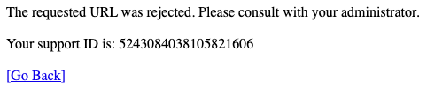

Module 5: Protecting Applications with the NGINXaaS Web Application Firewall (WAF)
===============================================================================

Overview
--------

Welcome to **Lab 5**. In this module of **"Mastering cloud-native app
delivery,"** we focus on protecting an application using the NGINX WAF.
You will deploy the **NGINX WAF** and then run several layer-7 attacks,
observing how the WAF protects the **OWASP Juice Shop** application.

--------------

.. _building_construction-pre-provisioned-infrastructure:

🏗️ Pre-provisioned Infrastructure
---------------------------------

The following resources are prepared for this lab:

- **Ubuntu VM:** Running OWASP Juice Shop in a Docker container on
  **Port 3000**.
- **Internal IP:** Your instructor will provide the private IP of the
  Juice Shop VM.
- You must have your Nginx for Azure instance running.
- Your Nginx for Azure instance must be running with the
  "plan:standardv3" SKU.
- You must have selected "Enable F5 WAF for NGINX" when creating the
  Nginx for Azure instance. (If you forgot to do this when provisioning
  your NGINXaaS instance, you can go to the NGINXaaS Overview page, then
  ``Settings`` > ``F5 WAF for NGINX``, and click ``Enable``.)

--------------

.. _rocket-lab-exercises:

🚀 Lab Exercises
----------------

Task 1: Test Application Vulnerabilities
~~~~~~~~~~~~~~~~~~~~~~~~~~~~~~~~~~~~~~~~

Prior to configuring the WAF policy, run some common L7 HTTP
vulnerability attacks and observe their effect.

1. Open another tab in your browser (Chrome shown), navigate to the
   newly configured Load Balancer configuration:
   http://juiceshop.example.com, to confirm it is functional.

2. Some samples of malicious URIs are listed below. Paste each into your
   browser and observe the results.

::

        http://juiceshop.example.com/?cmd=cat%20/etc/passwd
        http://juiceshop.example.com/cart?search=aaa'>
        http://juiceshop.example.com/product?code=echo%20shell_exec(%27/sbin/ifconfig%20eth0%27);

The Juice Shop application will appear for each request, but they will
generate security event data. Since these URIs have the potential of
exposing vulnerabilities on some applications, we want to block requests
like these.

Understanding NGINX WAF Configuration
^^^^^^^^^^^^^^^^^^^^^^^^^^^^^^^^^^^^^

F5 WAF for NGINX ships with two reference policies, both with a default
enforcement mode set to Blocking:

- The **default** policy which is identical to the base template and
  provides OWASP Top 10 and Bot security protection out of the box.
- The **strict** policy contains more restrictive criteria for blocking
  traffic than the default policy. It is meant to be used for protecting
  sensitive applications that require more security but with higher risk
  of false positives.

For this lab, we will only implement the *default* policy as this will
be sufficient to show how the NGINX WAF can protect your application
from the most common attacks. If your environment requires more
restrictive filters, the *strict* policy may be a good solution.
However, in real-world production environments, these are merely
starting points. Additional customizations can be performed according to
the needs of the applications F5 WAF NGINX protects.

For a list of additional options that can be use to further customize
your NGINX WAF policies, see the "Supported security policy features"
and "Additional policy features" tables at
https://docs.nginx.com/waf/policies/configuration/#supported-security-policy-features

Task 2: Adding an NGINX WAF Policy
~~~~~~~~~~~~~~~~~~~~~~~~~~~~~~~~~~

Create the Nginx for Azure configuration needed for the new
WAF-protected version of juiceshop.example.com.

Using the Nginx for Azure Console, enable WAF by adding the following
line to /etc/nginx/nginx.conf:

- ``load_module modules/ngx_http_app_protect_module.so;`` in nginx.conf.
- ``app_protect_enforcer_address 127.0.0.1:50000;`` in the http context.

The nginx.conf file should now look like this:

::

   # Nginx 4 Azure - Default - Updated Nginx.conf
   user nginx;
   worker_processes auto;
   worker_rlimit_nofile 8192;
   pid /run/nginx/nginx.pid;

   load_module modules/ngx_http_app_protect_module.so;

   events {
       worker_connections 4000;
       }
       
   error_log /var/log/nginx/error.log error;

   http {
       include /etc/nginx/mime.types;        
       app_protect_enforcer_address 127.0.0.1:50000;
       ...

When complete, click Submit.

Next, add the following lines to /etc/nginx/conf.d/juiceshop.conf,
within the server context:

::

      app_protect_enable on;
      app_protect_policy_file "/etc/app_protect/conf/NginxDefaultPolicy.json";
      app_protect_security_log_enable on;
      app_protect_security_log "/etc/app_protect/conf/log_all.json" syslog:server=127.0.0.1:5140;

The juiceshop.conf file should now look like this:

::

   # Nginx 4 Azure - Juiceshop Nginx HTTP
   # WAF for Juiceshop

   server {
       listen 80;      # Listening on port 80 on all IP addresses on this machine

       server_name juiceshop.example.com;   # Set hostname to match in request
       status_zone juiceshop;

       # REMOVE access_log  /var/log/nginx/juiceshop.log main;
       # REMOVE access_log  /var/log/nginx/juiceshop.example.com.log main_ext;
       # REMOVE error_log   /var/log/nginx/juiceshop.example.com_error.log info;

       # NGINX WAF CONFIGURATION
       app_protect_enable on;
       app_protect_policy_file "/etc/app_protect/conf/NginxDefaultPolicy.json";
       app_protect_security_log_enable on;
       app_protect_security_log "/etc/app_protect/conf/log_all.json" syslog:server=127.0.0.1:5140;
       # END OF NGINX WAF CONFIGURATION

      location / {
          # This matches the 'zone=limitone' we just defined in rate-limit.conf
          limit_req zone=limit100;  #burst=110;       # Set  Limit and burst here
       
          proxy_pass http://juiceshop_backend;
          proxy_set_header Host $host;
          proxy_set_header X-Real-IP $remote_addr;
          add_header X-Ratelimit-Status $limit_req_status;   # Add a custom status header
      }
   }

Click Submit.

The default policy enforces violations by Violation Rating, the F5 WAF
for NGINX computed assessment of the risk of the request based on the
triggered violations.

- 0: No violation
- 1-2: False positive
- 3: Needs examination
- 4-5: Threat

The default policy enables most of the violations and signature sets
with Alarm turned ON, but not Block.

These violations and signatures, when detected in a request, affect the
violation rating. By default, if the violation rating is calculated to
be malicious (4-5) the request will be blocked by the VIOL_RATING_THREAT
violation.

This is true even if the other violations and signatures detected in
that request have the Block flag turned OFF. It is the
VIOL_RATING_THREAT violation having the Block flag turned ON that caused
the blocking, but indirectly the combination of all the other violations
and signatures in Alarm caused the request to be blocked.

By default, other requests which have a lower violation rating are not
blocked, except for some specific violations described below. This is to
minimize false positives. However, you can change the default behavior.

For more information on configuring WAF capability in NGINX, see
https://docs.nginx.com/waf/policies/configuration/

Task 3: Test the Newly-added NGINX WAF Policy
~~~~~~~~~~~~~~~~~~~~~~~~~~~~~~~~~~~~~~~~~~~~~

Now, test out the newly-deployed default WAF policy.

1. Open another tab in your browser (Chrome shown), navigate to the
   newly configured Load Balancer configuration:
   http://juiceshop.example.com, to confirm it is functional.

2. Paste each of the previous malicious URI strings into your browser
   and observe the results.

::

        http://juiceshop.example.com/?cmd=cat%20/etc/passwd
        http://juiceshop.example.com/cart?search=aaa'>
        http://juiceshop.example.com/product?code=echo%20shell_exec(%27/sbin/ifconfig%20eth0%27);

Expected Results
----------------

If you applied the WAF policy correctly, each request should result in a
page that indicates the URL was rejected.

+-------------+
| Web Browser |
+=============+
| |NGINX aaS| |
+-------------+

..

   Note: *The web application firewall is blocking these requests to
   protect the application. The block page can* *be customized to
   provide additional information.*

--------------

**Congratulations!** You have now completed the NGINXaaS for Azure
workshop!

