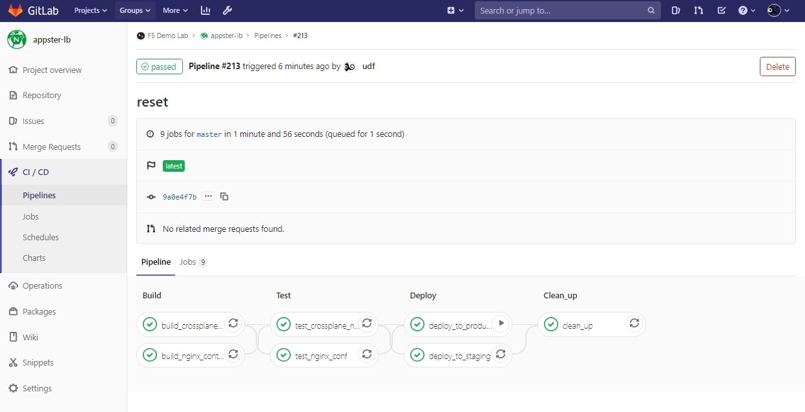

# Appster Load Balancer



A CICD demo for NGINX Plus **Load Balancing**

## File Structure

```
/
├── etc/
│    ├── nginx/
│    │    ├── conf.d/ # ADD your HTTP/S configurations here
│    │    │   ├── health_checks.............Active Health checks are defined and kept here
│    │    │   ├── status_api.conf...........NGINX Plus Live Activity Monitoring available on port 8080 - [Source](https://gist.github.com/nginx-gists/│a51 341a11ff1cf4e94ac359b67f1c4ae)
│    │    │   ├── stub_status.conf .........NGINX Open Source basic status information available http://localhost/nginx_status only
│    │    │   ├── upstreams_prod.conf.......Upstream configurations for Production environment
│    │    │   ├── www.appster.com.conf......HTTP www.appster.com Virtual Server configuration
│    │    │   └── www2.appster.com.conf_....HTTPS www2.appster.com Virtual Server configuration (we append `_` to disable the config)
│    │    ├── includes
│    │    │    ├── add_headers # Headers to attach to client response
│    │    │    │   └── security.conf_ ...........Recommended response headers for security
│    │    │    ├── proxy_headers # Headers to attach to upstream request
│    │    │    │   ├── keepalive.conf............Recommended HTTP keepalives headers for performance
│    │    │    │   └── proxy_headers.conf........Recommended request headers for request routing and logging
│    │    │    └── ssl
│    │    │        ├── ssl_intermediate.conf.....Recommended SSL configuration for General-purpose servers with a variety of clients, recommended for almost all systems
│    │    │        ├── ssl_a+_strong.conf........Recommended SSL configuration for Based on SSL Labs A+ (https://www.ssllabs.com/ssltest/)
│    │    │        ├── ssl_modern.conf...........Recommended SSL configuration for Modern clients: TLS 1.3 and don't need backward compatibility
│    │    │        └── ssl_old.conf..............Recommended SSL configuration for compatiblity ith a number of very old clients, and should be used only as a last resort
│    │    ├── stream.conf.d/ #ADD your TCP and UDP Stream configurations here
│    │    └── nginx.conf ...............Main NGINX configuration file with global settings
│    │    ├── test_env # Specific to for this CICD demo
│    │    │    ├── test_environments.md..........README of the templating search and replace
│    │    │    ├── upstreams_test.conf...........Localhost loopback test servers we will use to validate configurations in CICD pipeline
│    └── ssl/
│          ├── nginx/
│          │   ├── nginx-repo.crt........NGINX Plus repository certificate file (**Use your own license**)
│          │   └── nginx-repo.key........NGINX Plus repository key file (**Use your own license**)
│          ├── dhparam_2048.pem..........Diffie-Hellman parameters for testing (2048 bit)
│          ├── dhparam_4096.pem..........Diffie-Hellman parameters for testing (4096 bit)
│          ├── appster.com.crt...........Self-signed wildcard certifcate for testing (*.appster.com)
│          └── appster.com.key...........Self-signed private key for testing
├── usr/ # Not used in this demo
│   └── share/
│        └── nginx/
│              └── html/
│                    └── demo-index.html...Demo HTML webpage with placeholder values
└── var/ # Not used in this demo
     ├── cache/
     │    └── nginx/ # Example NGINX cache path for storing cached content
     └── lib/
          └── nginx/
               └── state/ # The recommended path for storing state files on Linux distributions
```

## Demos

SEE LAB GUIDE FOR DETAILED INSTRUCTIONS

### Example 1. Update nginx config

In this example we will configure a HTTPS redirect

1. Uncomment the following lines to enable HTTP to HTTPS redirect for [www2.appster.com](http://www2.appster.com)

**Before** `/etc/nginx.conf.d/www.appster.com.conf`:

```ini
# Rate limit
# Uncomment lines below to enable here 
# limit_req_zone $binary_remote_addr zone=limit_me:1m rate=10r/s;


server {
        # Rate limiting
        # Uncomment below to enable here.
        #limit_req zone=limit_me;
        #limit_req_status 429;
}
```

**After** `/etc/nginx.conf.d/www.appster.com.conf`:

```ini
# Rate limit
# Uncomment lines below to enable here 
limit_req_zone $binary_remote_addr zone=limit_me:1m rate=10000r/s;


server {
        # Rate limiting
        # Uncomment below to enable here.
        limit_req zone=limit_me;
        limit_req_status 429;
}
```

2. Commit and push changes to code repository:

```bash
git add .; git commit -m "Enable Rating limiting for www.appster.com"; git push origin master
```
