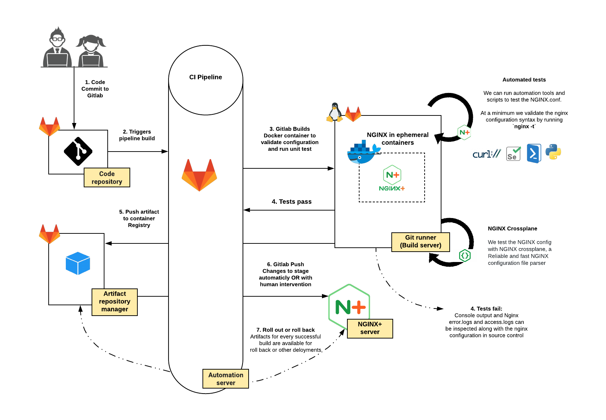
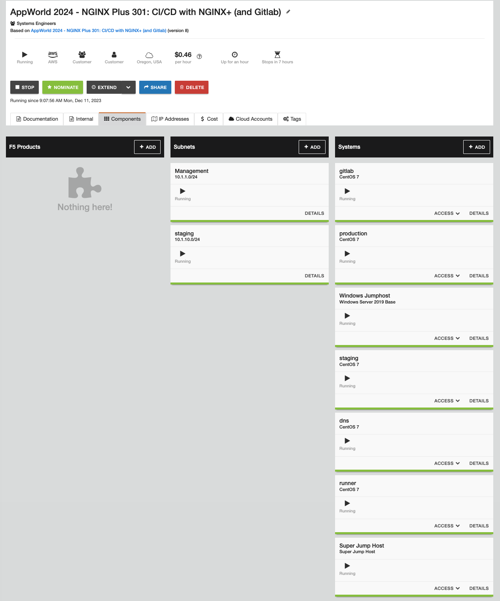
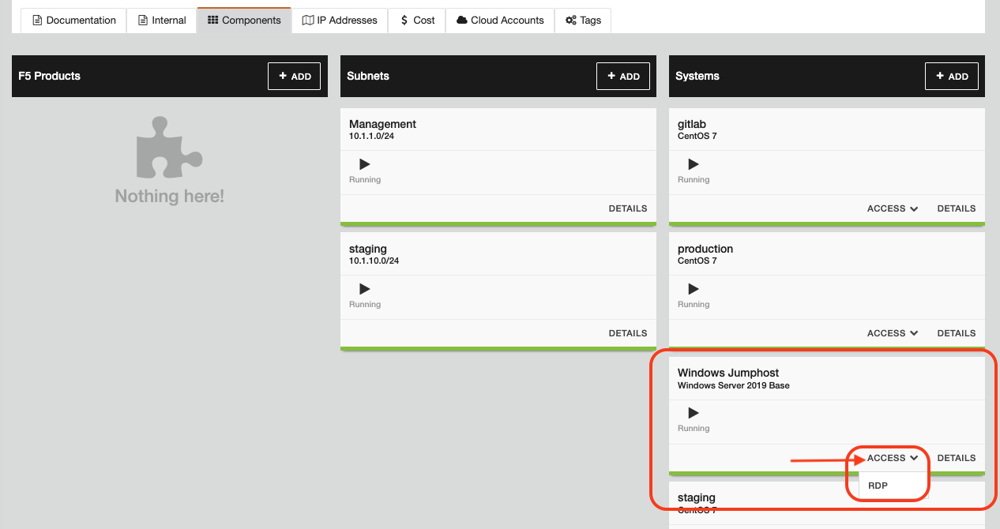
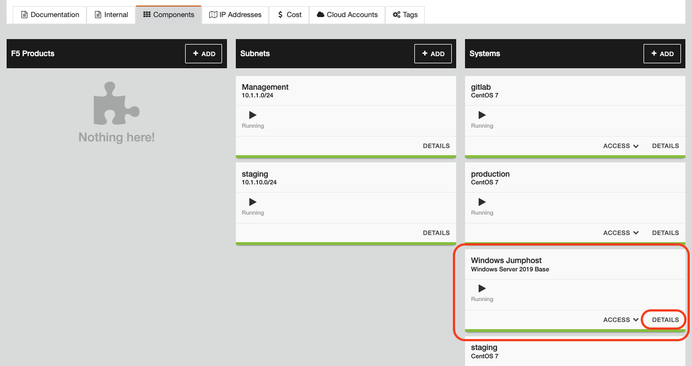
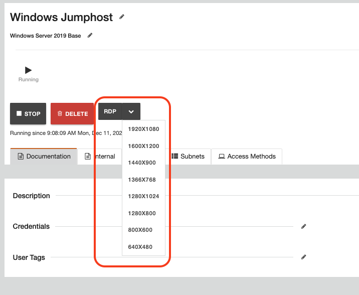
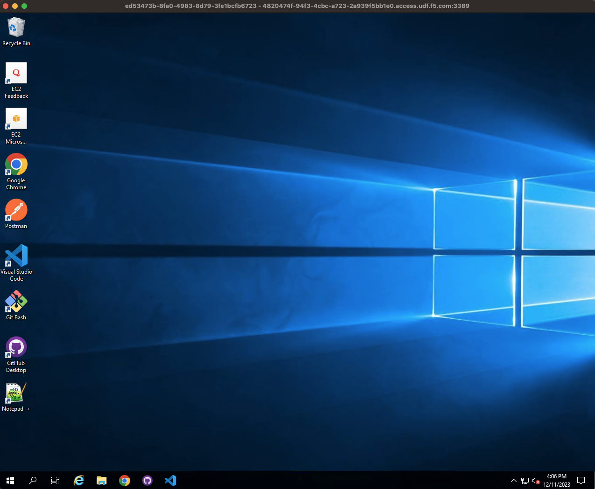
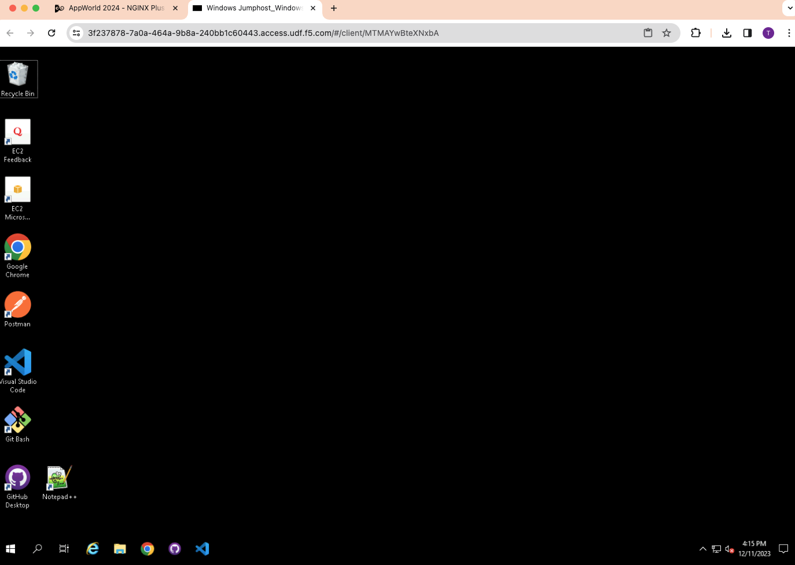

Introduction
============

The purpose of this Lab is to introduce continuous integration and continuous delivery (CI/CD) as a modern approach to managing the entire life cycle of writing, updating, and delivering applications with NGINX. By implementing CI/CD, everything from bug fixes to major feature changes are delivered to users on a consistent schedule typically measured in weeks, days, hours and even minutes!

The byword of CI/CD is *automation* - the key factor that enables both integration and delivery to be continuous. Once the code is considered stable, the goal is to eliminate the need for human intervention between the submission of code for integration and the delivery of the same code into the production environment. The agile and lightweight design of `NGINX <https://nginx.org/en>`__ and `NGINX Plus <https://www.nginx.com/products/nginx>`__ makes it extremely easy to deploy them using a CI/CD process.

NGINX native configuration is simple text stored in flat files and organized in logical folder structures. It is therefore trivial to keep the source of truth for NGINX configurations in source control. Furthermore, NGINX and NGINX Plus can be deployed in various form factors (virtual machine, bare metal, cloud platforms, and containers) which allows the NGINX artifacts of a CI/CD process to produce:

-  NGINX configurations files
-  A Docker container
-  Virtual Machine image - e.g., ``OVF``, ``OVA``, ``qcow2``, propriety cloud images, etc.
-  Any Other PaaS or IaaS manifests - e.g., Kubernetes manifests, Packer, Terraform, etc.

This Lab guide will help you complete the following:

1. Creating NGINX Plus Docker container images through a CI/CD process and using a private repository for NGINX Plus container images

2. Deploying a `NGINX Plus <https://www.nginx.com/products/nginx/>`__ web server through a CI/CD process

3. Deploying a `NGINX Plus <https://www.nginx.com/products/nginx/>`__ Load Balancer server through a CI/CD process

CI/CD flowchart
---------------

**Below is a diagram of a generic CI/CD Pipeline to deliver applications
on NGINX Plus**

Getting Started
---------------

The infrastructure is pre-built in UDF for your use and includes the following components:

- GitLab-CE Server
- Gitlab Runner
- NGINX Plus
- A Windows JumpHost
- Guacamole Super Jump Host (if not able to use RDP)
- Staging, and Production environments

The **JumpHost** (Windows) is already set up with all the tools required to edit and commit changes to our Dockerfiles, example “Appster” Web Application and NGINX Plus configurations. **Run all lab activites from the JumpHost** The **Chrome web browser** has been set up with bookmarks to all the web applications you need for this lab.  **Shell access** to the Staging and Production environment is required for one excercise and is useful to look “under the hood” of deployments to Linux servers in a live environment.

.. ATTENTION::
    If you are unable to use ``RDP``, scroll to the bottom for details on using the ``Guacamole Super Jump Host`` instead.

Lab Topology and Credentials
----------------------------

You will be required to access the following systems and web pages during
this lab:

+---------------------------------+-------------------+----------------+
| **Component**                   | **Access**        | **Credentials**|
|                                 |                   |                |
+=================================+===================+================+
| **JumpHost Windows Server 2019  | RDP Access        | ``user`` /     |
| R2**                            |                   | ``user``       |
+---------------------------------+-------------------+----------------+
| **Guacamole Super Jump Host**   | Gucamole          | ``user`` /     |
|                                 | Browser-Based RDP | ``user``       |
+---------------------------------+-------------------+----------------+
| **GitLab GUI**                  | http://10.1.1.5,  | ``udf`` /      |
|                                 | SSH               | ``P@ssw0rd20`` |
+---------------------------------+-------------------+----------------+
| **Staging Server - Appster**    | http://10.1.1.11, | ``centos`` /   |
|                                 | SSH               | (private key)  |
+---------------------------------+-------------------+----------------+
| **Production Server - Appster** | Four backend      | ``centos`` /   |
|                                 | (containers):-    | (private key)  |
|                                 | Appster-blue      |                |
|                                 | http://10.1.1.11: |                |
|                                 | 81\ -             |                |
|                                 | Appster-green     |                |
|                                 | http://10.1.1.11: |                |
|                                 | 82\ -             |                |
|                                 | Appster-yellow    |                |
|                                 | http://10.1.1.11: |                |
|                                 | 83\ -             |                |
|                                 | Appster-red       |                |
|                                 | http://10.1.1.11: |                |
|                                 | 84                |                |
|                                 | SSH access        |                |
+---------------------------------+-------------------+----------------+

To get started with the lab exercises, open an RDP session to the
``Windows server 2019 JumpHost > Access > RDP``

To get an open a preset screen resolution RDP session click on
``Details > RDP > [Select an RDP screen resolution]``

.. Note:: When prompted for your User Account details, enter: ``user``/``user``

.. image:: ./images/image5.png

The Windows JumpHost is now ready for the lab

.. ATTENTION::
    ``Guacamole Super Jump Host`` - details for using a browser based RDP session.

``Super Jump Host > Access > Guacamole``.  Login with user/user.

.. image:: ./images/image7.png

.. Important:: **Run all lab activites from the Windows JumpHost**