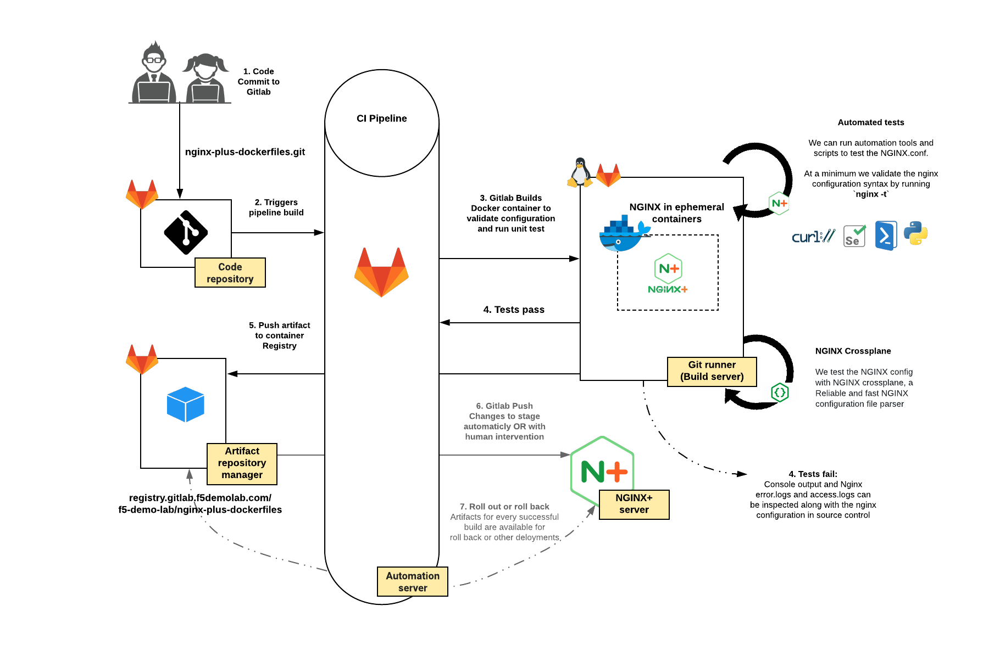

Module 1: Creating docker images for NGINX Plus
===============================================

In this lab exercise, we will automate building NGINX Plus Docker
containers, on various Linux base images, from custom and optimized
Dockerfiles, we will test the Docker container is functional before
pushing it to our private container registry. Our Docker containers are
then available for any application developer to pull and use for any
NGINX Plus based deployments!

`Docker <https://www.docker.com/>`__ is an open platform for building,
shipping, running, and orchestrating distributed applications. As
software applications, the open-source NGINX product and the enhanced
and commercially supported version, NGINX Plus, is an excellent use case
for Docker because it is feature-rich, deployable on many Linux
distributions and is less than 2.5mb in size.

While NGINX open-source images are available on `Docker Hub <https://registry.hub.docker.com/>`__,
the repository of Docker images, you are required to build your
own NGINX Plus docker images and store them in your **private**
container registry, due to License keys requirement activate NGINX Plus

For more information about Docker, see `What is Docker? <https://www.docker.com/whatisdocker/>`__
or bookmark the full `Docker documentation <https://docs.docker.com/>`__ for reference

CI/CD flowchart
--------------

**The diagram below depicts the workflow from code to deployment.** Our
exercise ends with pushing the docker image to the container registry
but could easily be extended to deploy a container with new application
code to a live environment

.. Important:: Run all lab activites from the Windows JumpHost

.. toctree::
   :maxdepth: 1
   :glob:

   lab/lab*
