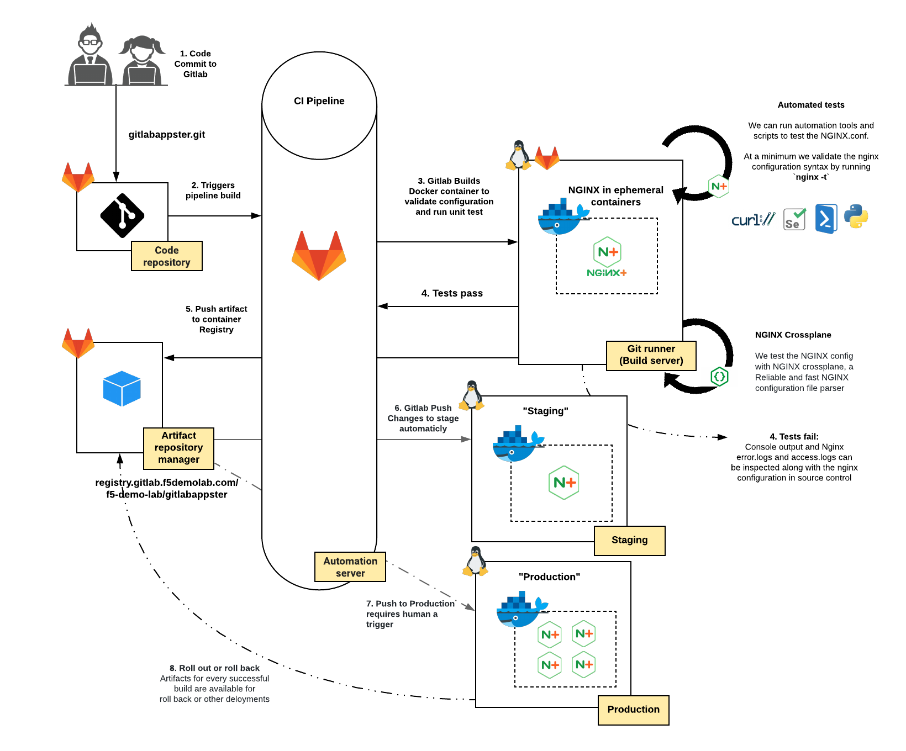

Module 2: Deploying `NGINX Plus <https://www.nginx.com/products/nginx/>`__ web server with CI/CD
===============================================================================================

This lab exercise will guide you through deploying an NGINX Plus web server through a CI/CD pipeline to help deliver code changes more frequently and reliably with as few manual steps as possible.

We will be making simple changes to our web application and rapidly push the new code to the staging and production environments. For this use case, we will build and push the updated Docker containers to the registry which is followed by a deployment to the staging environment. Deploying to production is a manual step executed after a human validates that everything looks good.

CI/CD flowchart
--------------

The diagram below depicts the workflow from code to deployment as described above.

.. Important:: Run all lab activites from the Windows JumpHost

.. toctree::
   :maxdepth: 1
   :glob:

   lab/lab*
