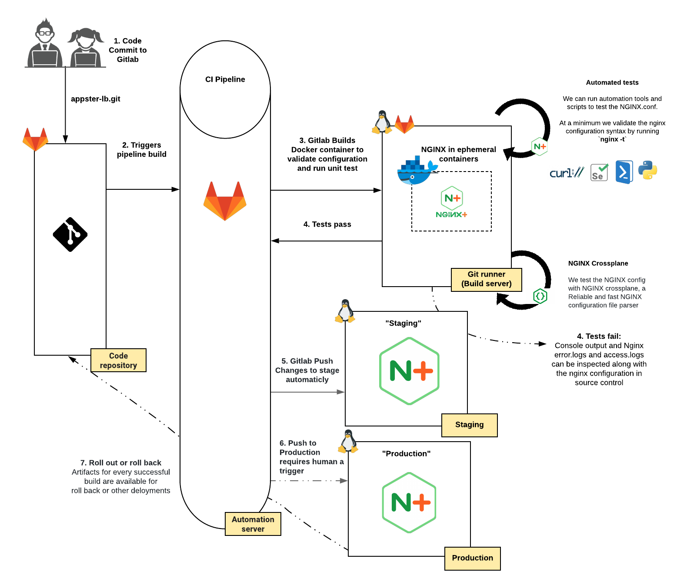
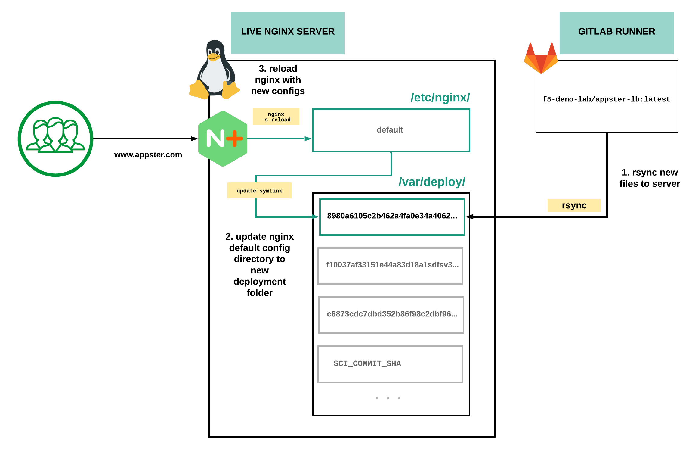

Module 3: Continuous Deployment for NGINX Plus Load Balancers
=============================================================

In this exercise, we will be using a CICD pipeline to deploy NGINX Plus
Load balancer.

Instead of deploying NGINX Plus as a container into our live
environments as we did in the previous exercise, we will be pushing new
NGINX configuration into a new deployment folder, the filesystem of our
NGINX Plus Virtual Machine.

Next, we create a \ `Symbolic link <https://linuxize.com/post/how-to-create-symbolic-links-in-linux-using-the-ln-command/>`__ to
point the default NGINX config directory, ``/etc/nginx`` to this new
deployment folder, ``/var/deploy/[$CI_COMMIT_SHA]``.

Lastly, we will reload NGINX with the new NGINX configuration gracefully
without dropping connections.

The \ `Commit SHA <https://git-scm.com/book/en/v2/Git-Internals-Git-Objects>`__ is a
unique hash referring to a particular commit of code. Because we deploy
new NGINX Plus configurations in a new folder using a \ `Commit
SHA <https://git-scm.com/book/en/v2/Git-Internals-Git-Objects>`__ as the
folder name, we can quickly revert to known NGINX configuration
consistent with the code commit in Gitlab’s git repository.

NGINX can reload a new configuration without any downtime, and without
interrupting any current connections. A soft-reconfiguration spawns a
new set of NGINX worker processes; the old ones continue to work until
completion (but do not accept new requests - all new applications are
accepted by the new set of worker processes). Live binary upgrades work
similarly. If the upgrade is successful, the old set of NGINX worker
processes are signaled to terminate, and the new set takes over. For
more information, please see: \ `Controlling NGINX <https://nginx.org/en/docs/control.html>`__

CICD flowchart
--------------

**The diagrams below depicts the workflow from code to deployment.**

Here is an overview of the entire CICD Pipeline

Here is a closer look at **steps 5 and 6**, where we use ``rsync`` to
deploy the new NGINX configuration files to live NGINX servers

.. Important:: Run all lab activites from the Windows JumpHost

.. toctree::
   :maxdepth: 1
   :glob:

   lab/lab*
