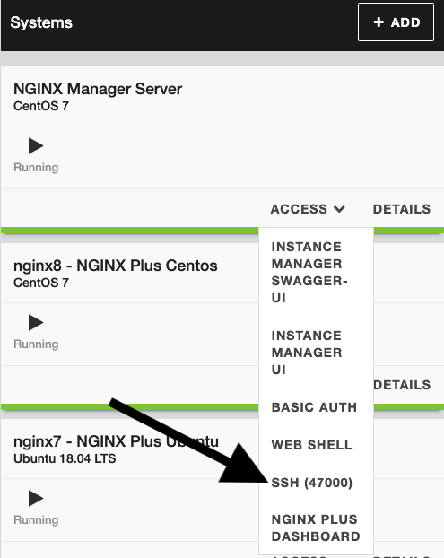
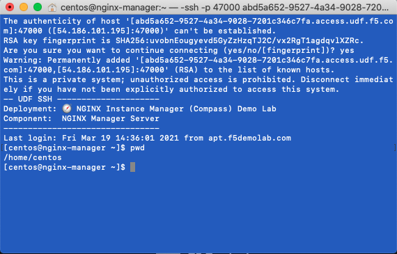
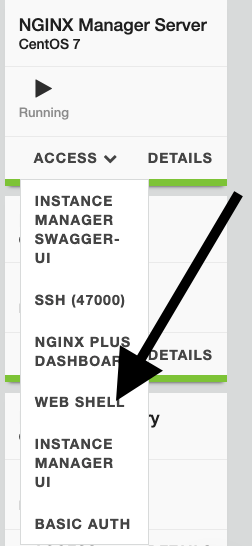
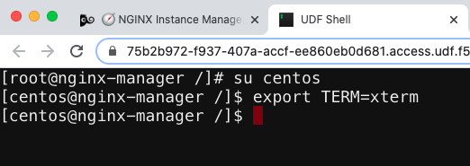

.. _1.0-explore:

Exercise 1.0: Exploring the lab environment
###########################################

Step 1
------

Navigate to the ``nginx-manager`` instance as ``centos`` and use the home directory.

Use the SSH menu option to beceome the centos user.  If you use the web-shell it 
defaults to the root user.  To follow best practice, please use the centos user.
Either method will work for the lab.

Option 1 - Direct SSH
=====================

If prompted, select yes for trusting the ssh connection in your terminal.

.. code-block:: shell-session

   [centos@nginx-manager ~]$ pwd
   /home/centos

Option 2 - Web Shell
====================

Once the web shell opens up enter the following commands to switch to the 
``centos`` user and also to set the Terminal for editing.

.. code-block:: shell-session

   [root@nginx-manager /]# su centos                                                                                      
   [centos@nginx-manager /]$ export TERM=xterm
   [centos@nginx-manager /]$ 

Step 2
------

Navigate to the UDF overview and note the instances we will use for the lab:

The infrastructure is already setup for you; however, we are going to clear 
out everything so we can practice the installation steps.  To do this, we 
will utilize ssh to connect to the nginx-manager server and run the 
`reset.sh` script in the home directory of the centos user.

The **nginx-manager** is the instance that provides the NGINX Instance Manager 
API, metrics endpoint and user interface to use.  It also functions as the 
reciever for the nginx-agent component on the NGINX instances.
**Run all lab activities from the nginx-manager unless specified**

The **dns** server is a nameserver and a repository server for the NGINX 
Instance Manager packages.  It hosts a yum repository for RHEL/Centos-based 
machines and an apt repository for debian/ubuntu-based machines.

The **docker** server is a Centos 7 instance with docker installed that 
is used in an optional module for using containers with ``nginx-manager`` 
and to host a test nginx instance that is outdated.

The NGINX machines are there to provide a cross section of installation 
options.

NGINX Instances:

+------------------+-----------------------------+--------------+-------------+-----------+
|   **Instance**   |             FQDN            |      OS      |    NGINX    |     IP    |
+==================+=============================+==============+=============+===========+
| Instance Manager | nginx-manager.f5demolab.com | Centos 7     | Plus        | 10.1.1.4  |
+------------------+-----------------------------+--------------+-------------+-----------+
| OSS-Centos       | nginx5.f5demolab.com        | Centos 7     | Open Source | 10.1.1.5  |
+------------------+-----------------------------+--------------+-------------+-----------+
| OSS-Ubuntu       | nginx6.f5demolab.com        | Ubuntu 18.04 | Open Source | 10.1.1.6  |
+------------------+-----------------------------+--------------+-------------+-----------+
| Plus-Ubuntu      | nginx7.f5demolab.com        | Ubuntu 18.04 | Plus        | 10.1.1.7  |
+------------------+-----------------------------+--------------+-------------+-----------+
| Plus-Centos      | nginx8.f5demolab.com        | Centos 7     | Plus        | 10.1.1.8  |
+------------------+-----------------------------+--------------+-------------+-----------+
| Docker           | docker.f5demolab.com        | Centos 7     | Open Source | 10.1.1.9  |
+------------------+-----------------------------+--------------+-------------+-----------+
| DNS              | apt.f5demolab.com           | Centos 7     | Plus        | 10.1.1.10 |
+------------------+-----------------------------+--------------+-------------+-----------+

