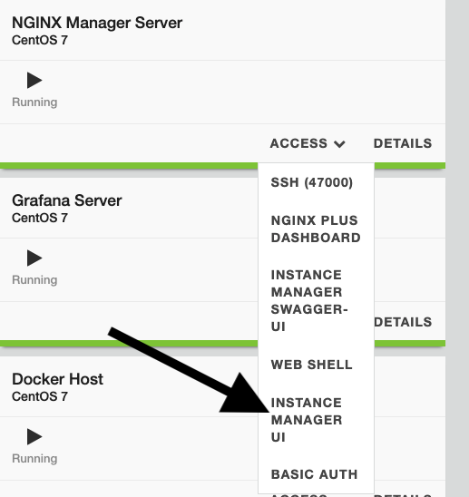
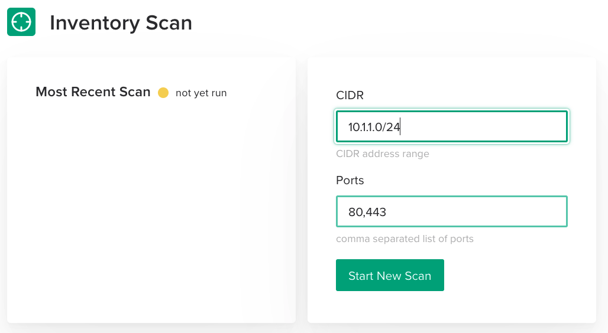
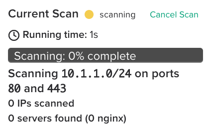
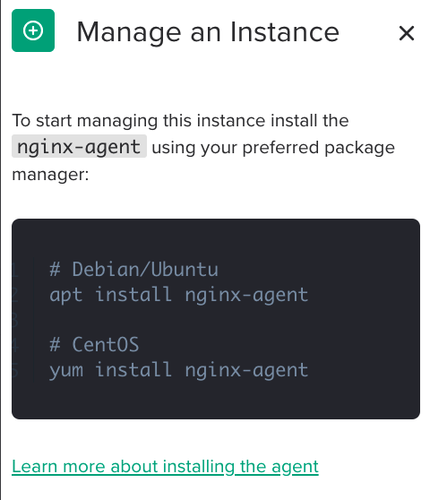

.. _1.0-scan:

Exercise 1.0: Acces the NIM UI and scan for instances
#####################################################

Objective
=========

Discover new instances using the scan function of NGINX Instance 
Manager.

Guide
=====

The lab environment contains 5 instances of NGINX (not including the 
repository server and the nginx-manager server). We will use the ``NIM Scan`` feature
to discover the instances and list CVE information.

The scan uses NMAP stealth scan to look at ports the web servers or load balancers 
listen on.  This is an optional component of nginx-manager but can be useful to 
keep track of NGINX instances since we can also call the function through an API. 
For this exercise, we will use the user interface to run the scan.

Step 1: Open UI
---------------

Navigate to the UDF dashboard for the lab and open the NGINX Manager instance, selecting 
the ``Instance Manager UI`` option under ``ACCESS``.

To sign in use the username ``admin`` and password ``NIM123!@#``

.. image:: ./UDF-sign-in.png

You should see a Welcome to NGINX Management Suite home screen, select Instance Manager, then click on the left navigation pane to select “Scan” and proceed to Step 2.

.. image:: ./UDF-welcome.png

.. image:: ./UI-select-scan.png

Step 2: Change scan options
---------------------------

The scan tool needs to know the subnet mask and ports you want to scan.  UDF 
uses the subnet ``10.1.1.0/24``.  Change the subnet to this value and leave the ports as ``80,443,8081``.

.. note::

   For production runs, check with your organizations security and network 
   policies.  While the stealth scan is unlikely to cause alarms, any tool 
   that looks at multiple IPs and ports could be viewed as a threat by detection 
   systems.

Step 3: Run a scan
------------------

Click on the ``Scan`` button and let the scan run.  You should see 
some information on the screen as the scan runs.

.. image:: ./UI-scan-complete.png

Once it is complete, you should see a list of instances underneath the two panels.

.. image:: ./UI-scan-results.png

Step 4: Review results
----------------------

The results of the scan have more instances than we described in the lab architecture.  
UDF. 

You should also notice there is an outdated NGINX server on ``10.1.1.8`` running NGINX ``1.6.0``. 
The CVEs icon shows an exclamation point within a yellow circle.  This indicates the instance has 
security vulnerabilities. At the time of this writing, it should show ``4`` next to the icon.

.. image:: ./UI-scan-cve.png

The CVE list isn't meant to replace other security tools.  It is meant to alert you to possible 
vulnerabilities in your environment.

.. note::

   NGINX Instance Manager scan uses the published CVE list for NGINX and matches the version to
   the applicable CVEs.  If a CVE is unscored we do not count it.  You can see a list of the CVEs 
   by viewing the `public CVE list <http://nginx.org/en/security_advisories.html>`__ .

Step 5: View install instructions
---------------------------------

Under the status column there are two states “Managed” and “Unmanaged”.  

.. image:: ./UI-install-steps.png

Click on any of the “Unmanaged” instances and a slide out dialog box will provide you with instructions on how to install the nginx-agent on the server. 

For module 2, we will focus on managing instances.
