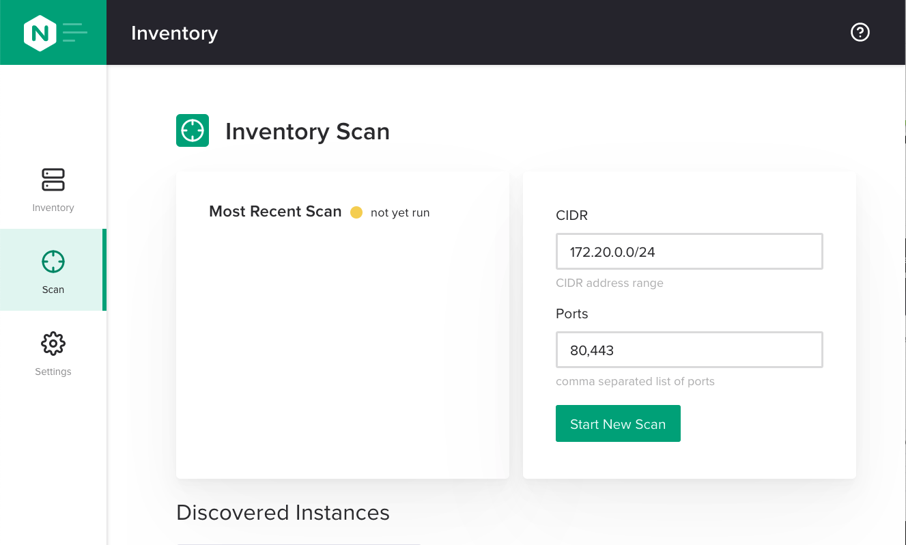
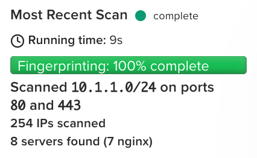

.. _1.3-scan:

Exercise 1.3: Discover new instances
####################################

Objective
=========

Discover new instances using the scan function of NGINX Instance 
Manager.

Guide
=====

The lab environment contains 5 instances of NGINX (not including the 
repository server and the nginx-manager server). We will use the ``ngxscan`` 
to discover the instances and list CVE information.

The scan uses NMAP stealth scan to look at ports the web servers or load balancers 
listen on.  This is an optional component of nginx-manager but can be useful to 
keep track of NGINX instances since we can also call the function through an API. 
For this exercise, we will use the user interface to run the scan.

Step 1: Open UI
---------------

Navigate to the UDF dashboard for the lab and open the NGINX Manager instance, selecting 
the ``Instance Manager UI`` option under ``ACCESS``.

.. image:: ./UDF-select-ui.png

You should see a loading screen and then a user interface for NGINX Instance Manager appear. 
Use the left navigation pane to select "Scan" and proceed to Step 2.

Step 2: Change scan options
---------------------------

The scan tool needs to know the subnet mask and ports you want to scan.  UDF 
uses the subnet ``10.1.1.0/24``.  Change the subnet to this value and leave the 
ports as ``80,443``.

.. image:: ./UI-scan-CIDR.png

.. note::

   For production runs, check with your organizations security and network 
   policies.  While the stealth scan is unlikely to cause alarms, any tool 
   that looks at multiple IPs and ports could be viewed as a threat by detection 
   systems.

Step 3: Run a scan
------------------

Click on the ``Start New Scan`` button and let the scan run.  You should see 
some information on the screen as the scan runs.

.. image:: ./UI-scan-running.png

Once it is complete, you should see a list of instances underneath the two panels.

Step 4: Review results
----------------------

The results of the scan have more instances than we described in the lab architecture.  
UDF has a built-in node.js server listening on ``10.1.1.254``.  In addition, we have captured 
the repository server on ``10.1.1.10`` and the ``nginx-manager`` server on ``10.1.1.4``.

You should also notice there is an outdated NGINX server on ``10.1.1.9`` running NGINX ``1.7.1``. 
The CVEs icon shows an exclamation point within a yellow circle.  This indicates the instance has 
security vulnerabilities.  At the time of this writing, it should show ``7`` next to the icon.

There should be a black circle with a minus sign next to the node.js instance.  This indicates that 
there was no CVE matching done or found for this instance.

The CVE list isn't meant to replace other security tools.  It is meant to alert you to possible 
vulnerabilities in your environment.

.. note::

   NGINX Instance Manager scan uses the published CVE list for NGINX and matches the version to
   the applicable CVEs.  If a CVE is unscored we do not count it.  You can see a list of the CVEs 
   by viewing the `public CVE list <http://nginx.org/en/security_advisories.html>`__ .

Step 5: Remove unused instances
-------------------------------

We don't need to keep information here for the node.js instance.  Click the garbage can icon 
next to the ``10.1.1.254`` instance to delete it.

Repeat this for ``10.1.1.10`` also.

Your inventory should look similar to the image below.

.. image:: ./UI-scan-clean.png

For module 2, we will focus on managing 4 instances (``10.1.1.5-10.1.1.8``).

Step 6: View install instructions
---------------------------------

Next to the Discovered Instances there is a plus symbol under the Actions column.  Click 
the icon and a window will give you instructions on installing the agent for the instance. 

.. image:: ./UI-scan-install.png

Currently we do not automate this in the UI but you can use other tools to automate the 
installation.  We will automate the install of the agent using a 
`bash script <https://docs.nginx.com/nginx-instance-manager/tutorials/manage-instance/#automate-agent-bash>`__ .

You have finished this exercise. `Click here to return to the lab
guide <..>`__

.. |f5pool| image:: pool.png
