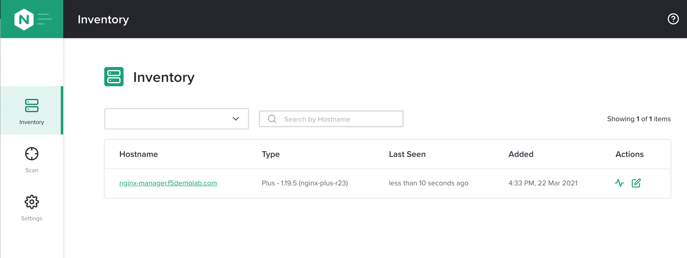

.. _1.4-install-nginx-agent:

Exercise 1.4: Installing NGINX Agent
####################################

Objective
=========

Demonstrate how to install `NGINX Agent <https://docs.nginx.com/nginx-instance-manager/getting-started/agent/>`__ .

Step 1: Verify the repository is setup
--------------------------------------

In the Lab environment, we are utilizing an internal repository server that 
mimics the public repo server.  You can also download the rpm or deb file 
and install directly if desired or in offline environments.

Let's look at the repository information for our Centos 7 server instance.

.. code-block:: shell-session

   [centos@nginx-manager ~]$ sudo cat /etc/yum.repos.d/nginx-instance-manager.repo
   [nginx-manager]
   name=NGINX Instance Manager repo
   baseurl=https://apt.f5demolab.com/centos/
   sslclientcert=/etc/ssl/nginx-manager/nginx-manager.crt
   sslclientkey=/etc/ssl/nginx-manager/nginx-manager.key
   gpgcheck=0
   enabled=1

.. note::

   In production these files are downloaded from pkgs.nginx.com and would point to 
   ``/etc/ssl/nginx/nginx-repo.crt`` and ``/etc/ssl/nginx/nginx-repo.key``

Check that yum can pull from the repository we setup.

.. code-block:: shell-session

   [centos@nginx-manager ~]$ sudo yum repolist
   Loaded plugins: fastestmirror
   Loading mirror speeds from cached hostfile
   * base: d36uatko69830t.cloudfront.net
   * extras: d36uatko69830t.cloudfront.net
   * updates: d36uatko69830t.cloudfront.net
   repo id                                                     repo name                                                             status
   base/7/x86_64                                               CentOS-7 - Base                                                       10,072
   extras/7/x86_64                                             CentOS-7 - Extras                                                        460
   nginx-manager                                               NGINX Instance Manager repo                                                8
   nginx-plus/x86_64                                           nginx-plus repo                                                          667
   updates/7/x86_64                                            CentOS-7 - Updates                                                     1,898
   repolist: 13,105

Step 2: Install nginx-agent
-----------------------------

We are going to use the yum repository manager for this.  We can also use yum 
for updates, removal and package management functions.  With the repository setup 
correctly, package management is simplified.

.. code-block:: shell-session

   [centos@nginx-manager ~]$ sudo yum install -y nginx-agent
   Loaded plugins: fastestmirror
   Loading mirror speeds from cached hostfile
   * base: d36uatko69830t.cloudfront.net
   * extras: d36uatko69830t.cloudfront.net
   * updates: d36uatko69830t.cloudfront.net
   Resolving Dependencies
   --> Running transaction check
   ---> Package nginx-agent.x86_64 0:0.9.1-3047962 will be installed
   --> Finished Dependency Resolution

   Dependencies Resolved

   ========================================================================================================================================
   Package                         Arch                       Version                             Repository                         Size
   ========================================================================================================================================
   Installing:
   nginx-agent                     x86_64                     0.9.1-3047962                       nginx-manager                     5.7 M

   Transaction Summary
   ========================================================================================================================================
   Install  1 Package

   Total download size: 5.7 M
   Installed size: 5.9 M
   Downloading packages:
   nginx-agent-0.9.1-3047962.x86_64.rpm                                                                             | 5.7 MB  00:00:00     
   Running transaction check
   Running transaction test
   Transaction test succeeded
   Running transaction
   Installing : nginx-agent-0.9.1-3047962.x86_64                                                                                     1/1 
   Platform systemd (default) detected. Installing service.
   To start this service, use: systemctl start nginx-agent
   ----------------------------------------------------------------------

   Thank you for using NGINX!

      Product: nginx-agent
      Version: 0.9.1
         Build: 3047962

   Please find the documentation for NGINX Agent here:
   https://docs.nginx.com/nginx-instance-manager/install/agent/

   NGINX Agent is proprietary software. EULA and License information:
   /usr/share/doc/nginx-agent/

   For support information, please see:
   https://www.nginx.com/support/

   Configuration settings can be adjusted here:
   /etc/nginx-agent/nginx-agent.conf

   ----------------------------------------------------------------------
   Verifying  : nginx-agent-0.9.1-3047962.x86_64                                                                                     1/1 

   Installed:
   nginx-agent.x86_64 0:0.9.1-3047962                                                                                                    

   Complete!

Step 3: Configure nginx-agent
-----------------------------

The agent is installed but we need to configure the ``nginx-agent`` also. 
By default, the agent points to ``127.0.0.1`` which isn't useful unless you 
are also running the ``nginx-manager`` on the same instance.  Although
we are doing that for this exercise, let's change the configuration as if 
we were on a different instance.

.. code-block:: shell-session

   [centos@nginx-manager ~]$ sudo vim /etc/nginx-agent/nginx-agent.conf

Enter or edit the following options for ``nginx-agent.conf``:

.. code-block:: yaml

   #
   # /etc/nginx-agent/nginx-agent.conf
   #

   # Configuration file for NGINX Agent

   # specify the server grpc port to connect to
   server: 127.0.0.1:10000

   # tls options
   tls:
      # enable tls in the nginx-manager setup for grpcs
      enable: false
      # path to certificate
      cert: /etc/ssl/nginx-manager/agent.crt
      # path to certificate key
      key: /etc/ssl/nginx-manager/agent.key
      # path to CA cert
      ca: /etc/ssl/nginx-manager/ca.pem
   log:
      # set log level (panic, fatal, error, info, debug, trace; default: info) (default "info")
      level: info
      # set log path. if empty, don't log to file.
      path: /var/log/nginx-agent/
   # (optional) tags for this specific instance / machine for inventory purposes
   tags:
      instance:
      location: unspecified
   # nginx configuration options
   nginx:
      # path of nginx to manage
      bin_path: /usr/sbin/nginx
      # specify stub status URL (see: nginx.org/r/stub_status)
      basic_status_url: "http://127.0.0.1:80/nginx_status"
      # specify plus status api url (see nginx.org/r/api)
      plus_api_url: "http://127.0.0.1:8080/api"
      # specify metrics poll interval
      metrics_poll_interval: 1000ms

-  ``server:`` is ``127.0.0.1`` by default and should be changed to 
   the FQDN and port of the ``nginx-manager`` grpc listener.

-  ``enable:`` under ``tls:`` is for enabling encryption on the grpc 
   channel.  This requires the ``nginx-manager`` to be setup with TLS also.
-  The ``cert:`` and ``key:`` options are for the PEM encoded certifiate and 
   private key for TLS encryption.  If provided, mTLS can be used with the 
   NGINX proxy.  If omitted, you can specify the ``ca:`` option for a trusted 
   CA PEM certificate chain for TLS server-side encryption.
-  The ``ca:`` option is for a CA bundle in PEM format for the agent to use 
   for verifying the server-side TLS certificate.  When used with ``cert:`` and 
   ``key:``, the client will also present a client certificate for mTLS.

-  ``level:`` under ``log:`` allows specifying the logging level for ``nginx-agent``.
-  ``path:`` under ``log:`` is the location of the log files for ``nginx-agent``.

-  ``instance:`` and ``location:`` under ``tags:`` will be used in the future for
   grouping but are unused in ``0.9.1``.

-  ``bin_path:`` is the path to the nginx binary
-  ``basic_status_url:`` is the URL for NGINX Open Source instances.  If you are running
   NGINX Plus, comment or remove the ``basic_status_url`` line.
-  ``plus_api_url:`` is the URL for NGINX Plus instances.  If you are running
   NGINX Open Source, comment or remove the ``basic_status_url`` line.
-  ``metrics_poll_interval:`` is the amount of time the agent polls.  This is
   1 second by default.

Modify the file so it looks similar to the configuration below for this lab.

.. code-block:: yaml

   server: nginx-manager.f5demolab.com:10443
   tls:
      enable: true
      cert: /etc/ssl/nginx-manager/agent.crt
      key: /etc/ssl/nginx-manager/agent.key
      ca: /etc/ssl/nginx-manager/ca.crt
   log:
      level: info
      path: /var/log/nginx-agent/
   tags:
      location: unspecified
   nginx:
      bin_path: /usr/sbin/nginx
      plus_api_url: "http://127.0.0.1:8080/api"

Save the file.

.. code-block:: shell-session

   [centos@nginx-manager ~]$ cat /etc/nginx-agent/nginx-agent.conf.rpmsave 
   server: nginx-manager.f5demolab.com:10443
   tls:
   enable: true
      cert: /etc/ssl/nginx-manager/agent.crt
      key: /etc/ssl/nginx-manager/agent.key
      ca: /etc/ssl/nginx-manager/ca.crt
   log:
      level: info
      path: /var/log/nginx-agent/
   tags:
      location: unspecified
   nginx:
      bin_path: /usr/sbin/nginx
      plus_api_url: "http://127.0.0.1:8080/api"

.. note::

   We are using the 10443 port because we are proxying traffic through an NGINX proxy.
   Don't get confused but the nginx-agent is actually pointing to the NGINX proxy it
   is managing. We will use nginx-manager to show the configurations we have for 
   proxying NGINX Instance Manager traffic.  For now, ignore the complexity with that 
   and realize we are using nginx-agent on the nginx-manager server to manage NGINX.
      
Step 4: Enable and start the service
------------------------------------

To enable the service to run at startup we will enable the systemd service.
We can also start the service with one command at the same time.  The command 
below is the equivalent of running ``systemctl enable nginx-agent`` followed 
by ``systemctl start nginx-agent``.

.. code-block:: shell-session

   [centos@nginx-manager ~]$ sudo systemctl enable nginx-agent --now

Step 5: Verify nginx-agent is running
-------------------------------------

Check that the service is now enable and running.

.. code-block:: shell-session

   [centos@nginx-manager ~]$ sudo systemctl status nginx-agent
   ● nginx-agent.service - nginx-agent
      Loaded: loaded (/etc/systemd/system/nginx-agent.service; enabled; vendor preset: disabled)
   Drop-In: /etc/systemd/system/nginx-agent.service.d
            └─override.conf
      Active: active (running) since Mon 2021-03-22 19:43:30 UTC; 7s ago
   Main PID: 4459 (nginx-agent)
      CGroup: /system.slice/nginx-agent.service
            └─4459 /usr/sbin/nginx-agent

   Mar 22 19:43:30 nginx-manager.f5demolab.com nginx-agent[4459]: time="2021-03-22T19:43:30Z" level=info msg="CommandChannel connec...shed"
   Mar 22 19:43:30 nginx-manager.f5demolab.com nginx-agent[4459]: time="2021-03-22T19:43:30Z" level=info msg="commander is ready"
   Mar 22 19:43:31 nginx-manager.f5demolab.com nginx-agent[4459]: time="2021-03-22T19:43:31Z" level=info msg="sent config with 2 chunks"
   Mar 22 19:43:31 nginx-manager.f5demolab.com nginx-agent[4459]: time="2021-03-22T19:43:31Z" level=info msg="adding access log tai....log"
   Mar 22 19:43:31 nginx-manager.f5demolab.com nginx-agent[4459]: time="2021-03-22T19:43:31Z" level=info msg="adding access log tai....log"
   Mar 22 19:43:31 nginx-manager.f5demolab.com nginx-agent[4459]: time="2021-03-22T19:43:31Z" level=info msg="adding access log tai....log"
   Mar 22 19:43:31 nginx-manager.f5demolab.com nginx-agent[4459]: time="2021-03-22T19:43:31Z" level=info msg="adding access log tai....log"
   Mar 22 19:43:31 nginx-manager.f5demolab.com nginx-agent[4459]: time="2021-03-22T19:43:31Z" level=info msg="adding access log tai....log"
   Mar 22 19:43:31 nginx-manager.f5demolab.com nginx-agent[4459]: time="2021-03-22T19:43:31Z" level=info msg="adding access log tai....log"
   Mar 22 19:43:31 nginx-manager.f5demolab.com nginx-agent[4459]: time="2021-03-22T19:43:31Z" level=info msg="collecting from: /var....log"
   Hint: Some lines were ellipsized, use -l to show in full.

Open the UI for NGINX Instance Manager and navigate to the Instances Screen.  
You should see nginx-manager listed now.

You have finished this exercise. `Click here to return to the lab
guide <..>`__
