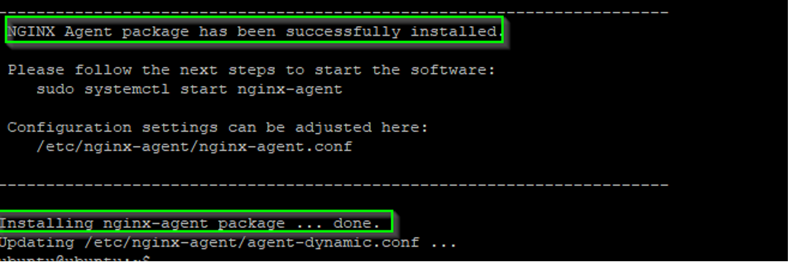
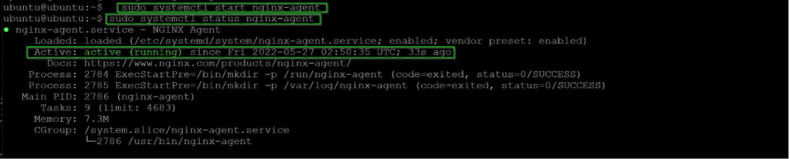
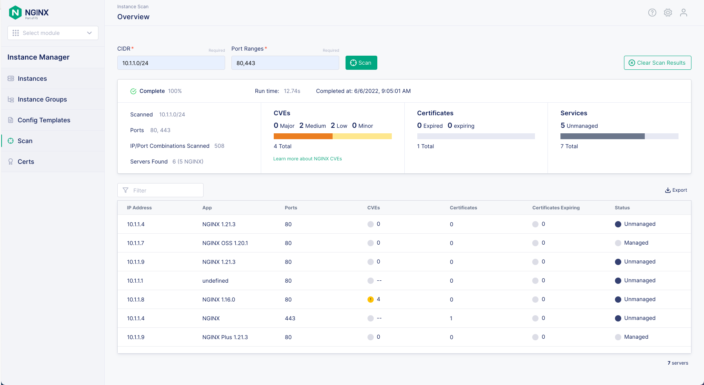
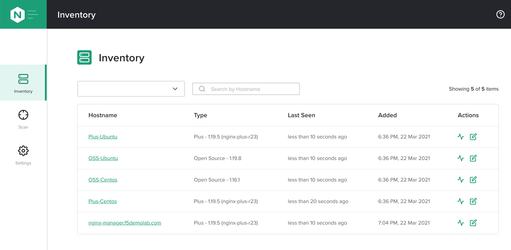
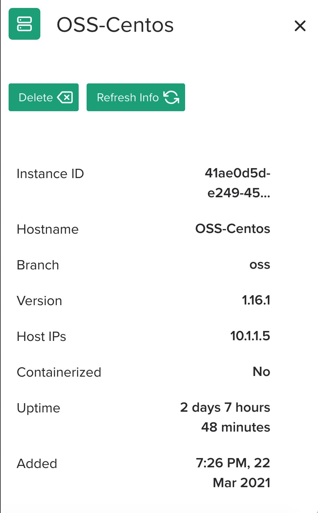

.. _2.0-install-agent:

Exercise 2.0: Installing NGINX Agent
####################################

Objective
=========

Install the ``nginx-agent`` and configure it to work with existing NGINX instance.

Guide
=====

Installation of `NGINX Agent <https://docs.nginx.com/nginx-instance-manager/getting-started/agent/>`__ 
follows a process that is very similar to installing 
`NGINX Plus <https://docs.nginx.com/nginx/admin-guide/installing-nginx/installing-nginx-plus/>`__.

Step 1
------
We are going to use NGINX Plus - 3 Server 10.1.1.9 and install the nginx-agent to manage the NGINX instances running on this host. Access the deployment tab and select the NGINX Plus – 3 Server Access menu then click WEB SHELL.

.. image:: ./UDF-nginx5-sample.png

Copy or type in the below command which you will use to install the nginx-agent:

.. note::

   This command has been adjusted around this lab's unique network environment. Please use the command below and not the command (with the UDF FQDN URL) from the NIM UI Status page.

``sudo curl -k https://10.1.1.4/install/nginx-agent | sudo sh``

Once the script has completed you should see the following output which indicates the agent was successfully installed and instructions on how to start the software:

Step 2: Enable and start the service
------------------------------------------------

Run the following command ``sudo systemctl start nginx-agent``
Once that is executed confirm the service is running by executing the following command :
``sudo systemctl status nginx-agent``. 

Step 3: Look at details of an NGINX instance 
--------------------------------------------

Run another scan test and notice 10.1.1.9 is in a managed status.

Navigate to the Instances page and look for the instance we added.

Notice how we have columns that show Hostname and Type. 
Our instances are named according to the Operating System and NGINX type they run.

Let's focus on the instance ``ubuntu`` which is running NGINX 1.21.3. Click the Hostname and more information on the instance will appear, scroll down to Network Interface and notice this is our 10.1.1.9 instance.

Click the instances tab to return to the instances list.

