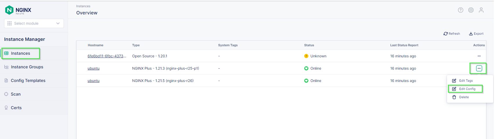
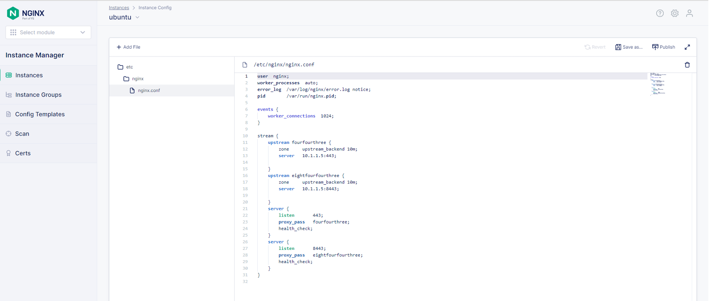
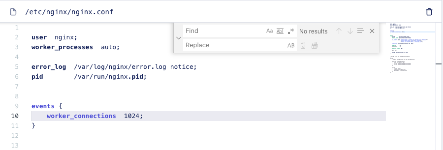
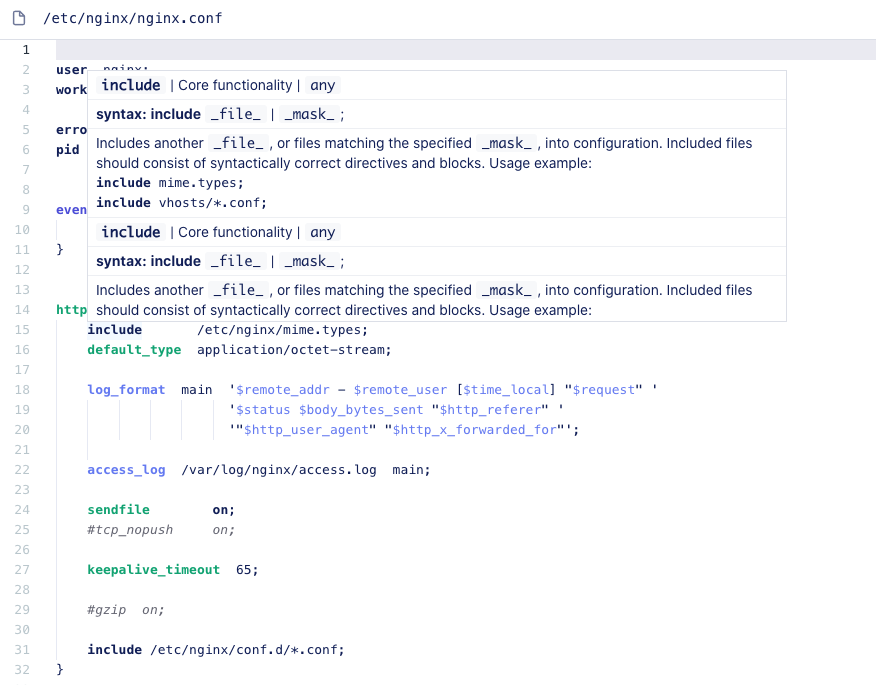
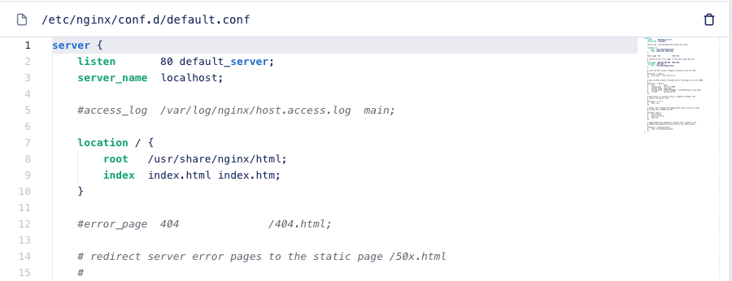
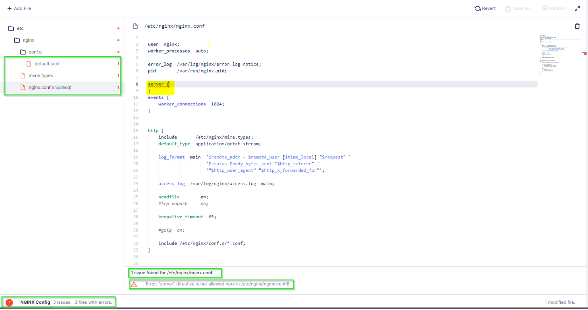
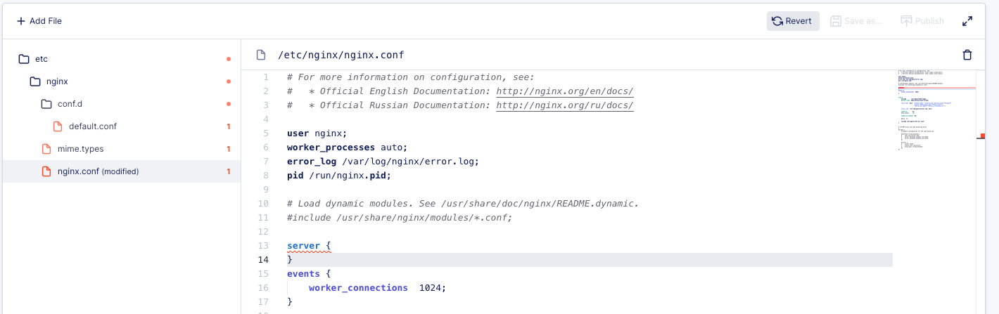

.. _2.2-conf-editor:

Exercise 2.1: Using the Configuration Editor
############################################

Guide
=====

Use the NGINX Instance Manager User Interface for this exercise and explore how to edit and configuration files for NGINX Instances.

Step 1: Open the editor
-----------------------

Select "Instance Manager" from the Launchpad and navigate to the Instances page and find the ``Ubuntu`` instance with the newly installed agent (10.1.1.9).  Click on the "..." under the Actions column and select "Edit Config"

The editor should look familiar if you are a Visual Studio Code (``vscode``) user.

Note the right side shows a birds-eye view of the entire conf file.  This is very helpful for very large conf files.

Step 2: Try a shortcut
----------------------

NGINX Instance Manager uses the monaco-editor project, which is also the editor Visual Studio Code uses.
This allows many similar functions to work. Let's try the search and replace function.

Click inside the editor window and press the key combination for ``find``.

.. note::

    For Mac users, this is the ``Command-F`` key, for Windows users, the ``CTRL-F`` key.

Click the arrow to the left of find and notice the ``replace`` function is there.

Note the options include searching with Regular Expressesions (``regex``) if desired.  The editor has powerful features already included.
Click the X to close the Search and Replace function box.

Step 3: Handle conf file includes
---------------------------------

NGINX Configuration files are best constructed using `includes <https://docs.nginx.com/nginx/admin-guide/basic-functionality/managing-configuration-files/#feature-specific-configuration-files>`__. 
If you bring the cursor near ``include``, a help box pops open showing the details of the command and the syntax.

The NGINX Instance Manager editor will list all the include files in your ``nginx.conf``. 
This includes other conf files and mime.types.  It doesn't include certificates and key and ``js_includes`` for version ``0.9``.

Select ``default.conf`` in the dropdown.  Notice how the editor changes to that file.

Use the dropdown includes menu again and select ``nginx.conf``.

Step 4: Make a mistake
----------------------

A major feature of NGINX Instance Manager is the ability to find errors and promote best practices.
Using the analyzer functionality from NGINX, the editor offers recommendations to help improve the 
performance, reliability, and security of applications.

To test analyzer, let's make a mistake by adding a server context outside the http context.

Open the editor on the ``nginx.conf`` file in the dropdown. And click into the editor window.

Add the following above the events context:

.. code-block:: nginx
    :emphasize-lines: 13,14

    # For more information on configuration, see:
    #   * Official English Documentation: http://nginx.org/en/docs/
    #   * Official Russian Documentation: http://nginx.org/ru/docs/

    user nginx;
    worker_processes auto;
    error_log /var/log/nginx/error.log;
    pid /run/nginx.pid;

    # Load dynamic modules. See /usr/share/doc/nginx/README.dynamic.
    #include /usr/share/nginx/modules/*.conf;

    server {
    }

    events {
        worker_connections 1024;
    }

    http {
        log_format main '$remote_addr - $remote_user [$time_local] "$request" ' '$status $body_bytes_sent "$http_referer" ' '"$http_user_agent" "$http_x_forwarded_for"';

        error_log /var/log/nginx/error3.log warn;

        access_log /var/log/nginx/access.log main;

        sendfile off;
        tcp_nopush on;
        tcp_nodelay on;
        keepalive_timeout 65;
        types_hash_max_size 2048;

        include /etc/nginx/mime.types;
        default_type application/octet-stream;

        # Load modular configuration files from the /etc/nginx/conf.d directory.
        # See http://nginx.org/en/docs/ngx_core_module.html#include
        # for more information.
        include /etc/nginx/conf.d/*.conf;
    }

The analyzer should find the error when you move off the line on the editor menu.

Step 5: Reset the configuration
-------------------------------

While on the page with the error.  Click the button ``Revert``.
Notice the configuration file reverted back to the original one.

What happened here?  NGINX Instance Manager stores a copy of the configuration from 
the ``nginx-agent`` at startup, but then uses a copy of the configuration in the database 
to avoid adding actions on the NGINX instance that could impact performance (such as ``nginx -T`` 
commands).  When we click ``Revert``, we tell ``nginx-agent`` to refresh the conf files 
in the database.  Due to the gRPC communication between the server and agent, we can do this from 
the server on-demand.

